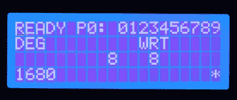

# 总线嗅探导致老式卡西欧的新显示

> 原文：<https://hackaday.com/2020/03/08/bus-sniffing-leads-to-new-display-for-vintage-casio/>

尽管他尽了最大努力修复他的卡西欧 FX-702P 的液晶显示器，但很快他就发现这是一个死胡同。他想知道是否有可能用更现代的显示器取代 LCD，而不是把这个相对有价值的设备扔进垃圾桶。他知道逆向工程 LCD 面板本身将是一个相当大的挑战，因此他决定将精力集中在解码计算器处理器和显示控制器之间的通信上。

通过将他的逻辑分析仪连接到卡西欧的四位总线上，[Andrew]能够在启动过程中捕获一系列字节，这看起来很有希望，尽管一开始并不太有意义。他必须颠倒每个半字节的顺序，将它们配对成字节，然后查阅 FX-702P 的字符映射表，因为该设备不使用 ASCII。这使他能够解码“准备好”的信息，并证明这个概念是可行的。

 当然，一个带有永久性逻辑分析仪的计算器并不完全理想，所以他开始研究一些更紧凑的东西。有了大量的显示控制器数据转储，【Andrew】为一个 [STM32“蓝色药丸”ARM Cortex M3 微控制器](https://hackaday.com/2017/03/30/the-2-32-bit-arduino-with-debugging/)编写了一些代码，该微控制器将近乎实时地嗅探和解码数据。在休息后的视频中，你可以看到在他按下按钮和相应的字符出现在下面的 LCD 上之间有一点延迟，但这肯定是可用的。

不幸的是，他为这个黑客创造的硬件只是*稍微*太大，不适合放入计算器本身。新的液晶显示器的尺寸和形状也远远达不到取代原来的液晶显示器的要求。但是这些都不重要。虽然[Andrew]说他当然可以把电子设备做得更小，但我们的目标绝不是让计算器恢复如新。有时候旅程比目的地更重要。

 [https://www.youtube.com/embed/PFEQpZJrdY4?version=3&rel=1&showsearch=0&showinfo=1&iv_load_policy=1&fs=1&hl=en-US&autohide=2&wmode=transparent](https://www.youtube.com/embed/PFEQpZJrdY4?version=3&rel=1&showsearch=0&showinfo=1&iv_load_policy=1&fs=1&hl=en-US&autohide=2&wmode=transparent)

