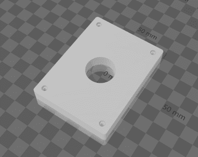

# CadQuery 成年了

> 原文：<https://hackaday.com/2022/02/04/cadquery-comes-of-age/>

现在，我们知道你们中的一些人会说什么——“哦，天哪，不是吧*另一个*编程 CAD 工具，OpenSCAD 怎么了？”—你可能是对的，但也许等一下，看看这个，因为我们认为它现在非常棒！OpenSCAD 很棒，我们在这些地方一直都在使用它，但是它在某些地方有点奇怪。然后[出现了 CadQuery](https://cadquery.readthedocs.io/en/latest/intro.html) ，在易用性和功能性方面彻底击败了它。现在，我们已经看到了几年来对 CadQuery 的一些提及，最终它已经成为一个完全成熟的工具集，拥有一个图形化的前端/编辑器， [CQ 编辑器](https://github.com/CadQuery/CQ-editor)。没有奇怪的依赖 FreeCAD 被看到！也就是说，安装 FreeCAD 也不是一件坏事。

> 目标是让生成该对象的 CadQuery 脚本尽可能接近人类使用的英语短语。

对于那些以前没有见过它的人来说，CadQuery 是一个 python 库，它允许你创建 3D 模型，并将它们导出为 STL 和 STEP，所以为你的 KiCAD 项目制作模型也是一个选项。然而，与 OpenSCAD 不同的是，CadQuery 更侧重于*设计*–*意图*。这个想法是让 python 脚本读起来更像是人类对对象形式的描述，而不是一堆算法从直接的布尔运算中构造对象，所有这些都是相对于全球坐标系的。CadQuery 使用相对关联模型，在该模型中，事物被定义为相对于其他事物。从文档中:

> CadQuery 有所不同，您可以以相对的方式定位与其他要素相关的要素，就像人类在创建绘图或构建对象时一样保留设计意图。

STL file created by this code visualised in Microsoft 3D Builder

`height = 60.0`
`width = 80.0`
`thickness = 10.0`
`diameter = 22.0`

``# make the base`
`result = cq.Workplane("XY").box(height, width, thickness)\`
`.faces(">Z").workplane().hole(diameter)\`
`.faces(">Z").workplane() \`
`.rect(height - padding,width - padding,forConstruction=True)\`
`.vertices()\`
`.cboreHole(2.4, 4.4, 2.1)\`
`.edges("|Z").fillet(2.0)``

 ``# Render the solid`

`# Export`
`cq.exporters.export(result,'result.stl')`

我们并不是说 OpenSCAD 不好，远非如此，它只是与众不同，对于一些人来说，CadQuery 将更容易完成您需要的工作。需要完全参数化的外壳来进行 3D 打印？用 47 行 python 代码完成的[怎么样？随着对象复杂性的增加，CadQuery 方法的好处也在增加。有相当多的概念需要用这个工具来学习，因为它非常强大，提供了许多解决问题的方法，但是我们认为这种努力是值得的。如果你不喜欢 QC-editor，那也没问题，因为 CadQuery 可以独立使用任何你喜欢的编辑器，它甚至可以与 Jupyter notebook 一起使用！安装它也不应该是一个问题，与](https://cadquery.readthedocs.io/en/latest/examples.html#a-parametric-enclosure)[罐头建立可用](https://github.com/CadQuery/CQ-editor)，但这是说，这是一个庞大的安装，所以我们希望你有一个备用的磁盘空间！

如果你是一个更加视觉化的思考者，并且所有这些编码都让你感到冷淡，那么你可能想看看这个关于 FreeCAD 中参数化建模的[指南，一个关于 fusion360](https://hackaday.com/2020/10/09/freecad-parametrics-made-simple/) 的[类似指南，或者如果你坚持使用 OpenSCAD 非常感谢，那么为什么不](https://hackaday.com/2016/02/02/making-parametric-models-in-fusion-360/)[温习一下那些 OpenSCAD 技能](https://hackaday.com/2021/04/17/guide-to-mastering-openscad-costs-roughly-the-same-as-openscad/)。

谢谢[JohnU]的提示！`