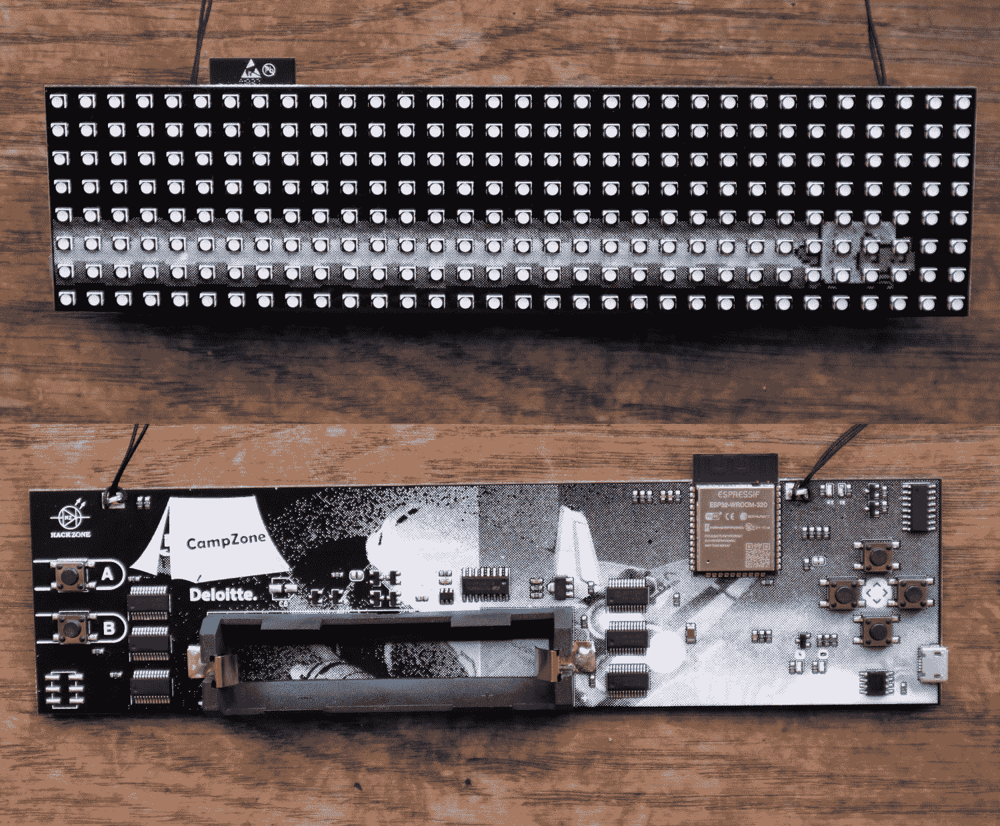
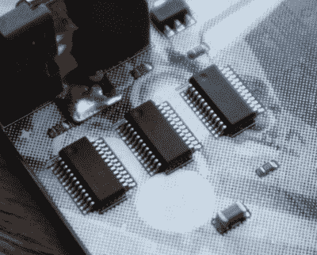
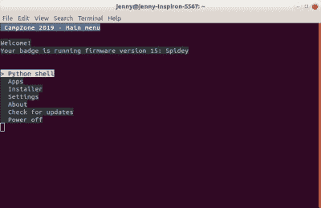

# CampZone 2019 徽章正在乞求成为一个巨大的广告牌

> 原文：<https://hackaday.com/2019/07/25/campzone-2019-badge-is-begging-to-become-a-huge-billboard/>

什么东西有 256 个全彩色 led，每个人都喜欢的锂电池外形，无线连接，挂在你的脖子上？CampZone 2019 徽章将所有与会者变成了一个真正有趣的广告牌——但与会者能把自己黑进一个巨大的显示屏吗？

CampZone 是欧洲游戏社区的大型活动之一，在荷兰举办，从 7 月 26 日持续到 8 月 5 日。这是一个典型的大型夏令营，适合那些将游戏和黑客活动与 HackZone 相结合的人，hack zone 是一个规模相当大的黑客营地。我很幸运地得到了一个 CampZone 2019 徽章，被称为 I-Pane ，让我们看看他们在这个电子会议徽章中添加了什么。

## 一个由你指挥的 Blinky 矩阵

The CampZone 2019 badge, front(top) and rear.

包裹到达英国时被英国边境部队的胶带包裹着，显然它被标记为可疑并接受人工检查。这里没有什么邪恶的东西，里面是一个整齐地打包好的徽章，还有一张信息表、挂绳和几个可选的额外组件；一个是电容器，用于在从 USB 源驱动 led 时平滑电源，另一个是 6 路劣质插件连接器，用于电路板背面。

徽章 PCB 本身是一个大约 190x50mm 毫米(7.5 英寸 x2 英寸)大小的宽矩形，它的派对技巧是它的整个前表面是一个 8×32 的 5 毫米多色 led 矩阵，可以形成明亮的全色像素显示器。徽章的趋势是在设计中尽可能多地覆盖 led，CampZone 徽章将这一趋势推向了逻辑的终点。显示器由一对 SM16106SC LED 驱动芯片驱动

Half of the SM16106SC LED drivers that supply the matrix of tri-colour LEDs.

18650 电池支架位于背面，旁边是 TP4056 锂离子充电器和相关的电源组件。很高兴看到一种常见的锂质电池被使用，因为你希望它可以在 con 之后找到替代用途。

徽章本身的用户交互由一组按钮提供。一端有一个 4 向方向键，另一端有 A 和 B 按钮。这里有趣的一点是，按钮位于显示板的另一侧。

选择 CH340C USB 转串行芯片是因为其价格低廉，允许用户与运行节目并提供连接的 ESP32 WROOM 模块接口。开机时，徽章首先尝试连接到 Campzone 无线网络，然后进入一个包括贪吃蛇游戏和 Wi-Fi 配置应用程序的短菜单。添加网络密码是一个稍微复杂的循环字母表的过程。一旦连接，它会自动下载固件更新，这是一个聪明的功能，为最后一分钟的错误修复。

我们可以看到为什么它在这一点上被称为 I-Pane，因为这些 led 非常亮，幸运的是，亮度可以通过左右键降低到不那么灼热的水平。

## 与你的徽章交谈，变得简单

该软件基于 badge.team 项目，该项目源于 SHA2017 徽章。像他们所有的作品[一样，它是完全开源的](https://github.com/badgeteam/cz19-badge)，并附带了常用的应用程序库和一套活动应用程序。

The user-friendly serial menu.

真正有趣的部分应该为任何其他希望将其应用于自己的徽章的人开辟新的可能性，那就是他们如何设法用这样一个低分辨率的显示器制作一个可用的界面。如果你不介意等待滚动文本，它有一个可以导航和阅读的菜单，但一旦你通过 USB 连接它并启动终端，聪明的事情就来了。它直接进入一个菜单，从这里你可以轻松地访问所有与应用程序相关的功能，运行和安装应用程序，以及执行更新或进入 MicroPython 提示符。在这里，你可以非常快速地将整个应用程序作为 MicroPython 代码进行粘贴和测试，当然[也有很多可用的函数](https://wiki.badge.team/CZ19#Writing_your_own_app)将图形放在那些 led 上。

我被告知，有一个在线图形编辑器正在工作，将在活动开始时发布。这使得为 LED 矩阵创建像素艺术变得容易。所有这些都使徽章成为我们见过的最容易测试软件的工具之一，一旦一段代码被完善，通过在他们的"[孵化场](https://badge.team/projects)"应用程序库中创建一个项目来与世界分享它就成了一项简单的任务。

虽然 LED 矩阵令人印象深刻，玩起来也很有趣，但这款徽章缺乏 EMF2018 的手机或 CCCamp 2015 的 SDR 等突出的硬件功能。虽然它在两个关键点上得分很高，因为它开箱即用，不需要用户等待任何补丁，而且将软件安装到它上面的容易程度比其他许多软件都高。到目前为止，孵化场里只有几个应用程序，但和往常一样，在活动过程中会有更多的应用程序出现，我们期待看到人们用它做什么。

一位黑客同事想知道是否有人能成功地黑掉多个徽章，形成一个更大的屏幕。一个巨大的广告牌会很有趣，但考虑到多徽章多人游戏，我会更兴奋地看到它，在这些游戏中，游戏对象被扔在徽章之间，如来自 2018 年贝尔格莱德黑客日的“拍摄我的情人节”黑客。无论生产出什么，我们都可以看到它拥有超越事件的生命，只要它是一个非常明亮的可编程显示器和可穿戴的配件。

你可以在网站上找到更多关于 CampZone 和 HackZone [的信息。在撰写本文时，如果你想参加的话，似乎还有票。](https://campzone.nl/?lang=en)