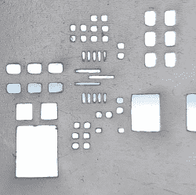

# 锡膏模版可以 3D 打印吗？他们可以！

> 原文：<https://hackaday.com/2020/03/27/can-solder-paste-stencils-be-3d-printed-they-can/>

3D printed solder paste stencil, closeup.

[Jan Mrázek]3D 打印焊膏模板的成功非常有趣，尽管他明确表示这只是一个概念证明。这个技巧有很多部分，所以让我们一步一步来。

首先，事实证明，将 PCB 焊膏层转换为 3D 模型是一个挑战。[Jan]在网上找到的一个工具并不奏效，所以他求助于 [OpenSCAD](https://www.openscad.org/) 并编写了一个脚本(GitHub 上有[)，该脚本将两个 DXF 文件作为输入:一个用于电路板轮廓，一个用于孔图案。如果你使用的是](https://github.com/paradise-fi/RoFI/blob/UniversalModule/util/pcbStencilGenerator.scad) [KiCad](https://www.kicad.org/) ，他有一个 Python 脚本([也在 GitHub](https://github.com/paradise-fi/RoFI/blob/UniversalModule/util/kicadExportDxf.py) 上)，可以导出必要的数据。

结果是一个 3D 模型，就像一个锡膏掩模，结合了一个凸起的边框，以匹配电路板的轮廓，这样整个东西就可以通过安装在 PCB 的顶部来自动对齐。一个方便的功能，当然。[Jan]说这张照片中的模型不到 10 分钟就打印出来了。从工作流程的角度来看，这无疑比等待模板邮寄要有利得多。但是实际的锡膏效果如何比较呢？

3D printed solder stencil on PCB, after applying solder paste.

[Jan]表示，印刷模板有一些缺陷，但对于 0.5 mm 间距的 IC 和 0402 电阻来说，它工作得很好，并且 3D 印刷模板自注册到电路板上是一个受欢迎的功能。也就是说，取得这样的结果需要付出很多努力。[Jan]的 SLA 打印机是一台 Elegoo Mars，如果不首先[改进他的打印机以获得更好的 X/Y 精度](https://blog.honzamrazek.cz/2020/01/making-elegoo-mars-more-precise-in-the-xy-direction-hardware-mitigation-of-exposure-bleeding/)，他就无法让它为 0.2 mm x 0.5 mm 的衬垫打孔。

最后，他承认，虽然一个功能性的 DIY 焊料模板可以在大约 10 分钟内 3D 打印出来，但专业制作的效果更好的模板并不特别昂贵或难以获得。不过，这是一个可以派上用场的巧妙技巧。此外，快速提醒一下，我们过去曾逐步讲解过如何在 OpenSCAD 中制作零件，这应该有助于刚接触 OpenSCAD 的人理解[Jan]的脚本。