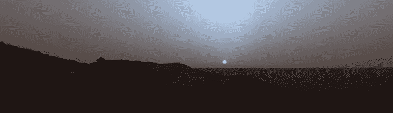
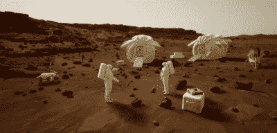
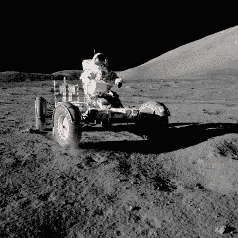

# 能否帮助 NASA 在 VR 中建立一个火星 Sim？

> 原文：<https://hackaday.com/2022/05/12/can-you-help-nasa-build-a-mars-sim-in-vr/>

无论你的项目或努力的领域，模拟都是发现你不知道的东西的有用工具。在许多情况下，直到你尝试去做一些事情，问题才变得明显。如果做这件事是昂贵或困难的，模拟可以是一种低风险的方式来找出一些问题，而没有巨大的成本或不适当的风险。

去火星是非常困难和昂贵的。因此，美国宇航局依靠模拟来规划其红色星球的任务就不足为奇了。现在，航天局正致力于在虚拟现实中创建一个火星 sim，用于培训和评估目的。最棒的是你可以帮忙！

## 为什么要模拟火星？

Sunset on Mars, as captured by NASA’s Spirit rover in 2005\. Even simple things like night and day are different on Mars compared to Earth, and could present complications to NASA’s operations. Simulation will help find that out ahead of time. Credit: [NASA, public domain](https://en.wikipedia.org/wiki/Astronomy_on_Mars#/media/File:MarsSunset_losslesscrop.jpg)

当涉及到火箭性能和计算卫星轨道等问题时，NASA 在模拟方面做得很好。它拥有由工程师和科学家组成的精英团队，他们花了几十年时间为该机构改进这些工具。

然而，当谈到将宇航员送上火星表面时，美国国家航空航天局并没有太多的进展。将来，宇航员可以登陆火星，并在火星环境中承担各种任务。这些可能是多种多样的，如徒步或在机动交通工具上探索，建立永久的生活设施，或建造和排除硬件故障，以在火星表面本地产生资源。

人类以前从未承担过这些任务，所以很难知道未来的宇航员到达火星时会面临什么挑战。理想情况下，我们希望在宇航员被留在几千万公里外的星球上独自生活之前，有一个很好的想法。到达火星后发现你的工具太难使用，或者你的住所不实用，当一切都为时已晚时，这将是令人难以置信的沮丧。

## 就像在那里一样

因此，模拟是必要的！该机构已经自己做了一些基础工作，在 Epic Games 的虚幻引擎 5 中创建了一个火星环境。该虚拟环境被称为火星 XR 操作支持系统，它模拟了宇航员将会经历的火星表面的条件。该模拟旨在与虚拟现实设备一起使用，让宇航员或其他人感觉和行动就像他们真的在红色星球上一样。

到目前为止，有一个模拟的火星日/夜循环，有合适的天空条件，以及合适的火星重力值。根据我们对火星气象学的最佳了解，也有工作的火星车和不断变化的天气条件。该模拟器包括一个巨大的 400 公里(154 英里)的地形遍历基于美国宇航局自己的研究。

One of the challenge categories is “Set Up Camp.” The intention is to create a simulation of setting up a Mars camp to see what challenges this might present to astronauts. Credit: [NASA, public domain](https://www.nasa.gov/sites/default/files/thumbnails/image/marsxr.png)

做完这些后，NASA 又遇到了一个新问题。该机构的火星模拟实际上*太精确了。就像这个星球本身一样，实际上没有任何事情可做。这就是公众介入的地方。美国宇航局已经创建了[Mars xr 挑战赛](https://www.nasa.gov/marsxr-challenge/)，让公众负责向火星模拟器填充有用的内容。自然，模拟器需要充满现实的资产和场景，以便成为 NASA 及其宇航员的有效培训和调查工具。*

Epic Games 负责模拟的虚幻引擎业务主管 Seb Loze 指出，这为参与者提供了机会。Loze 说:“创作者可以使用 Unreal Engine 来构建逼真的模拟场景，以帮助 NASA 为未来的任务做好准备，无论是去月球还是去火星。”他补充道，“无论你是游戏设计师、建筑师、业余爱好者还是火箭科学家，任何人都可以使用 UE5 来构建，我们迫不及待地想看到社区提供的沉浸式模拟。”

Astronauts famously used the Lunar Roving Vehicle to get around the Moon on later Apollo missions. We’re sure few would pass up the chance to drive something similar on the surface of Mars. Credit: [NASA, public domain](https://nssdc.gsfc.nasa.gov/planetary/image/as17_147_22526.jpg)

该比赛由众包平台 HeroX 主办，该平台帮助客户与更广泛的公众分享项目，以找到有用和独特的解决方案。根据[挑战网站，](https://www.herox.com/MarsXR)有五个不同的类别供参赛者参与。四个是面向任务的类别，包括建立营地、科学研究、维护和探索。最后一个类别是《震撼我们的心灵》,邀请有创造力和技术娴熟的人制作一些让评委印象深刻的东西，超出所有人的预期。

这项挑战的奖金为 70，000 美元，将由 20 名个人分享。每个类别有四个奖项，每个类别的总获胜者可以获得 6000 美元的奖金。不过，没有必要限制你自己或你的团队。美国宇航局欢迎多个类别的多个条目，参赛者也有资格获得多个奖项。

你可能有一个火星医疗模拟的好主意，或者一个令人兴奋的任务，宇航员驾驶类似月球漫游车的东西深入红色沙漠。也许你想模拟一次回收行动[来带回勇敢的勇气号](https://xkcd.com/695/)，它表现出色，理应回家。

无论你的想法是什么，提交截止日期是 2022 年 7 月 27 日。想出一个主意，召集你的团队，开始行动吧！