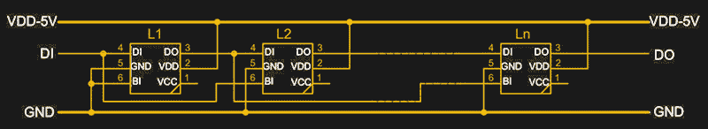
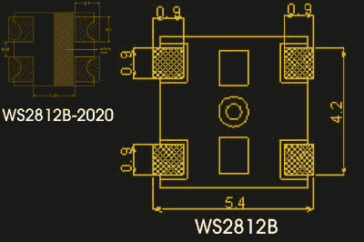
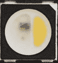

# 没有 WS2812 你能活吗？

> 原文：<https://hackaday.com/2019/03/26/can-you-live-without-the-ws2812/>

据我们所知，流行的 WS2812 可单独寻址的 RGB LED 大约在 2013 年下半年发布。这不是很久以前，或者也许是一个永恒；ESP8266 是一款我们都知道并喜爱的 WiFi 微控制器，大约一年后才发布。如果你称这些东西为“新像素”，有一个很好的理由: [Adafruit](https://www.youtube.com/watch?v=HO6xQMR8naw) 向 maker 社区介绍了 WS28212，在软件支持和品牌推广方面花费了不小的努力。

WS2812 由 WorldSemi 生产，该公司早期以 LED 驱动器解决方案而闻名，尤其是 WS2811，这是一种 SOIC 芯片，可以将普通阳极 RGB LED 变成串行可控的 LED。当他们将 WS2811 的大脑塞进一个带有几个 LED 的小包装中时，他们创造了可能是当今最常见的可编程 LED 照明解决方案。

在 WS2812 上市的六年中，发生了很多变化。计算机改装界已经多年没有听到“冷阴极”这个词了。圣诞灯要酷得多，任何想在他们的珠宝上添加亮闪闪的东西的人都有一个简单的方法。

但在 WS2812 上市以来的几年里，有很多后续产品在同样的事情上做得更好。你现在有串行可寻址的发光二极管，当它们发生故障时不会使串的其余部分停止工作。你有 RGBW 发光二极管。还有色域更广的 led 等等。这是对串行可寻址 RGB LEDs 当前状态的观察，以及未来可能会发生的事情。

## WS2813

WS2812 和 WS2812B LED 有四个引脚:电源、接地、数据输入和数据输出。这个想法是给一串发光二极管供电，发送数据，发光二极管就会点亮。WS2812 和 WS2812B 几乎相同，其中~B 版本具有反向电流保护，以防您忘记红色是正极，黑色是负极。对于 4 针设备来说，这非常简单。

WS2812 的一个缺点是，当它们以串行方式连接时，如果其中一个发生故障，则该串的其余部分也会发生故障。当然，在最坏的情况下，失败率可能只有 0 . 25 %,但是我们已经看到了挂着数百根 WS2812s 的琴弦。当你处理成百上千的东西时，这种可靠性不是你想要的。

The WS2813 fixes the problem of dead strings of LEDs with a ‘BI’ pin. In a string of LEDs, this pin is connected to the DI pin of the previous LED.

WS2813 是一个 LED 带动其余 LED 串的解决方案。该封装有六个引脚和两个数据信号。集成电容可简化布局，刷新频率最高可达 2 kHz。基本上，如果你用 WS2812s 做什么，用 WS2813s 代替。如果你将这些 RGB LEDs 放入回流焊炉中，这一点尤其正确，请相信我。

## 你想要更小的 led？

 虽然 WS2812B、2813 和相关的 led 非常适合添加 blinky，但对于一个 5 毫米 x 5 毫米的大型方形封装，您只能做这么多。对于某些应用来说，像素间距很重要，如果你见过由小 LED 制成的高密度 LED 矩阵，你就会知道我在说什么。看看显示这段文字的屏幕。

如果有更小的可单独寻址的 RGB LED 会怎么样？这就是 WS2812B-2020 的用武之地。不是 5 毫米见方，是 2 毫米见方。这有多大的区别呢？看看右边的图片。这是常规 2812B 和 2020 尺寸版本的占地面积，按正确的相对尺寸进行了缩放。您可以在 WS2182 的占地面积中安装四个。

## WS2815

虽然 WS2812 在 5 伏电压下工作良好，但欧姆定律是一个问题，RGB LEDs 消耗大量电流。如果能有一个能在更高电压下工作的可单独寻址的 RGB LED 就好了。就好像电水壶不是 120 V 市电的东西一样。有时候电压越高越好。

进入 WS2815。在 12 V 下运行可以降低电流，减少电阻损耗，如果你运行的是很长的 LED，可以使混合的 LED 颜色更加一致。

## APA-109B

The APA-109B. The ‘B’ stands for ‘white’.

尽管我们喜欢尽可能经常、尽可能大声地喊着“ **WorldSemi** ”，但还有其他制造商生产串行可寻址 led，其中一些芯片具有一些有趣的功能。

我想给你讲一个为什么工程师和营销人员永远不应该混在一起的故事。几年前，夏普的一名工程师在阅读宽色域显示器的相关文献时，发现了大量关于产生更鲜艳色彩的研究。文献称传统的 RGB 色彩空间存在缺陷，人眼对绿色极其敏感。如果你想创建一个具有宽色域的显示器，你需要制作一个具有四种颜色的显示器:红色、绿色、蓝色，以及最好被描述为“祖母绿”的颜色。祖母绿更深，不像液晶电视上的传统绿色子像素那样“霓虹”。

夏普公司的一名高管一直坚持这个想法，直到一名营销人员介入并表示，没有人能卖出两份蔬菜。你怎么称呼它，“另一种绿色”。工程师回到绘图板上，划掉了“祖母绿”，写下了“黄色”。这是夏普的 Quattron 技术，在他们的 Aquos 系列电视中发现，是的，每个像素有四个子像素:红色、绿色、蓝色和黄色。[出现了由*精益求精*号船长主演的广告。是的，有一个电视广告(你会在电视上看)展示了一台电视机的功能，它通过显示器中的第四种原色实现了更宽的色域。大约在这个时候，你的思想在试图理解现实的强烈压力下经历液化。别担心，这种感觉不会过去，但你会习惯的。](https://www.youtube.com/watch?v=JcXPwM03x2k)

APA-109B 是尝试用红色、绿色和蓝色 led 显示白色的解决方案。如果你曾经试图在 WS2812s 的面板上涂上白色，你会注意到它不太对。这是一个电动莫奈，周围有可见的彩色漩涡，或者至少当你盯着 500 瓦的 RGB LEDs 时是这样的。APA-109B 在 5 mm 封装中增加了第四个 LED，在这种情况下是白色 LED。它几乎占据了整个封装的一半，但如果你需要一个白色的串行可寻址 LED，这就是你要找的。