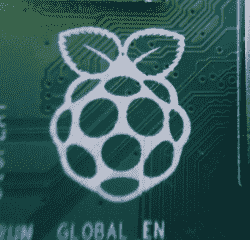
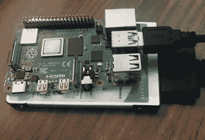

# 真的可以把树莓派 4 当台式机用吗？

> 原文：<https://hackaday.com/2019/09/09/can-you-really-use-the-raspberry-pi-4-as-a-desktop-machine/>

当[树莓 Pi 4 发布](https://hackaday.com/2019/06/23/raspberry-pi-4-just-released-faster-cpu-more-memory-dual-hdmi-ports/)时，许多人鄙夷地看着双微 HDMI 端口。为什么像 Raspberry Pi 这样的 SBC 需要两个 HDMI 端口？答案是，Pi 4 终于快得足以作为台式机的替代品，而台式机的杀手级功能(对我们许多人来说)是多显示器。

现在我知道你们很多人在想什么。一台 35 美元甚至 55 美元的信用卡大小的电脑不可能取代一台 1000 多美元的台式电脑，对吗？对吗？当然不是，但同时，是的，是的，它可以。于是我试着用 Pi 当了一个星期的台式机替代品，效果不错。事实上，这篇文章几乎完全是在具有 4 GB 内存的 Pi 4 上写的，还有我最近的几篇安全专栏文章。为此，我肯定可以继续和 Pi 一起工作，作为我的日常司机。

首先有几个程序问题需要解决。最初的评论是基于 6 月 20 日发布的 Raspbian，而 Raspbian 又是基于预发布的 Debian Buster。此后，巴斯特发布了。由于发布冻结已经结束，排队等待的修复程序已经登陆。7 月 10 日发布了一个新的 Raspbian 映像，许多最初发布的问题都已得到修复。

### 设置

从 SD 卡运行桌面似乎不是一个好主意，所以我选择使用 SATA 混合硬盘驱动器，并利用新的 USB3 端口。Pi 4 还不支持从 USB 启动，虽然随着 PXE 启动，它计划在未来的更新。因为我们可以控制内核引导参数，所以从 SD 卡和硬盘驱动器上的根文件系统引导内核是很简单的。我预计这将显著提高性能，但令人惊讶的是，系统一次有几秒钟无法使用。查看内核日志并与其他人的经验进行比较，很快就会发现，当与一些 USB3 设备对话时，一些内核的 USB 连接 SCSI (UAS)存在问题。泄露的是消息日志中的 USB 设备重置。消除重置和性能问题只需要一个内核引导选项来禁用违规设备的 UAS。

注:写这篇文章写到一半，硬盘没电了，所以我又回到了传统桌面。我最终还是用了一个多星期的圆周率。不过，圆周率并不是我辞职的原因。

对于电源，我选择使用 Canakit Pi 4 电源，因为它在亚马逊上有现货。USB C 的问题不会影响这种配置，到目前为止，电源还不是一个问题。另一方面，过热一直是个问题。值得称赞的是，当温度超过 80°C 时，Pi 的处理器会减速，甚至在负载下也很稳定。事实上，具有如此高性能的处理器在没有散热器的情况下使用时不会立即自行加热，这一点非常值得注意。

使用两个显示器确实会增加热量，观看使用硬件解码的视频也是如此。我的 Pi 就支在我的桌面上，不用机箱。官方案例没有任何气流可言——加热问题会糟糕得多。如果我继续使用 Pi 4，我可能会投资一个铝装甲案件。这些全铝外壳兼作散热器，看起来也很锋利。

你可能会注意到，我们的桌面设置不仅仅是 55 美元。我估计一个合理的桌面替换版本大约需要 150 美元。这包括 4 GB Pi 4、电源、散热器、SD 卡、USB3 到 SATA 适配器、廉价的 SSD 驱动器和一对 Micro-HDMI 电缆。公平地说，大多数其他 SBC 需要类似的附件列表，如果不包括 SSD，价格可能会更低——如果包括鼠标和键盘，价格可能会更高。

### 体验

除了硬盘崩溃之外，Raspberry Pi 是一个非常好用的桌面，可以用来浏览网页、写文章，甚至编辑一些简单的图像。毫无疑问，你不会喜欢在 Pi 上使用 Blender，但话又说回来，这也适用于经济型台式机和笔记本电脑。4 GB 的内存刚好够一台台式机用。我的 13 个 Chromium 标签，包括一个 Youtube 视频，使用了 4 GB 可用内存的一半多一点。看起来有可能用 2 GB，但几乎不可能。浏览器是内存消耗大户。

仍然有一些我没有解决的怪癖。首先，KDE 不会在圆周率上正确渲染。我体验的 3D 加速似乎比预期的要慢。比如 Openarena，以 1920×1080 分辨率全屏运行的时候是幻灯片。WiFi 在实验的早期是不稳定的，但是解决硬盘问题似乎也有帮助。

编辑文件、做研究、听音乐对私家侦探来说都是轻而易举的事。网飞无法工作——我怀疑这是一个 DRM 问题，因为我使用的是 Chromium，它缺乏任何 Widevine 支持。也许我能给的最高评价是，使用 Pi 4 作为日常驱动桌面是不起眼的。不是最快的计算机，但却是一款适用于多种用途的台式机。

### 结束语

所以你需要一个桌面，你应该用一个树莓派吗？如果你已经有了，当然，试一试；可能会让你大吃一惊。如果你只有几美元可以花，或者需要一堆机器，使用 Pis 可能是一个很好的选择。编辑视频、3D 建模、编译大型项目或其他处理器或显卡密集型工作负载？Pi 可能不是正确的选择。

对于一个 55 美元的硬件来说，这令人印象深刻。它能代替你的桌面吗？是的，是的，它可以。应该吗？大概不会。