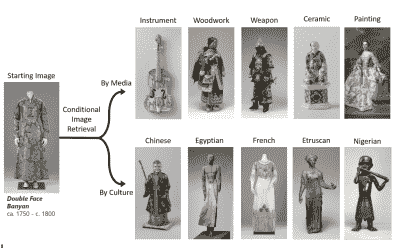

# 你记得这是哪里的吗？

> 原文：<https://hackaday.com/2020/08/05/can-you-remembrandt-where-this-is-from/>

一组研究人员建立了一种算法来寻找艺术品中隐藏的联系。

该团队由来自麻省理工学院计算机科学和人工智能实验室(CSAIL)和微软的计算机科学家组成，他们使用大都会艺术博物馆和阿姆斯特丹国立博物馆的画作来展示这些隐藏的联系，这些联系将具有相似风格的艺术品联系在一起，如弗朗西斯科·德·祖巴朗的*圣塞拉皮翁殉难*(左上)和简·阿塞利恩的*受威胁的天鹅*(右上)。他们最初的灵感来自于国立博物馆的“伦勃朗和贝拉斯克斯”展览，该展览展示了艺术家们作品的相似之处，尽管前者来自信奉新教的荷兰，后者来自信奉天主教的西班牙。

该算法被称为“马赛克”，不同于基于概率生成对抗网络(GAN)的项目，后者生成艺术品，因为它专注于图像检索。该算法不仅关注颜色和风格等显而易见的因素，还试图揭示意义和主题。它通过构建一种称为条件 k-最近邻(KNN)树的数据结构来实现这一点，该树提供了一种树状结构，其中从中心图像分出的分支指示与该图像的相似性。为了查询数据结构，沿着这些分支，直到找到与数据集中的图像最接近的匹配。在进一步的迭代中，它修剪无用的分支以改善新查询的时间。

对博物馆藏品运行该算法的一些结果发现，荷兰双面榕树和中国陶瓷雕像之间有相似之处，可追溯到 16 至 20 世纪瓷器和肖像从中国流向荷兰。

这项研究的一个令人惊讶的结果是，发现这种方法也可以应用于发现深度神经网络的问题，这些网络用于创建深度假货。虽然 GANs 在他们的模型中经常会有盲点，难以再现某些类别的照片，但 MosAIc 能够克服这些缺点，准确地再现真实的图像。

虽然该团队承认他们的实现不是 KNN 的最佳版本，但他们的主要目标是提出一个简单而有效的广泛的条件方案。他们的希望是激励相关研究人员考虑算法的多学科应用。

