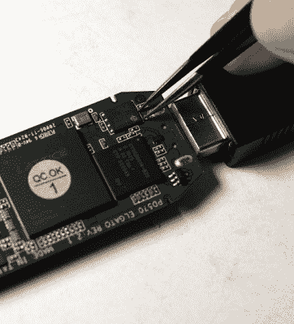

# 捕获设备固件黑客解锁所有像素

> 原文：<https://hackaday.com/2020/04/14/capture-device-firmware-hack-unlocks-all-the-pixels/>

根据[Mike Walters]的说法，如果你正在寻找一个在 Linux 下工作的 HDMI 捕获设备，Elgato Cam Link 4K 是一个很好的选择。但坏消息是，它不能与他试图使用的任何视频会议软件一起工作，因为他们希望视频流是不同的像素格式。对大多数人来说，这可能是故事的结尾。但是你正在 Hackaday 上阅读这篇文章，所以很明显他没有不战而降。

早些时候，[Mike]发现有一个软件可以解决这个问题。问题不在于 Elgato 不能生成想要的格式，而是视频会议程序不知道如何要求它切换模式。软件修复是创建一个虚拟 Video4Linux 设备，并使用该设备通过`ffmpeg`实时更改格式。如果你几分钟后有一个电话会议，这是一个聪明的技巧，但它确实浪费 CPU 资源，并增加了一些不必要的跳跃。

Putting the device into bootloader mode.

受到软件修复的启发，[Mike]想知道是否有一种方法可以简单地强制 Elgato 默认输出所需格式的视频。他在网上找到了该设备的固件转储，并通过使用`hexdump`在 ASCII 中搜索像素格式的名称，找到了像素格式被引用的位置。通过查看 Linux USB 视频类(UVC)驱动程序的源代码，他能够确定每种视频模式的完整 16 字节序列，这样他就可以将不需要的序列清零。然后，只需将他修改过的固件刷新回硬件即可。

但有一个问题:安装了修改后的固件后，设备停止了工作。在调查了明显的罪魁祸首之后，[Mike]拿出示波器，把它连接到 Elgato 的闪存芯片上。原来[由于他使用的程序](https://github.com/ktemkin/camlink-re)中的一个 bug，SPI 擦除命令在闪存期间没有被发送。这导致固件损坏，使 Elgato 无法启动。在用他的修复程序发出一个拉请求后，固件没有出现任何问题地闪了一下，这个捕获设备现在可以在必要的时候兼做网络摄像头。

我们当然可以想到更简单快捷的方法是使用自己的网络摄像头，但我们很高兴[迈克]花时间修改了他的 Elgato Cam Link 4K 并记录下来。这是一个实用固件黑客的极好例子，即使你不是在市场上购买新的高清视频会议设备。