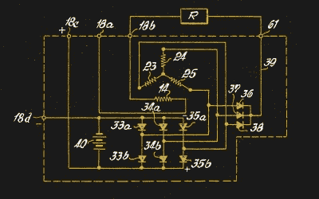
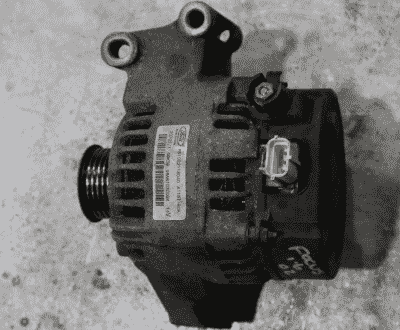
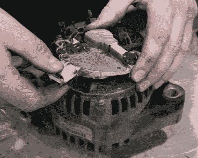
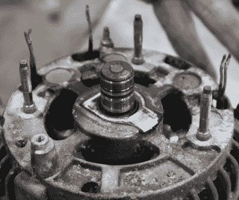
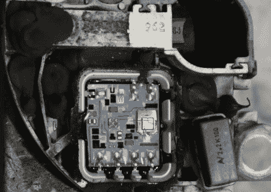
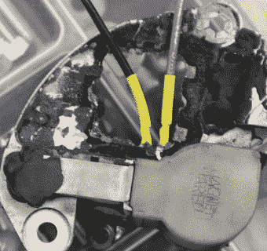
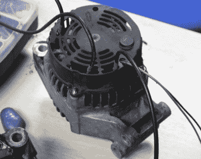
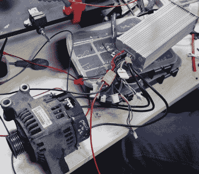

# 汽车交流发电机是很好的电动机；以下是方法

> 原文：<https://hackaday.com/2020/01/16/car-alternators-make-great-electric-motors-heres-how/>

不起眼的汽车交流发电机隐藏着一个有趣的秘密。众所周知，它们是将内燃机产生的能量转化为运行其他一切所需的电力的部分，它们本身也可以用作电动机。

The schematic of a simple automotive alternator, from [US patent 3329841A](https://patents.google.com/patent/US3329841) filed in 1963 for Robert Bosch GmbH.

这些设备几乎总是采用三相交流发电机的形式，其磁性部件由转子上的电磁体提供，并带有整流器和调节器组件，以将较高的交流电压转换为 12V，用于汽车电气系统。在内部，它们有三个连接到定子线圈的连接，这些线圈看起来普遍以[三角形配置](https://www.electricaltechnology.org/2014/09/comparison-between-star-and-delta-connections.html)布线，还有一对连接到一组电刷的连接，这些电刷通过一组滑环为转子线圈供电。它们有惊人的高容量，估计它们的能力相当于几马力的马达。最棒的是，它们很容易买到二手的，而且出奇的便宜，这里展示的福特福克斯单元来自易贝的一个拆车者，只花了 15 英镑(约 20 美元)。

我们已经听到你在喊“为什么？!"在你神奇的网络设备上。让我们开始吧。

## 这些人觉得自己造电动车很好玩！

观看英国 Hacky Racer 系列赛从一群朋友制造愚蠢的电动汽车发展到接近正式比赛系列赛的有趣方面之一是看到了建造 Hacky Racer 的艺术的演变。作为美国[动力赛车系列](http://www.powerracingseries.org/)的略显肮脏的堂兄弟，它从继承他们的一些进化经验中受益匪浅，但这并没有阻止 Hacky Racers 开发自己的车辆。他们已经从回收的移动和高尔夫球车电机转向中国的电动自行车和三轮车电机，现在更具冒险精神的制造商开始寻找更远的动力。汽车交流发电机是一种廉价且动力充足的发动机的一个有希望的来源。

Our Ford Focus alternator

搜索汽车交流发电机转换显示了各种页面，如何做，和指南，其中许多可以非常混乱和过于复杂。特别是关于三个定子连接的建议，建议断开单个绕组，并对其应用特殊的接线配置。根据转换相当多交流发电机的经验，这似乎令人惊讶，因为我们转换的所有不同型号都具有相同的现成三角形配置，根本不需要重新布线。也许是时候用一个真正的交流发电机来展示一个日常指南了，并且当我们在做的时候，要打破任何残留的神话。

因此，被上面一段话中廉价无刷电机的前景点燃，你面前的长凳上有一台福特福克斯交流发电机。一个人如何去转换它呢？

## 肆意破坏一个无辜的汽车零件

Removing the regulator/brush assembly

在现代交流发电机的背面，通常有一个由一组螺栓固定的塑料防尘罩。这些装置被设计成可翻新的，因此(对于现代汽车部件来说，这可能令人惊讶)它们通常非常容易拆卸。如果你拿掉防尘盖，你会看到调节器，整流器和电刷，有时集成到一个单一的单位，但更通常的情况下，在重点交流发电机的情况下，调节器和电刷作为一个单独的装配整流器。

经常有大量的硅酮密封剂需要切除，但是任何固定调节器的螺母或螺栓都应该能够松开，并且小心不要损坏电刷本身，它可以作为一个整体被提起。然后，整流器单元可以被移除，在这个过程中，有时用偏口钳攻击它比试图整体移除它更简单。

The rear plate of the alternator with the regulator and rectifier removed, showing the stator winding connections.

您应该能够识别来自定子线圈的三束粗漆包铜线，并从它们上拆下整流器带。在一些交流发电机中，它们是焊接的，但在其他一些特别烦人的设计中，它们是点焊的。在拆卸过程的最后，你应该有一个裸露的交流发电机，带有三组突出的定子线和一个带有两个滑环的裸露轴，整流器组和调节器/电刷组的任何剩余部分。

下一步是拆除调节器电路，同时保持调节器/电刷组件的形状，并在电刷与调节器的连接处定位和保持电刷连接。尽管还会有大量的硅树脂灌封化合物需要清除，但最终还是会暴露出调节器。这些通常是在陶瓷或金属衬底上的某种形式的混合电路，从它们周围的模制塑料中露出的连接被焊接到它们边缘的焊盘上。识别电刷的一对连接，小心地拆下它们，并推出调节器电路应该是相对简单的。

  The regulator circuit exposed, with the slip ring contacts at its top right.  The slip ring contacts secured to their wires.

The completed motor.

最后，你应该有一个裸露的交流发电机，一个缺少调节器电路的电刷组，和塑料防尘罩。简单地将三根合适的大规格导线焊接到三组定子导线上，并用热缩材料覆盖，将一对较轻的导线焊接到电刷连接处，并将电刷组重新组装到交流发电机上。您可能需要在连接到电刷的电线上施加某种形式的应力消除。整流器组不需要重新组装，因此在某些型号上，您可能需要制作一个垫片来替换它，以支撑电刷组的一侧。

可以在防尘罩上为各种电线打孔，所有电线都可以穿过防尘罩。在这一点上，你已经转换了你的交流发电机，剩下的就是用一些东西来驱动它。幸运的是，这是一个非常简单的过程，有现成的零件。

## 驾驶你的新汽车

Motor and controller, on the bench.

所谓的无刷 DC 电机只是一个交流电机，带有一组电子设备，将 DC 电源转换为交流电源来运行。与有刷 DC 电机相比，它们在可靠性、效率和速度控制的简易性方面具有优势，但代价是更加复杂。

对于将汽车交流发电机转换为电动机的人来说，好消息是，一系列无刷电机控制器都可以花不了多少钱，以电子速度控制器(ESC)的形式用于那些中国电动自行车和三轮车。它们采用电池 DC 供电，产生适合驱动三角形连接电机的三相交流电，并且它们与转换后的交流发电机配合良好。

ESC 有两种模式，一种用于带霍尔效应反馈传感器的电机，另一种用于不带霍尔效应反馈传感器的电机，如我们的交流发电机。通常需要一个有线链接来实现这一点，请查阅控制器的说明。我们发现，在 36V 或 48V 电源下，交流发电机可以像电动机一样良好地驱动，只要使用具有足够功率的控制器，它们就可以可靠地驱动。在全球速卖通搜索“无刷电机控制器 1500W”会有很多选择。

给定一个控制器，我们的交流发电机成为电动机还有一个要求，它必须有一个 DC 供应给它的转子绕组。它需要有大约 2 或 3A 的电流流过，限流 PSU 模块可以出色地完成这项任务。不得不使用这种能量使得电动机的效率比永磁电动机低一点，但是报废交流发电机的成本很难被击败。

我们图片中的发动机注定是为今年的比赛提供牵引力的新车中的一对。与机器人战争机器人 SMIDSY 的个人经历会让我给它们强制通风冷却，但与电动三轮车马达不同，这些似乎可以很好地应对变热。交流发电机可能不是满足小型牵引需求的一站式解决方案，但即使如此，也值得注意的是，它们是一种没有意外接线仪式的选择。如果您为一个项目转换一个，请务必写下来并[发送到我们的提示行](https://hackaday.com/submit-a-tip/)！