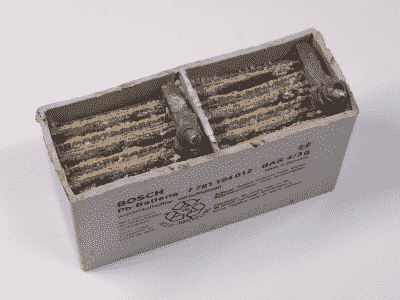

# 汽车电池:不仅仅是湿铅

> 原文：<https://hackaday.com/2022/12/01/car-batteries-more-than-just-wet-lead/>

汽车电气系统的维修过去很容易。电池只是在启动时为汽车的启动马达提供动力，或者在发动机不运转时运行少量的附件。其余时间，交流发电机为电池充电，并为车辆的其余部分和点火系统提供电力。虽然非常早期的汽车没有电池，一些旧汽车有 6 V 正极接地系统，但我们大多数人一生中汽车电池有几种尺寸(由国际电池委员会控制)，汽车有 12 V 负极接地系统。

时代变了。汽车已经没有分销商了，有了电脑。他们也有很多小玩意，从全球定位系统到备用相机和手机充电器。电池必须变得更结实，现代趋势是也需要更少的维护，所以，今天，你会发现不只是一种汽车电池。但是这些其他的电池是如何工作的，老式的铅酸蓄电池有什么问题呢？

就本文的目的而言，我不是在谈论电动汽车电池，这是一个完全不同的话题——大多数电动汽车电池也是普通的汽车电池。

## 在实践领域

 

一块 6 芯铅酸电池。[CC BY SA 3.0](https://creativecommons.org/licenses/by-sa/3.0/deed.en)BY【genetics 4 good】

回到现实，你不需要为一个汽车电池支付 800 美元，但有多种选择。伴随我们成长的传统电池是充满水的铅酸电池。这些电池具有许多理想的特性。它们长时间保持充电状态。它们可以处理像启动马达时出现的大浪涌。它们可以经受多次轻微放电和充电。事实上，这些电池中的大多数不喜欢完全放电和充电。

这些电池足够简单。每个电池都有一个栅格，阴极为铅基合金，阳极为氧化铅，置于硫酸中。一个典型的电池有六个电池来达到 12.6 伏，有一个盖子允许用户在需要时加水，最好是蒸馏水，还可以排出充电过程中产生的氢气。

## 蒸发和脱落

所有这一切的灾难是电解质电池的蒸发。用旧电池，你可能会把里面的东西洒出来。电池操作也会去除水分。热量可以蒸发液体。更少的液体意味着暴露在电解液中的表面积更小，这会降低电池的性能。它还会导致硫酸盐化，电极被硫酸铅覆盖，这会削弱电池，需要小心充电。

然而，这种类型的电池的主要磨损是在运行过程中部分材料如何脱落硫酸铅，硫酸铅沉入电池底部。深循环电池将有更厚的极板，底部有更多的空间来堆积废物。最终，如果底部积累了足够多的废物，电池就会失效。

## 丰富

当你不得不像检查轮胎中的空气一样检查电池中的水时，有像 VX-6 这样的添加剂，你可以将其倒入使用硫酸镉来防止硫酸盐化的电池中。至少，这是一些有争议的说法。

但是很明显，你希望有一个可以永久使用并且不需要任何维护的电池。当然，你不可能拥有一切，但你可以尝试。新合金减少了分解水的数量，因此电池中可以有足够的液体来维持使用寿命。这就是为什么今天大多数电池都是密封的，只有通风孔让气体在充电时逸出。

增强型淹没式电池是另一项创新，并设法在很大程度上取代了传统电池。这些电池使用一种聚合物隔膜，这种隔膜对电解液是多孔的，但能防止极板短路。这些电池比传统电池持续时间长得多，对深度放电的耐受性也大得多。

## 玻璃大头钉

 

AGM 电池打开了。[CC BY SA 3.0](https://creativecommons.org/licenses/by-sa/3.0/deed.en)BY[bullen wchter]

然而，今天的主要电池是 AGM 或吸水玻璃垫电池。这些也被称为阀控式铅酸或 VRLA 电池或密封铅酸电池。从技术上讲，VRLA 或密封铅酸也可以指凝胶电池，但在汽车应用中，您通常会看到 AGM 电池，因为它们充电速度快，使用寿命长。

AGM 电池的关键创新在于电解液不是液体。相反，它被固定在由非常细的玻璃纤维织成的玻璃纤维垫中。在制造过程中，垫被浸泡在酸中，拧干以去除多余的液体，然后安装在电池中，在电池的寿命期间，垫保持足够的酸与电极接触。

AGM 电池几乎不需要维护，与液体电池不同，它可以在任何方向工作。这在全地形车辆和摩托车中尤其重要，因为电池可能会翻倒或翻转。它们排放的氢气也更少，这使得它们更安全。它们不需要任何定期维护，但它们可能比维护得当的传统电池使用时间长，也可能不长。不过，请注意，如果你没有正确维护正常电池，一切都完了。话又说回来，年度股东大会上收费过高更难。

虽然垫子似乎意味着一个扁平的垫状结构，但 AGM 垫子可以卷起来，也可以根据电池的情况做成其他形状。例如，下面你可以看到传统电池和螺旋 AGM 电池的对比。半固态电解质的另一种选择是凝胶电池，但在汽车应用中并不常见，因为凝胶硫酸在较低温度下表现不佳。

 [https://www.youtube.com/embed/99oGcq4-t-4?version=3&rel=1&showsearch=0&showinfo=1&iv_load_policy=1&fs=1&hl=en-US&autohide=2&wmode=transparent](https://www.youtube.com/embed/99oGcq4-t-4?version=3&rel=1&showsearch=0&showinfo=1&iv_load_policy=1&fs=1&hl=en-US&autohide=2&wmode=transparent)

有办法[修复未密封电池中的某些类型的问题](https://hackaday.com/2019/01/20/epsom-salts-restores-lead-acid-battery/)，其中一些[涉及大电压尖峰](https://hackaday.com/2017/08/25/blast-your-batterys-sulphates-is-it-worth-it/)。托马斯·爱迪生喜欢在他的电动汽车中使用镍铁电池，在某些情况下，这项技术可能会有一点[的复兴。](https://hackaday.com/2021/04/08/electric-vehicle-1900s-style-new-leases-on-old-tech/)

特色图片:迈克·莫扎特的《[沃尔玛 EverStart 汽车电池，电池](https://www.flickr.com/photos/jeepersmedia/15124468492)