# DEF CON 26 上的汽车黑客

> 原文：<https://hackaday.com/2018/08/11/car-hacking-at-def-con-26/>

DEF CON 上的汽车黑客村是一个让你涉足现代汽车数据网络仙境的好地方。我周六下午顺道去看看，那里挤满了人。从杜卡迪摩托车到废车场仪表组，从机动踏板车到自动遥控试车跑道，这感觉像是整个骗局中最具互动性的村庄之一。

## 显而易见:CAN 总线黑客

[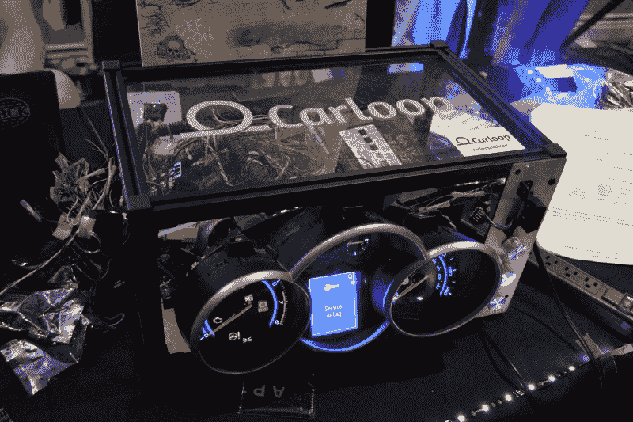](https://hackaday.com/wp-content/uploads/2018/08/dc26-car-hacking-carloop-cluster.jpg)

当我想到汽车黑客时，首先想到的是 CAN 总线。CAN 是几乎所有现代车辆上数据网络使用的协议。标准因制造商而异，自计算机被赋予控制发动机、刹车、电动车窗、电动杯架、转向灯和车辆其他电子部件的任务以来，标准一直在不断发展。这是一个纸牌屋，是逆向工程的一次伟大冒险。

[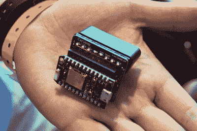](https://hackaday.com/wp-content/uploads/2018/08/dc26-car-hacking-carloop-hardware.jpg)

Carloop dongle

玩易拉罐最简单的方法就是去垃圾场买一个组合仪表，发动机控制单元和点火开关。这就是上面显示的一个漂亮的挤压框架盒，以及一个车身控制单元(控制窗户，锁，空调和收音机的东西)。这是一个关于 [Carloop dongle](https://www.carloop.io/) 的演示，它可以让你与汽车的 ODB-II 端口连接。

电子狗可以放在你的手掌里。这是一个粒子的分线板，根据你使用的 Carloop，你可以通过 WiFi，蓝牙或手机网络进行交互。早在 2016 年，Carloop 就在 Maker Faire 上首次亮相，最初的 50 台在几个小时内就销售一空。

  Most of a Ford Focus electronic system [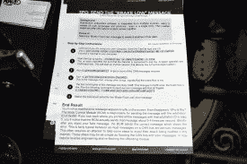](https://hackaday.com/2018/08/11/car-hacking-at-def-con-26/dc26-car-hacking-cluster-hacking-cheat-sheet/) CanCat hacking tutorial [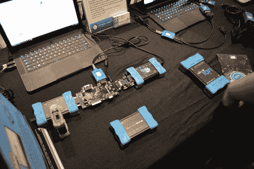](https://hackaday.com/2018/08/11/car-hacking-at-def-con-26/dc26-car-hacking-polished-tools/) CAN tools closer to the consumer level

汽车黑客村还使用了 2012 款福特福克斯集群，以及大量其他 CAN 总线显示器和用户输入。这是用于 [CanCat](https://github.com/atlas0fd00m/CanCat) 的演示装备，该板使用 Arduino Due 接口和 Python 脚本接口。你可以查看上面演示的说明。Carloop 和 CanCat 都是开源项目，但也有更多的消费级产品提供，如上面显示的 [neoVI Fire 2](https://www.intrepidcs.com/products/vehicle-network-adapters/neovi-fire-2/) 硬件。

## 汽车黑客 CTF 是一切的一部分

这个村庄有一个互动的夺旗挑战，鼓励你做任何事情。在杜卡迪摩托车上玩电脑？是的，请！黑一辆四轮越野卡丁车？当然啦！挑战以解锁网页的形式呈现，您可以在完成每项活动的过程中逐步完成。

 [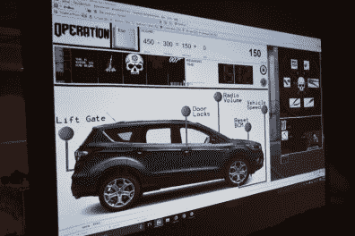](https://hackaday.com/2018/08/11/car-hacking-at-def-con-26/dc26-car-hacking-escape-scoreboard/)  [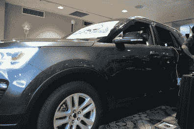](https://hackaday.com/2018/08/11/car-hacking-at-def-con-26/dc26-car-hacking-escaperoom-vehicle/) 

CTF 的一个有趣的部分是一个类似密室的游戏，除了你需要逃离这辆 SUV。玩家提前选择自己的难度等级，其中一个选项是模拟绑架。村里的工作人员会在白天蒙住你的眼睛，把你束缚在一个不知名的地方，然后把你扔进车后座。你将与倒计时钟对抗，试图逃脱你的束缚，侵入 SUV，将分数放在板上。

 [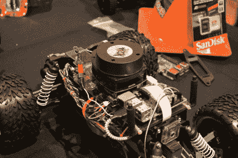](https://hackaday.com/2018/08/11/car-hacking-at-def-con-26/dc26-car-hacking-tensor-flow-lidar/) LIDAR on an autonomous RC vehicle [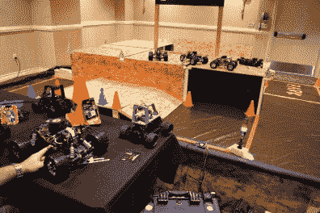](https://hackaday.com/2018/08/11/car-hacking-at-def-con-26/dc26-car-hacking-tensor-flow-donkey-autonomous-track/) 

自动驾驶汽车也有一些乐趣。这条测试赛道设置在一个角落，挑战人们使用 TensorFlow 绘制和导航赛道。我们之前已经见过其中一款名为[的汽车设计](http://www.donkeycar.com/)。上面的特写中有另一个模型，顶部有激光雷达来帮助绘图！

## 不明显的

[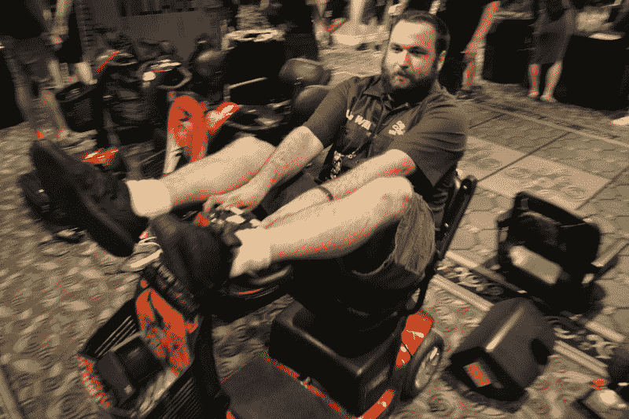](https://hackaday.com/wp-content/uploads/2018/08/dc26-car-hacking-mobility-scooter.jpg)

代步车黑客？技术上来说，这些东西可能是汽车？Hackaday [的朋友威尔·卡鲁阿纳](https://twitter.com/WillCaruana)负责这个新增加的项目，这个项目似乎与[@ defconbaddideas](https://twitter.com/defconbadideas)账户有关。当我找到威尔的时候，他正忙着拆除其中一个的控制装置。它们使用 24V，显然只有 50%的能量在工作，除非你在爬山时有更多的能量进入。他想用 36V 的电压给马达供电，让它超过 100%的极限。

 [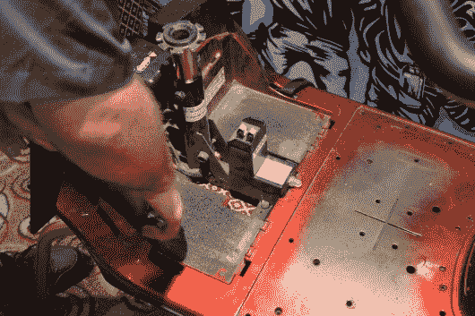](https://hackaday.com/2018/08/11/car-hacking-at-def-con-26/dc26-car-hacking-mobility-teardown/) Teardown of a mobility scooter [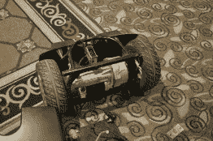](https://hackaday.com/2018/08/11/car-hacking-at-def-con-26/dc26-car-hacking-mobility-motors/) Mobility motor assembly [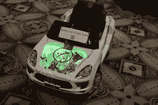](https://hackaday.com/2018/08/11/car-hacking-at-def-con-26/dc26-car-hacking-driverless-powerwheels-lol/) Some autonomous powerwheels

在这一点上，有四个不同的团队工作在移动滑板车黑客攻击。他们已经在赌场之间进行了一场比赛，所以当你到达长街的人行道时要小心。

有一辆漂亮的像电动轮一样的小汽车紧跟在房间里每个人的后面。我没有得到这方面的独家新闻，但如果你在现场，去火烈鸟看看吧。这是一个绝佳的机会，在你决定去垃圾场建立你自己的测试平台之前就开始吧。