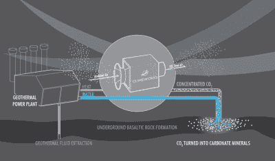
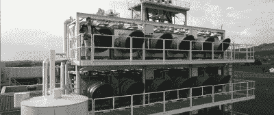
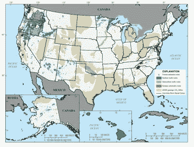

# 碳封存作为一项服务并不完全合理

> 原文：<https://hackaday.com/2021/10/15/carbon-sequestration-as-a-service-doesnt-quite-add-up/>

燃烧化石燃料会向大气中释放二氧化碳。虽然大多数减少温室气体排放的尝试都集中在减少二氧化碳排放量上，但是还有其他的选择。一段时间以来，碳捕获和封存一直是一个活跃的研究领域。能够直接从空气中提取二氧化碳，并以稳定的方式储存起来，将使我们能够降低大气中的二氧化碳水平，并在气候变化方面发挥重要作用。

一家名为 Climeworks 的公司最近的一个项目声称正在这样做，并把它作为订阅服务来运行。该公司刚刚在冰岛开设了最新的工厂，并希望从空气中吸收温室气体。今天，我们将检验这项技术是否是对抗气候变化的可行工具。

## 它是如何工作的

A diagram of the method of operation. Image credit: Climeworks

基本理论是从空气中捕捉二氧化碳，然后将其泵入地下，在那里可以安全、稳定地储存。这从[直接空气捕获](http://www.climeworks.com/our-technology/)开始:风扇吸入空气，二氧化碳被化学捕集在过滤器中。 [Climeworks 似乎使用了一种吸附型过滤器](https://tu-dresden.de/ing/maschinenwesen/iet/ess/ressourcen/dateien/herbstworkshop-ess-2017/V4-HW2017-Jan-Wurzbacher-Capturing-CO2-from-Air-Climeworks.pdf?lang=en)来捕获二氧化碳，但该公司网站上的细节很少。

一旦达到最大容量，过滤器就可以被加热以释放其捕获的 CO [2] ,从而将其储存起来。这种气体与水混合后被泵入地下深处的玄武岩层中。随着时间的推移，二氧化碳与矿物质反应形成稳定的碳酸盐。

科学论文以前报道过这个概念，在冰岛进行的一项试验探索了这个想法。在实践中，95%的注入 CO [2] 在不到两年的时间内成功矿化并储存。

## 实用吗？

The Climeworks facility in Switzerland. Image source: Climeworks

与任何碳存储技术一样，查看硬数据以确定这是否是应对气候变化的可行解决方案非常重要。这不仅包括可以储存的温室气体量，还包括实现这一目标所需的能量。

[2017 年，Climeworks 在瑞典运营了一家工厂](https://www.fr.de/wissen/schweizer-wundermaschine-geht-betrieb-11052722.html) ( [机器翻译](https://translate.google.com/translate?sl=auto&tl=en&u=https%3A%2F%2Fwww.fr.de%2Fwissen%2Fschweizer-wundermaschine-geht-betrieb-11052722.html))。这个装置每年能够从大气中去除 900 吨的二氧化碳，用来喂养温室。这个过程需要 1800 千瓦时到 2500 千瓦时的热能来从空气中捕获每吨二氧化碳。虽然能源需求可能看起来很高，但该小组指出，其他工业过程的废热通常足以满足所需的能源投入。

等式的存储部分不一定是困难的；目前的数据表明，冰岛海岸可以储存 7000 亿吨二氧化碳，世界上还有很多其他地质上合适的选择。

当时，该团队设定了一个目标，即到 2025 年，每年减少全球 1%的二氧化碳排放。[2019 年全球二氧化碳排放量预计为 368.1 亿吨](https://www.csiro.au/en/news/news-releases/2019/global-co2-emissions-set-to-reach-all-time-high#:~:text=Global%20fossil%20carbon%20dioxide%20emissions,Parties%20(COP25)%20in%20Madrid.)。去除 1%的二氧化碳需要 409，000 家工厂以每年 900 吨的速度运转。该小组被引述说，他们自己的模型将需要大约 250，000 家工厂，这大概是考虑到了 2025 年潜在的更高排放量和未来更大的封存工厂。

这些数字很高，实施这些设施需要大量的资金和土地。作为一个指南，麦当劳在全球经营着近 40，000 家餐厅。在短短的几年时间里，我们似乎不太可能看到近 250，000 座封存工厂在世界各地出现。各国政府仍在缓慢采取更简单的措施来减少产出。同样，许多国家推迟或干脆忽略了过去几年达成的国际协议中的目标。

## 封存即服务

不管怎样，Climeworks 坚持不懈。该公司与冰岛公司 Carbfix 合作，刚刚在冰岛开设了迄今为止最大的工厂。这座名为“Orca”的工厂旨在每年从大气中清除多达 4000 吨的二氧化碳。根据环保局的数据，这大约相当于 870 辆乘用车的排放量。

建造这座工厂的费用大约为 1000 万至 1500 万美元。该公司声称，该项目是未来五年(T1)达到“百万吨级”清除能力的垫脚石。凭借这种产能的设施，该公司可以通过 92，000 家工厂实现 1%的排放目标。这仍然是一个荒谬的数字；考虑到它对全球排放的有限影响，这个数字似乎大得不可思议。

假设世界上能找到足够的土地，以这样的速度建立工厂将花费 9200 亿美元。减少 1%的全球排放是一个巨大的代价。

那么谁来为此买单呢？Climeworks 的商业模式引起了一些人的质疑，它本质上提供了封存即服务。它允许公众抵消自己的碳排放，用户需要注册并支付月费。根据所选择的水平，用户每年支付一定数量的费用来抵消一定量的二氧化碳。

一个月 49 欧元(约 57 美元)，就可以支付每年捕获 600 公斤二氧化碳的费用。或者，同样的服务可以从转售商[明天的空气](https://www.tomorrowsair.com/act/clean-up)那里买到，标价高达 75 美元。作为一个指南，一个从伦敦到纽约的往返航班为每位乘客排放大约 [968 公斤的二氧化碳](https://www.theguardian.com/environment/ng-interactive/2019/jul/19/carbon-calculator-how-taking-one-flight-emits-as-much-as-many-people-do-in-a-year)。缩短到伦敦到罗马的距离，你会看到每位乘客大约 234 公斤。Climeworks 拥有 8662 个用户，遍布全球 56 个国家，并声称目前运营着 15 个空气捕获设施。

The USGS has surveyed the country to find potential areas that could store CO2\. However, the hard part is capturing it in the first place.

从表面上看，这种认购方式似乎是试图从有环保意识的个人那里为封存业务创造收入。值得注意的是，在该公司自己的常见问题中，它指出，订户已付费的 CO2 清除将在“订阅日期后的 5 年内或更早”执行。该公司向订户提供年度证书，但这些证书只注明“以[订户]名义订购清除的二氧化碳量。”然而，该公司确实声称正在寻求第三方认证，以提高其运营的可信度。

总的来说，这项技术本身并没有太大的问题。二氧化碳可以通过吸附过滤器从空气中捕获，同样也可以通过矿化过程储存起来。真正的问题是，在中短期内，这是否是应对气候变化的可行方案。根据目前的数据，投资其他领域似乎更有可能获得更大的收益。例如，在可再生能源和电网存储上投入巨资将首先消除大量的碳排放，完全避免以后从空气中提取二氧化碳的需要。

虽然碳捕获和封存在理论上是一个伟大的想法，但在实践中它还不存在。直接从大气中捕获二氧化碳(而不是像发电厂的洗涤器那样在源头捕获)的效率不够高，或者无法大规模实施，因此无法解决这个问题。对这项技术的研究应该继续，但不要指望它会成为未来几年拯救世界的灵丹妙药。