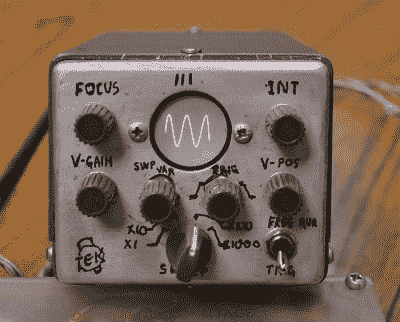

# 纸板模型追踪复古泰克迷你镜的设计过程

> 原文：<https://hackaday.com/2020/10/22/cardboard-models-trace-design-process-of-vintage-tektronix-miniscopes/>

没有多少品牌能像泰克一样激发顾客的热情。历史悠久的俄勒冈州高端测试设备制造商在过去 75 年里生产了比其他任何人都多的有收藏价值的设备。

在那段时间里，他们进行了大量的创新，在 20 世纪 70 年代，他们开始考虑将他们的旗舰示波器小型化。由现任和前任员工经营的 vintageTEK 博物馆对 200 系列便携式示波器的设计过程进行了回顾，这非常有趣。在那个时代，示波器就像一个打包的手提箱一样便携，在一个可放入口袋的外形中制作一个有用的仪器是一个相当大的挑战——即使是对大口袋来说。

 这篇文章详细描述了工业设计师和工程师之间的反复，工业设计师有着源源不断的模型，而工程师实际上必须将工作范围填充到他们想出的任何案例中。博物馆收藏的模型是历史的精彩片段，展示了工业设计师真正推动一些创新设计的地方。

一些模型显然是从大板凳 scopes 的设计，但一些有创新的翻盖和其他有趣的元素，从来没有生产。大多数模型都是纸板的，但也有一些是在机械加工厂用铝制成的，并带有人们熟悉的“泰克蓝”涂装。但该系列的*pie ce de resistance*是后来成为 200 系列微型望远镜的工程模型，这是一个手工制作的原型，带有一个微型圆形 CRT 和粗糙的控制标签。

vintageTEK 博物馆听起来像是计算机和技术历史爱好者的另一个遗愿清单。长期以来，Tek 一直以自己的方式做事情，参观博物馆肯定会是一种享受。

感谢[坦纳巴斯]的提示。