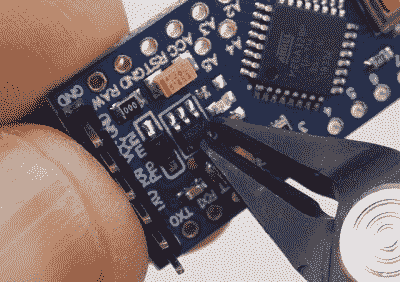

# 小心切割让伐木工在硬币电池上坚持一年

> 原文：<https://hackaday.com/2022/03/14/careful-cuts-lets-logger-last-a-year-on-a-coin-cell/>

硬币电池非常适合作为实时时钟等设备的备用电源，甚至可以为手表等非常小的机械设备供电。但是对于在标准微控制器上运行的数据记录器之类的东西，大多数人会选择某种锂电池。然而，这种构造并非如此，它从硬币电池中榨出每焦耳的能量来运行一整年的数据记录器。

Won’t be needing that anymore.

提高数据记录器效率所需的大多数设计和工程都涉及低功耗设备的标准实践，例如关闭不必要的组件，并在设备不活跃时将其置于睡眠状态，但这一构建远远不止于此。RTC 上的 Vcc 引脚被削波，禁用了部分内部逻辑，但基本功能保持不变。

所有的电压调节器都被移除或禁用，以支持不会浪费太多能源的定制电路。在可能的情况下，状态和电源 led 被移除，并且整个数据记录器也配备了定制的节能代码。

如果你正在开始一个低功耗项目，即使不是数据记录器，也值得看看这个版本，看看如果你愿意用切割工具和烙铁来破解 PCB，你能走多远。至于为什么这个数据记录器需要如此低的功率要求，原来它是教室里使用的套件的一部分，使用硬币电池极大地降低了整个单元的价格。即使你手头有锂电池，[检查一下你的微控制器的低功耗模式](https://hackaday.com/2017/09/24/datalogger-uses-esp32-and-esp8266-low-power-modes/)仍然是值得的。

感谢[阿德里安]的提示！