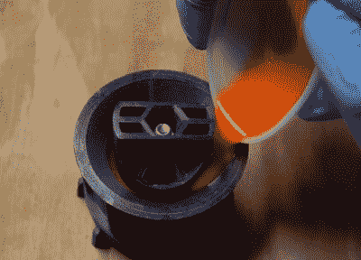

# 用 3D 打印模具铸造滑板轮子

> 原文：<https://hackaday.com/2020/12/26/casting-skateboard-wheels-with-a-3d-printed-mold/>

我们承认，大多数 Hackaday 员工不会在滑板上走得太远，但这并不意味着我们不能欣赏[Chris McCann]使用 3D 打印模具成功铸造的令人印象深刻的 DIY 轮子。从独特的颜色组合到实验材料，这一过程无疑为那些寻求真正定制他们的游乐设施的人开辟了一些有趣的可能性。尽管值得注意的是这其中有一定的风险因素。如果一套自制的轮子在速度上出了故障，对骑手来说可能会很糟糕。

模具的 STL 和 STEP 文件都是在知识共享署名 4.0 许可下发布的，这意味着任何拥有 3D 打印机的人都可以在家使用。不幸的是，这并不像点击打印并回到可用的模具那么简单。由于 FDM 3D 打印固有的层线，模具内部需要彻底打磨和抛光。[Chris]提到[在 ABS 中打印模具并使用蒸汽平滑](https://hackaday.com/2013/03/23/smoothing-3d-prints-with-acetone-vapor/)可能是一种可行的替代品，可以替代肘状油脂和 PLA，但他还没有亲自尝试过。

 一旦你把三个部分的模具打印出来，抹平，涂上合适的脱模剂，比如凡士林，就该做一些轮子了。每个轮子的核心实际上是从 PETG 3D 打印的，这应该给它相当合理的抗冲击性能。如果你有车床，生产铝芯也不会太难。将型芯装入模具后，从顶部注入聚氨酯树脂，直到填满所有的空间。

但是你还没有完成。树脂中所有的小气泡都需要在固化前处理掉。[【Chris】将装满的模具放入压力室](https://hackaday.com/2016/02/05/bubble-free-resin-casting-with-a-modified-paint-tank/)，尽管他提到真空脱气也是可行的，这取决于所用的氨基甲酸乙酯混合物。一切都凝固后，模具可以很容易地被拆开，露出新铸造的车轮。

虽然经常会有一些尝试和错误，但 3D 打印和树脂浇铸无疑是一个强大的组合。如果你能掌握相关的技术，[你就能生产出一些令人印象深刻的零件](https://hackaday.com/2016/07/14/learn-resin-casting-techniques-cold-casting/)，否则以黑客的预算来生产这些零件会非常困难。尤其是当[你准备开始浇铸熔融金属](https://hackaday.com/2020/12/07/how-to-get-into-lost-wax-casting-with-a-dash-of-3d-printing/)的时候。

 [https://www.youtube.com/embed/ck5xBcpLJgs?version=3&rel=1&showsearch=0&showinfo=1&iv_load_policy=1&fs=1&hl=en-US&autohide=2&wmode=transparent](https://www.youtube.com/embed/ck5xBcpLJgs?version=3&rel=1&showsearch=0&showinfo=1&iv_load_policy=1&fs=1&hl=en-US&autohide=2&wmode=transparent)

