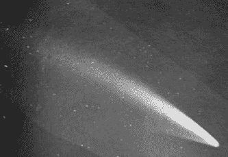
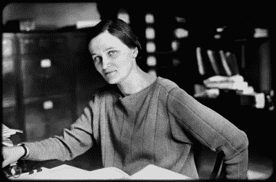
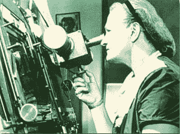

# 塞西莉亚·佩恩·加波施金看穿了星星

> 原文：<https://hackaday.com/2020/12/15/cecilia-payne-gaposchkin-saw-through-the-stars/>

作为人类，我们自己看待事物的方式是有限的，我们依赖他人的不同观点和见解来帮助理解事物。只需要一个人看一组数据，发现一些完全不同的东西，改变我们对宇宙的基本看法。

塞西莉亚·佩恩·加波施金发现恒星主要由氢和氦组成，而当时天文学家认为太阳和地球在元素上没有显著差异。她提出氢不仅更普遍，而且是普通的一百万倍。

这个古怪的结论在当时遭到了彻底的否定，直到几年后她的发现得到了广泛的证实，她才缓和了论文中的一些结论。真正具有突破性的是，在恒星中普遍存在氢的发现为我们目前理解它们作为我们所知道和喜爱的重元素的熔炉的作用铺平了道路，事实上它们是由重元素组成的。

## 陨石、彗星和蜜蜂兰花

塞西莉亚·海伦娜·佩恩 1900 年 5 月 10 日出生于英格兰白金汉郡的温多弗。她是艾玛和律师、历史学家和音乐家爱德华的三个孩子之一。她四岁时，父亲就去世了，留下母亲独自一人养家。

The Great Daylight Comet of 1910 as seen by Lowell Observatory. Image via [Wikipedia](https://en.wikipedia.org/wiki/Great_January_Comet_of_1910)

当她只有几岁的时候，塞西莉亚看到一颗陨石划过天空，完全被迷住了。八岁时，她发现了一株生长在果园里的蜜蜂兰花，此后她继续对科学表现出兴趣。这很令人兴奋，因为蜜蜂兰花原产于地中海，而不是英格兰。几年后，她目睹了 1910 年的大白天彗星和同年的哈雷彗星。

塞西莉亚的母亲在她 12 岁的时候为了她的哥哥汉弗瑞的教育把他们搬到了伦敦。塞西莉亚的教育侧重于语言，但她对植物学和其他科学更感兴趣。她自学了植物学和数学，她的一位老师带她去博物馆，借给她书看。

17 岁时，塞西莉亚终于能够学习科学了。她转到圣保罗女子学校，在那里呆了两年，然后获得了剑桥大学纽汉姆学院的奖学金。她主修植物学、物理学和化学，但在参加了阿瑟·爱丁顿爵士关于日食和相对论的讲座后，她的兴趣坚定地转向了天文学，这改变了她的世界图景。

Cecilia works at the observatory. Harvard College Observatory via [Brain Pickings](https://www.brainpickings.org/2019/05/08/cecilia-payne-harvard-observatory-radio-talks/)

## 明星的东西

塞西莉亚在英国的选择仅限于教学，所以她寻找能让她去美国的助学金。1923 年从纽汉姆大学毕业后，她获得了国家研究奖学金，用于在拉德克利夫学院进行研究生学习，这是一所与哈佛大学有关联的女子学院，当时该学院只招收男生。

她的学术顾问说服她写一篇博士论文，尽管拉德克利夫大学或哈佛大学没有天文学项目。当时普遍认为地球和太阳是由相同的元素组成的。通过研究数万张光谱图像，塞西莉亚确定太阳和其他恒星主要由氢和氦组成。她建立了恒星温标，并通过应用天文学家 Meghnad Saha 的电离理论，将恒星的光谱类别与其温度精确地联系起来。她的论文发表于 1925 年，她获得了哈佛大学和拉德克利夫学院的第一个天文学博士学位。

包括亨利·诺利斯·罗素在内的一些教师和天文学家发现她的论文有问题，因为它太不正统了。他们甚至强迫她添加一份声明，说太阳中存在氢的可能性极小。在四年内，塞西莉亚的发现被其他人独立验证，包括亨利·诺利斯·罗素。具有讽刺意味的是，尽管拉塞尔在自己的论文中称赞了塞西莉亚，但他却经常称赞这一发现。

Cecilia at the blink microscope. Image via [Harvard Square Library](https://www.harvardsquarelibrary.org/biographies/cecilia-payne-gaposchkin-3/)

## 佩恩-加斯波什金教授

获得博士学位后，塞西莉亚研究了高光度恒星，以便更好地了解银河系的结构。1933 年，她在德国遇到了天体物理学家谢尔盖·I·加波什金。第二年他们结婚，并在哈佛附近的一个小镇定居，最终抚养了三个孩子。塞西莉亚于 1931 年成为美国公民，并在几年后帮助谢尔盖获得了美国公民身份。

塞西莉亚和谢尔盖一起调查了所有亮度超过十等的恒星。塞西莉亚与谢尔盖和她的助手一起，对变星进行了 300 多万次观察。她出版了几本书，包括*高光度恒星* (1930 年)、*变星* (1938 年)和*变星和星系结构* (1954 年)。1966 年，塞西莉亚从教学岗位上退休，但继续从事研究，编辑哈佛天文台出版的书籍和期刊。多年来，各种各样的人尽其所能提升她在哈佛的地位。她是第一个被提升为正教授的女性，也是第一个领导一个系的女性。她为同工同酬而斗争，但在教学生涯的大部分时间里，她挣的工资与初级男教授一样多。

尽管如此，塞西莉亚在许多方面都有影响力。她的几个学生，如海伦·索亚·霍格，继续对天文学做出了自己的重要贡献。当琼·费曼在一本天文学教科书中发现塞西莉亚的名字时，她重拾了足够的信心，不顾母亲和祖母的意愿去学习科学。

塞西莉亚一生赢得了许多奖项，是第一位获得安妮·约姆普·坎农天文学奖的人。她于 1979 年 12 月 7 日在马萨诸塞州的剑桥去世，但她对科学的巨大贡献将永远被人们铭记。

感谢[基思奥尔森]的提示。