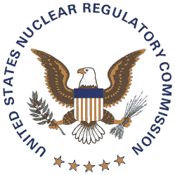
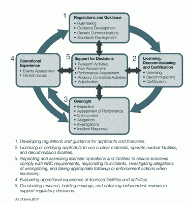
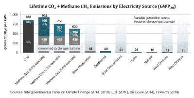

# 核证核反应堆:NRC 如何批准其第一个小型模块化反应堆设计

> 原文：<https://hackaday.com/2020/10/01/certifying-nuclear-reactors-how-the-nrc-approved-its-first-small-modular-reactor-design/>

美国核管理委员会(NRC)最近宣布[已经批准了 NuScale 的 SMR](https://www.businesswire.com/news/home/20200828005299/en/) (小型模块化反应堆)设计的认证，完成了 NuScale 设计认证申请(DCA)的第 6 阶段审查。这意味着一旦规则制定程序完成，使用 NuScale 反应堆设计的 SMR 可以在美国合法建造。美国核管理委员会的认证也意味着在其他国家的设计认证不会造成重大障碍。

对于大多数人来说，在这一点上仍然没有答案的一个问题是，NRC 的这个认证过程实际上是如何工作的。在过去的几十年里，当美国核工业日渐衰弱的时候，美国核管理委员会是否有很多部门的工程师无所事事？NuScale 作为认证过程的一部分必须向 NRC 发送的数百万份文件中有什么，这六个阶段到底是什么？

在了解了一点 SMR 历史之后，请继续关注核反应堆认证速成班。

## 来自苏联的爱

SMR-powered Sevmorput container ship in 2007.

尽管小型模块化反应堆( [SMR](https://en.wikipedia.org/wiki/Small_modular_reactor) )的概念近来被大肆宣扬，但它无论如何都不是一个新概念。例如，为美国、法国、中国和俄罗斯的军舰和潜艇提供动力的反应堆就是 SMR。它们基本上是自给自足的装置，在[海军反应堆](https://en.wikipedia.org/wiki/United_States_naval_reactors)的情况下，可以使用低浓缩铀或高浓缩铀(主要是美国)燃料，热输出不到 100 兆瓦到几百兆瓦，燃料寿命约为 10-30 年。

目前唯一一个在商业服务中使用 SMRs 的国家是俄罗斯，俄罗斯的第一个 SMR(EGP 6 号反应堆)本质上是 T2 RBMK 反应堆(因切尔诺贝利 4 号反应堆而流行)的缩小版，电能为 12 兆瓦。其中四个反应堆建于 20 世纪 70 年代的比利比诺核电站，其中三个至今仍在运行。这些反应堆计划由“罗蒙诺索夫院士”号上的 [KLT-40S](https://en.wikipedia.org/wiki/KLT-40_reactor) SMR 取代，后者产生约 52 兆瓦的电力。

世界上唯一的核动力集装箱船 [Sevmorput](https://en.wikipedia.org/wiki/Sevmorput) 号使用 KLT-40 SMR 号，俄罗斯破冰船如[泰米尔](https://en.wikipedia.org/wiki/Taymyr_(1987_icebreaker))号也是如此。KLT-40 背后的公司(OKBM Afrikantov)最近见证了其继任者 RITM-200 SMR 凭借 [LK-60Ya 系列破冰船](https://en.wikipedia.org/wiki/Project_22220_icebreaker)首次进入商业服务。这些 SMR 设计为每 6 到 10 年换一次燃料，RITM-200 的电力输出功率为 55 兆瓦(55 兆瓦)，而 RITM-400 的电力输出功率为 120 兆瓦(315 兆瓦热输出功率，或兆瓦特)。

其他国家在 SMRs 方面的经验远不如俄国，尽管阿根廷的 25 MWe [CAREM](https://en.wikipedia.org/wiki/CAREM) SMR 项目已经处于建设的最后阶段，而中国正在以 125 MWe [ACP100](https://www.world-nuclear-news.org/Articles/CNNC-launches-demonstration-SMR-project) 的形式建设其第一个 SMR。像韩国这样的国家已经获得了设计许可，但仍然需要有兴趣的商业团体来建造它们。[东芝的 4S](https://en.wikipedia.org/wiki/Toshiba_4S) SMR 原定在阿拉斯加安装，直到 2011 年该项目被取消。

显然，在考虑 NuScale 的新 SMR 设计时，授权 SMR 有很多背景历史可以参考。

## 安全决定

自 1974 年成立以来，NRC 的任务之一就是监管商业核电站。这包括[证明](https://www.nrc.gov/reactors/new-reactors/design-cert.html)一个新的反应堆设计在美国的建设和运行是安全的。这种设计证书的有效期为 15 年，此后每 10 至 15 年需要更新一次。

在 NRC 关于新核电厂设计的背景介绍中他们在新设计中寻找的一些东西都包括在内。这些设计包括改进现有的设计，使之更简单，并利用重力等有利因素。例如，这反映在与第二代反应堆设计相比的第三代+反应堆设计中，在第二代设计中，前者几乎总是使用冷却回路的重力和热特性进行非能动冷却。

查看 NuScale SMR 的[审查时间表页面](https://www.nrc.gov/reactors/new-reactors/smr/nuscale/review-schedule.html)，我们可以看到许可流程经历的各个阶段。初次申请和验收审查后，安全审查正式开始。对于 NuScale 的设计，第一阶段始于 2018 年 4 月的初步安全评估报告(SER)。接下来是第 2 阶段，在第 1 阶段提出问题后，根据新提供的信息创建新的 SER。在第 3-6 阶段之后，这在最后的 SER (FSER)中达到高潮，伴随着[的是 NRC 新的和更新的许可证部门的主任 Anna H. Bradford 给 NuScale](https://www.manufacturing.net/home/news/21194253/2-charges-dismissed-in-trial-over-plant-fire-during-harvey) 的这封信。

在 NRC 关于 FSER 竣工的[新闻稿中，注意到他们满足了该机构 42 个月的技术审查时间表，下一步将是](https://www.nrc.gov/reading-rm/doc-collections/news/2020/20-043.pdf)[规则制定](https://www.nrc.gov/about-nrc/regulatory/rulemaking.html)过程，在该过程中，设计将被正式认证。该证书将“允许公用事业公司在申请建造和运营核电厂的综合许可证时参考该设计”。

## 这是一个工程问题

An overview of the NRC’s tasks and responsibilities.

FSER 文件都可以在核管制委员会的网站上公开获得。[第 1 章](https://www.nrc.gov/docs/ML2020/ML20204A986.pdf)(“介绍和一般讨论”)概括介绍了 NuScale 应用程序所经历的整个过程。它包括分级审查方法，根据设计的不同方面是否与安全相关和风险显著(A1)以及与安全无关和风险不显著(B2)，使用四种不同规范中的一种来考虑设计的不同方面。

由于轻水反应堆(LWR)和 SMR 不是我们之前看到的新事物，它们能够使用标准参考( [NUREG-0800](https://www.nrc.gov/docs/ML0923/ML092330826.pdf) ，“核电厂安全分析报告审查的标准审查计划:LWR 版”，特别是 SMR 部分)。在与 NuScale 工程师的访谈和会议中，NRC 工作人员煞费苦心地获得所有相关问题的答案，包括 B2 级项目的失败是否会对 B1 级或 A 级项目产生影响。

对于每一项，NuScale 的声明都经过审查，使用实验数据(由 NuScale 的工程师提供)来支持上述声明。NuScale 的 NIST-1 (NuScale 整体系统测试设施)是 NuScale 创建的一个实验设施，用于检查反应堆容器和其他地方在工作反应堆系统中可能出现的情况。NuScale 准备了超过 200 万页的数据和其他信息，并将其发送给 NRC 以帮助认证过程。

## 让工业界和学术界参与进来

在 NRC 拥有大量只处理 NRC 相关任务的工作人员是相当疯狂的，因此 NRC 的工作人员相当少，每年有大量的[合同](https://www.nrc.gov/about-nrc/contracting.html)授予商业公司、非营利组织和大学，涵盖从技术援助到研究的一切。除此之外，还有由 NRC 赞助的[研究项目](https://www.nrc.gov/about-nrc/regulatory/research.html)，目的是加强该机构对任何相关主题的了解，包括材料科学、安全方法以及新技术和材料的确切属性等主题。

这些信息随后被记录在监管文件(NUREGs)中，随后用于核反应堆的许可和重新许可。NRC 在他们的网站上维护着一个大型的图书馆部分，其中包括 NUREGs。所有这些都有助于使整个核电监管过程对公众尽可能透明，同时也提供有关技术、材料和过程的宝贵信息。

## 吸取教训

The carbon footprint of energy sources compared.

NRC 的任务之一当然也是对当前事件做出反应，比如 2011 年大规模海啸和地震袭击日本东海岸，导致福岛第一核电站事故。尽管日本国会(调查该事件的委员会)[得出结论，这是一起人为事故](https://www.nirs.org/wp-content/uploads/fukushima/naiic_report.pdf)，导致负责公司(TEPCO)被国有化，但 NRC 采取措施，确保[从这起事故中吸取的任何教训](https://www.nrc.gov/reactors/operating/ops-experience/japan-dashboard/priorities.html)将适用于美国所有的反应堆，无论是现有的还是待建的。

随着 TEPCO 的国有化，日本也改革了其旧的和不充分的核能管理委员会成为一个新的机构，核能管理局。这个机构的风格更像 NRC 的结构，确保它尽可能的公正和科学驱动。

尽管商业核能是最安全的发电方式，碳排放量非常低，但它的形象已经被 T2 的反核情绪严重玷污。当 NuScale 这样的初创公司寻求利用 SMRs 不仅对电网进行大规模脱碳，还替代其他碳密集型来源(如供热或制氢)时，这大大增加了赌注。NRC 的透明度在这方面很有帮助，但很少有人会花时间通读他们的综合图书馆或以其他方式自学。

NuScale 的常见问题也反映了[对“常见问题”的某种程度的失望。在商业核工业中，以及在相关领域中，存在这样的希望，即关注科学和技术，而不是不正确和/或过时的信息。已经解决的安全问题是其中一项，因为“核废料”一词的不正确使用是指用过的 LWR 燃料，它实际上只是用于快中子反应堆的“T2”燃料。](https://www.nuscalepower.com/about-us/faq)

NRC 以及加拿大的类似机构( [CNSC](https://nuclearsafety.gc.ca/eng/) )证明了一个监管良好的行业，在这个行业中，科学家、工程师和无数其他人共同努力，为每个人的利益创造一个更美好、更清洁的世界。