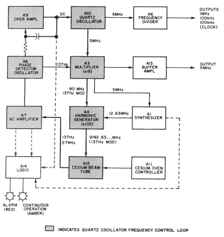

# 铯原子钟拆卸，或量子物理游乐场

> 原文：<https://hackaday.com/2020/03/25/cesium-clock-teardown-or-quantum-physics-playground/>

得到老式测试设备的一半乐趣就是打开它。也许这就是乐趣的一半以上。[CuriousMarc]得到了一个 [HP 5061A 铯原子钟](https://www.youtube.com/watch?v=eOti3kKWX-c)，作为试图证明相对论的模型，这是一个有点名气的仪器。原因？这座钟真的是第一座可以方便移动的钟，包括放在飞机上。可以看下面的视频。

根据视频，你可以将狭义相对论简化为，如果你走得快，时间就会变慢——这就是众所周知的时间膨胀。广义相对论表明时间随着重力的增加而变慢。因此，使用机载铯原子钟，你可以让钟在高空盘旋或高速飞行，以检验爱因斯坦的预测。
  我们非常喜欢设备手册中的一句话:“5061A 型铯束频率标准本身能够定义频率，因此无需校准。”根据国际协议，铯的超精细跃迁的定义是 9192631770 赫兹。

一个 5 MHz 晶体振荡器产生一个由 137 Hz 信号调制的信号。调制信号被放大 18 倍，然后利用谐波放大 102 倍。这提供了一个激发铯束管的大致正确值的信号。电子管的输出用于锁相环中，以控制 5 MHz 时钟的正确启动。这是可行的，因为如果载波频率与铯的超精细跃迁频率完全相同，电子管将输出两倍的调制频率。如果有任何变化，输出将包括基频(137 Hz)，如果环路处于锁定状态，则不存在基频。

管子最终会耗尽铯，因为仪器实际上会蒸发掉几克铯。[马克的]似乎还有点生命力。您可以看出仪器已经过维修，因为试管标记为安捷伦，所以它不是原装试管。

这个视频很好地解释了铯以及超精细跃迁到底是什么。定义的频率是在没有磁场的情况下，但是因为地球有磁场，你必须有一个策略来处理它。在管子里，有强大的磁铁控制着地球的磁场。这导致了一个误差，但是一个仪器可以校正的已知误差。

想知道在核时代之前时钟标准是怎样的吗？我们大多数人仍然不得不满足于[铷](https://hackaday.com/2014/11/27/jaw-dropping-atomic-clock-build/)或 [GPS 学科](https://hackaday.com/2018/06/04/gps-disciplined-oscillators/)。

 [https://www.youtube.com/embed/eOti3kKWX-c?version=3&rel=1&showsearch=0&showinfo=1&iv_load_policy=1&fs=1&hl=en-US&autohide=2&wmode=transparent](https://www.youtube.com/embed/eOti3kKWX-c?version=3&rel=1&showsearch=0&showinfo=1&iv_load_policy=1&fs=1&hl=en-US&autohide=2&wmode=transparent)

