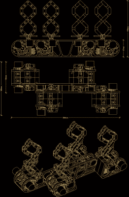

# 链条时钟拖着时间走

> 原文：<https://hackaday.com/2021/01/27/chain-link-clock-drags-time-along/>

当谈到建造古怪的时钟，同时也是美丽的动画雕塑时，[Ekaggrat Singh Kalsi]是一位杰出的大师。他的最新产品是 [Getula](https://hackaday.io/project/176659-getula) ，这是一款灵感来自一条废弃的旧自行车链条的计时腕表，而其名称似乎是受链条 kingsnake—[Lampropeltis Getula](http://Lampropeltis getula)的启发，因为它有蛇形运动。Getula 通过操纵八个短链来显示时间，显示代表小时和分钟的四个数字。但是，将一段灵活的链条转变成数字，结果证明是一项比他预想的要复杂得多的努力，他不得不在这个过程中做出一些妥协。

他不能使用真正的自行车链条，因为它们太软太重，无法保持他想要的形状。相反，他设计了定制的 3D 打印链，类似于用于电缆管理的牵引链。为了增加刚性，他在链节上加了 O 形圈来增加摩擦力。但即使这样，也不足以用一根链条完整地形成每个数字。

折衷的办法是在每个数字上使用两根链子，这样可以更艺术地表达时间。每一段链条都用步进电机推动或拉动，用伺服系统弯曲成形。最终的结果是一个迷人的舞蹈链链接，步进机和伺服每分钟，昼夜不停。

设计时钟不是一项简单的工作，所以[Ekaggrat]经过几次迭代对它进行了改进。有四个同步工作的模块化模块，每个模块都由一个 Arduino Nano、两个带电机的步进电机驱动器和两个伺服系统组成。每条链的起点都有一个嵌入的磁铁，霍尔传感器可以感应到磁铁，将链初始化到一个已知的位置。DS1307 RTC 模块提供计时功能。该项目仍在进行中，而且[Ekaggrat]已经设法完成了四个模块中的一个——让我们看到了迎接 2021 年的 Getula。

如果你喜欢更闪亮的东西，可以看看他的[独特的时钟，它最终将黑客和亮片结合在一起，](https://hackaday.com/2020/01/30/unique-clock-finally-unites-hackers-and-sequins/)而他的其他一些创作，如 [Edgytokei](https://hackaday.com/2018/01/09/edgytokei-time-on-the-edge/) 时钟和 [Torlo](https://hackaday.com/2017/06/08/torlo-is-a-beautiful-3d-printed-clock/) 时钟都具有美丽而复杂的 3D 打印机制。

 [https://www.youtube.com/embed/ZXhVSKZmvAM?version=3&rel=1&showsearch=0&showinfo=1&iv_load_policy=1&fs=1&hl=en-US&autohide=2&wmode=transparent](https://www.youtube.com/embed/ZXhVSKZmvAM?version=3&rel=1&showsearch=0&showinfo=1&iv_load_policy=1&fs=1&hl=en-US&autohide=2&wmode=transparent)

