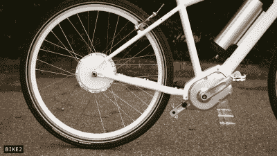

# 无链“数字驱动”自行车使用电力传输代替

> 原文：<https://hackaday.com/2022/12/23/chainless-digital-drive-bikes-use-electric-power-transmission-instead/>

我们都熟悉普通自行车的工作原理，踏板通过简单的链传动连接到后轮。这种装置重量轻，价格便宜，效率高。然而，这并不是驾驶自行车的唯一方式，而且围绕“数字驱动”自行车的概念有很多讨论。

Look, ma – no chains!

这些传动系统依靠电气方法代替机械方法来传递动力。踏板被用来转动发电机，然后电力被传送到驱动后轮的电动机。这个概念听起来可能过于复杂，但它确实提供了一些好处。发电机可以改变其运行方式，使骑车人以最高效、最稳定的速度蹬车。也不会有链条脱落，挂在衣服上，或者需要定期维护。

这将使集成再生制动成为可能，让自行车在下坡时也能获得能量。这可以通过蓄电池或超级电容器来实现。作为一个额外的奖励，它将非常容易为骑手集成助力，例如在处理艰难的山坡时。不需要直接的机械动力传输也意味着有更多的灵活性来设计具有有趣几何形状的自行车。

然而，这种驱动系统确实损失了一些效率。机械能和电能之间的所有能量转换意味着“数字驱动器”可能只有 58%的效率。这与普通机械驱动自行车大约 95%的动力传递效率相比就很糟糕了。也有体重的惩罚。

目前，市场上只有一种“数字驱动”自行车——被称为 Mando Footloose。这是一种俯冲、折叠、未来主义的设计，在踩踏板时会有一些感觉问题。而且，考虑到这些系统增加的复杂性和费用，普通自行车或 T2 电动自行车不太可能很快消失。不管怎样，想想其他传动系统概念改变我们骑行方式的潜力是很有趣的。休息后的视频。

 [https://www.youtube.com/embed/r-Zyp6jX0HM?version=3&rel=1&showsearch=0&showinfo=1&iv_load_policy=1&fs=1&hl=en-US&autohide=2&wmode=transparent](https://www.youtube.com/embed/r-Zyp6jX0HM?version=3&rel=1&showsearch=0&showinfo=1&iv_load_policy=1&fs=1&hl=en-US&autohide=2&wmode=transparent)

【感谢 Keith Olson 的提示！]