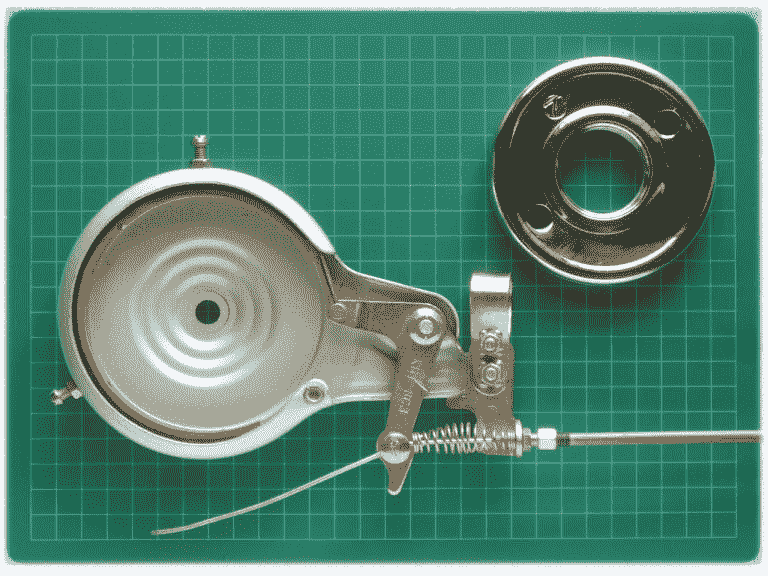
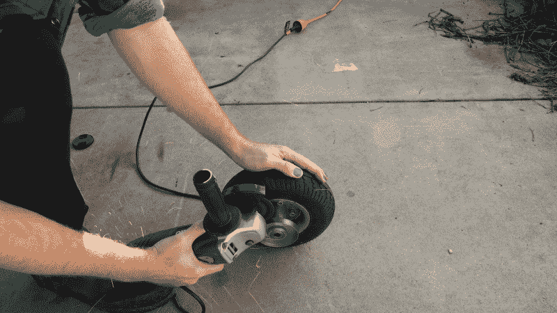
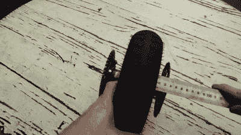
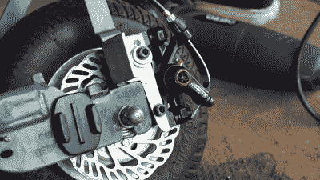
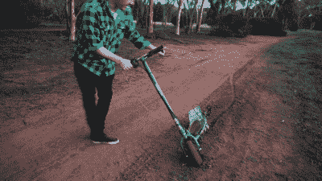

# 廉价电动滑板车获得大刹车升级；解锁正确的漂移模式

> 原文：<https://hackaday.com/2019/08/14/cheap-electric-scooter-gets-a-big-brake-upgrade-unlocks-proper-drift-mode/>

在过去的几年里，电动滑板车的地位大幅上升。无刷电机、锂电池、滑板车共享公司把它们带到了主流。然而，各种设计的电动滑板车已经存在了很长时间，催生了一个专注的黑客亚文化，旨在充分利用它们。

一个这样的黑客是你真正的黑客，早在 2009 年，他就开始用各种推进系统修改基本的踏板车。在对在没有机床的情况下制造高速旋转组件的局限性感到沮丧之后，我把目光转向了市场上可以买到的东西。用我的第一份工程薪水，我给自己买了一个剃须刀 E300，但很快对它的性能感到失望。很自然，随着铅酸电池被替换成锂，黑客攻击随之而来。

这些年来，电池、控制器甚至又大又重的有刷电机都被更换了。基本的机械布局是合理的，很容易用简单的手工工具进行修改。随着加速变得剧烈，最高时速逐渐接近 40 公里/小时，我开始对滑板车的一个明显的主要缺陷越来越失望。是时候修理刹车了。

## 如果你以前听过这个，请阻止我

A typical band brake, similar to the type fitted to the Razor E300\. Note the drum, top right, which is mounted to the wheel to be braked.

剃须刀 E300 备有带式制动器，类似于反鼓式制动器。当拉动刹车杆时，刹车索拉动一个杆，该杆拉紧连接在踏板车后部从动轮上的鼓周围的带子。

带式制动器制造成本低，在某些应用中可能有效。不幸的是，E300 刹车上使用的廉价冲压金属外壳容易变形，导致制动带和制动鼓之间的错位。仅仅是漫不经心地在坑坑洼洼的人行道上骑来骑去就足以引发问题。通常情况下，刹车要么持续摩擦鼓，浪费能量，要么无法产生足够的摩擦力来减慢踏板车的速度。无论哪种方式，它通常不能锁定后轮做可怕的打滑，这是一个耻辱。与电动滑板车有一点不酷的氛围类似于赛格威，不能做上述可怕的滑行的影响不能低估。

## 升级到盘式制动器

像鼓式制动器的所有变体一样，带式制动器与卓越的盘式技术相比相形见绌。对于汽车和大规模应用，这主要是由于改善散热和更容易维护。在我们的情况下，其他因素更重要——自行车盘式制动器便宜，在易贝很容易买到，如果安装正确，应该不会遇到摩擦或缺乏制动力的问题。一系列不同尺寸的光盘，连同卡钳和安装支架的价格低于 50 澳元。卡钳可以安装在远离障碍物的地方，大小合适的制动盘也应该不会受到冲击。

尽管我接受了多年的正式工程训练，但我从来都不喜欢在开始工作前起草设计。相反，在将零件浸泡在装运箱中 18 个月后，我终于在一个阳光明媚的冬日将它们拿出来，并开始盯着摩托车的后部，直到有了一个计划。

The drum was cut back to leave a plate suitable for mounting the brake disc.

非常优雅的是，带式制动器的制动鼓很好地充当了制动盘的安装面。通过用角磨机去除摩擦表面，我留下了一个漂亮的平板连接到轴上，我会用螺栓固定在制动盘上。对圆盘的安装凸耳进行了轻微的修改，以清除轮轴的中心，它滑动到轮毂上，并用三个 M4 螺栓连接。

使用直尺检查圆盘是否垂直于轴并正确对齐。需要在后部组件上增加垫片，以弥补原带式制动器组件的宽度不足；在这种情况下，一系列三个半英寸的垫圈完成了任务。

It’s important to check that the disc is mounted straight and true.

A simple steel bracket mounted the caliper to the rear. Alignment is easy thanks to adjustment built into the factory caliper mounts.

卡钳更加困难，需要制造一个定制的支架来将卡钳安装硬件与 E300 的框架结合起来。一块钢制 L 形角钢被加工成合适的形状，用螺栓固定在后车架上。钢板可能已经足够了，但是黑客经常使用先到手的东西。正确安装对于确保刹车有效工作至关重要，因为卡钳与制动盘的错位会导致刹车片过早磨损，使踏板车减速。令人欣慰的是，卡钳自带的安装硬件允许对最终位置进行一些调整，这意味着支架不必达到特别高的精度。

所有的东西都用螺栓固定好了，剩下要做的就是用一根足够长的刹车索替换原来的刹车索，直到后卡钳，后卡钳比原来的带式刹车安装得更靠后。原来的刹车杆也是廉价的建设，并取代了更好的全金属单位也来自易贝。

## 表现如何？

Skids in mud make for a fun, albeit messy, afternoon.

在最初的一些令人头痛的原始塑料刹车杆崩溃后，新的盘式刹车装置表现出色。即使在崎岖不平的沥青路面上，厚实、厚实、高速的滑行也很容易。当不使用时，制动器几乎没有噪音，这是对持续尖叫的带式制动器的巨大改进。这有一个副作用，大大提高了滑板车的隐形能力。从动力上来说，这是一个更好的体验，尽管在湿滑泥泞的山坡上下坡时仍然感觉不到前制动器的缺失。

现在骑摩托车是一种享受，这是一种升级，我希望我能更快完成。任何有电钻和研磨机的人应该可以在一个周末完成转换。希望这个黑客能激励你改进你自己的车辆，以获得更好的性能，对于那些陷入困境的人，我期待着在路上看到你！

 [https://www.youtube.com/embed/7jXPPaRMylI?version=3&rel=1&showsearch=0&showinfo=1&iv_load_policy=1&fs=1&hl=en-US&autohide=2&wmode=transparent](https://www.youtube.com/embed/7jXPPaRMylI?version=3&rel=1&showsearch=0&showinfo=1&iv_load_policy=1&fs=1&hl=en-US&autohide=2&wmode=transparent)

