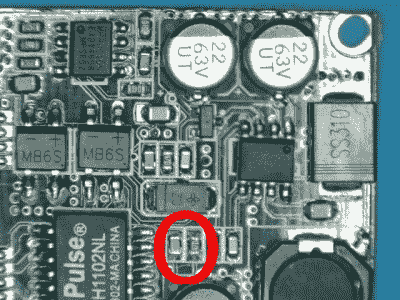

# ESP32 的以太网廉价电源

> 原文：<https://hackaday.com/2019/02/05/cheap-power-over-ethernet-for-the-esp32/>

虽然我们看到的大多数 ESP32 项目都利用了其强大的无线功能，但如果您愿意，该芯片可以轻松连接到有线网络。[Steve]喜欢将他的 ESP32s 放在有线网络上的想法，但发现需要二次电源连接很麻烦。因此，他决定修改一些廉价的以太网供电(PoE)硬件，并创建一个单电缆解决方案(T2 谷歌翻译 T3)。

 【史蒂夫】买了一个用于安全摄像头的 PoE 模块，仔细查看了一下电路板，以确定它使用了哪种硬件来产生标称的 12 V 输出。他找到了一个 MP2494 降压转换器，根据手中的数据手册，他发现如何通过改变电路中的电阻值来配置输出电压。将 21.5kω电阻替换为 57.1kω电阻后，转换器的输出变为电子设备所需的 5 V。

当然，这只是解决了问题的一半；他仍然需要将 PoE 设备的以太网端连接到为 ESP32 提供以太网的 Waveshare LAN8720 板。因此，他将 LAN8720 上的 RJ45 插孔完全移除，并将其直接连接到 PoE 板上的连接器。有益的是，PoE 板的底部贴有所有引脚的标签，因此这并不像您预期的那样难以理解(如果一直这么简单就好了)。

[我们之前已经介绍过 Waveshare LAN8720 板](https://hackaday.com/2017/04/18/enabling-ethernet-on-the-esp32/)，供任何对获得 ESP32 谈话以太网感兴趣的人使用。如果你想知道如何让 PoE 为你工作，我们自己的[【乔纳森·本内特】已经展示了他家的树莓 Pi 基础设施](https://hackaday.com/2018/09/26/hack-my-house-raspberry-pi-as-infrastructure/)[大量使用了新的 PoE 帽子](https://hackaday.com/2018/08/26/rasberry-pi-poe-hat-released/)。