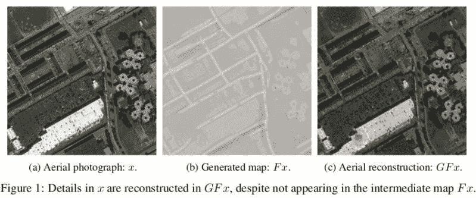

# 作弊人工智能抓住隐藏数据使用隐写术

> 原文：<https://hackaday.com/2019/01/03/cheating-ai-caught-hiding-data-using-steganography/>

今天的人工智能就像一个在学校里跑得超快的孩子，他的老师需要比他更聪明，如果不是一样快的话。令人惊讶的是，一种(卫星)图像到(地图)图像的转换算法被发现在生成地图时隐藏了各种各样的备忘单，使[看起来好像已经“学会”有效地做相反的事情](https://arxiv.org/pdf/1712.02950.pdf) [PDF]。

CycleGAN 是一个擅长学习如何映射图像转换的网络，例如将任何旧照片转换成看起来像梵高或毕加索的照片。另一个例子是能够获取马的图像并添加条纹，使其看起来像斑马。经过训练的 CycleGAN 人也可以做相反的事情，比如拿一张地图，然后把它转换成卫星图像。这在很多方面都非常有用，但正是在这项任务中，谷歌的一项实验出错了。

一个绘图系统开始表现得太好了，人们发现该系统不仅能够从地图上重新生成图像，还可以添加一些细节，如排气孔和天窗，这些都是无法从地图上预测的。通过检查，发现该算法已经学会通过将图像数据隐藏到生成的地图中来满足其学习参数。这是肉眼看不到的，因为数据是微小的颜色变化，只有机器才能检测到。多酷啊。！

这类似于一种叫做“[对抗性攻击](https://www.researchgate.net/publication/259440613_Intriguing_properties_of_neural_networks)的东西，在这种攻击中，图像或其他数据集中的少量隐藏数据会导致人工智能产生错误的输出。少量的像素可能会导致人工智能将熊猫理解为长臂猿，或将海洋理解为开放的高速公路。幸运的是，有一些策略可以阻止这种攻击，但没有什么是完美的。

你可以用人工智能做很多事情，例如[可靠地检测树莓派](https://hackaday.com/2018/07/31/object-detection-with-tensorflow/)上的物体，但随着[面部识别可能侵犯隐私](https://hackaday.com/2019/01/02/your-face-is-going-places-you-may-not-like/)，一些欺骗人工智能的技术可能会派上用场。