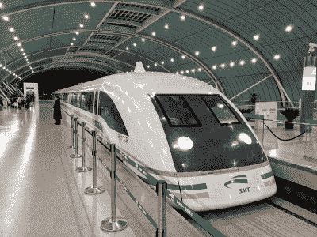
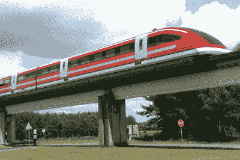
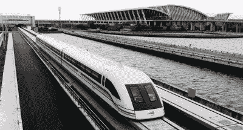

# 时速 600 公里的新设计推动了中国磁悬浮列车的发展

> 原文：<https://hackaday.com/2021/08/10/china-maglev-train-aspirations-boosted-by-new-600-km-h-design/>

磁悬浮列车一直被吹捧为列车技术的新曙光。尽管在 20 世纪中期有着强烈和热切的兴趣，但发展一直很缓慢，只有有限的商业运营见过服务。最著名的例子之一是连接机场和大城市的上海磁悬浮列车。该系统是从德国购买的交钥匙安装系统，运行距离只有 30.5 公里，根据土木工程杂志的报道[在 2001 年花费了 12 亿美元建造](https://web.archive.org/web/20060508063634/http://thetransitcoalition.us/Civil%20Engineering%20Magazine%20-%20November%2020O04.htm)。从那以后，它就成了磁悬浮技术的光辉典范——也提醒人们磁悬浮技术的困难和昂贵。

然而，中国在过去几十年里爱上了高速铁路运输，并进行了大量投资。在建设世界上最大的高速铁路网络的同时，积极寻求外国公司的技术转让，中国取得了巨大的进步。现在，中国轨道交通制造商 CRRC 公司展示了他们最新的磁悬浮列车，希望成为世界上最快的。

## 会很快的

 

改进型 L0 系列磁悬浮列车在日本的试验架上。[Image BY[Saruno Hirobano](https://commons.wikimedia.org/wiki/File:L0-950.jpg)CC-BY-SA 4.0】

其目标是建造一辆时速可达 600 公里的磁悬浮列车，这将大幅缩短中国主要城市之间的长途旅行时间。这种列车将巧妙地介于现有的时速约为 350 公里的高速铁路服务和时速约为 800-900 公里的客机之间。在至关重要的北京-上海线路上，旅行时间可能会从火车的 5.5 小时降至磁悬浮的 2.5 至 3.5 小时，这取决于你与谁交谈。这仅仅比航空旅行慢一点点，大约需要 2.5 个小时，而且这还没有考虑到飞行时通常会遇到的更麻烦的安检和登机程序。

600 公里/小时的速度非常快，大致相当于日本 L0 系列磁悬浮原型目前保持的速度纪录，该原型于 2015 年在一条测试轨道上实现了 603 公里/小时的速度。L0 系列保持着目前的记录，并计划在 2027 年开通的东京-名古屋线路上以 500 公里/小时的速度运行。

A maglev train at Longyang Station, Shanghai.

中国新的磁悬浮设计，被称为 CRRC 600，于 2019 年首次公开。预计在 5 到 10 年内投入使用，它是现有上海机场线所用技术的进一步发展。该列车是从德国公司 Transrapid 购买的交钥匙运营，该公司几十年来一直在开发磁悬浮列车技术。[我们自己的 Mike Szczys 在 2019 年](https://hackaday.com/2019/03/20/hacker-abroad-a-very-long-way-to-china/)乘坐了这个系统，在高峰时段的速度可达 430 公里/小时。CRRC 在 Transrapid 公司的所有者蒂森克虏伯公司的许可下继续开发这项技术。也有关于中国[重新开放德国埃姆斯兰最初的 Transrapid 测试赛道](https://www.railjournal.com/passenger/high-speed/german-maglev-test-track-set-for-revival/)的讨论，该赛道在 2006 年的一次致命事故后关闭了五年。

## 这项技术

一辆 Transrapid 原型车在德国家中的测试跑道上。[【来源】](https://en.wikipedia.org/wiki/Transrapid#/media/File:Transrapid-emsland.jpg)

快速铁路技术与传统铁路技术有着尽可能大的不同。没有轮子，也没有传输电力的受电弓。这种火车依靠电磁悬浮原理，用强大的电磁铁使车辆悬浮起来。在 Transrapid 的情况下，列车具有环绕导轨的臂，其下方安装有磁体，磁体被向上拉向轨道的下侧。磁悬浮的想法是在没有直接接触的情况下使车辆相对于轨道悬浮，因此使用强大的控制系统，通过改变流经列车悬浮线圈的电流，小心地保持列车和导轨之间的间隙。推进是通过[主动导轨线性电机概念](https://railroads.dot.gov/sites/fra.dot.gov/files/fra_net/16407/1993_LINEAR%20SYNCHRONOUS%20MOTORS%20FOR%20MAGLEV.PDF)实现的。它使用导轨中的线圈，线圈依次通电，产生移动磁场，推动列车前进。

## 商业案例

上海磁悬浮列车是中国磁悬浮技术的第一步。【[来源](https://en.wikipedia.org/wiki/Transrapid#/media/File:Transrapid-emsland.jpg)】

磁悬浮的好处是噪音降低，速度更快，通过消除车轮在钢轨上运行的摩擦，效率更高。除了这项技术的初期阶段，主要的缺点是成本。很难给出一个数字，尽管一份高度批评性的美国报告引用磁悬浮列车的成本可能是普通高铁的 1.5 倍。上海磁悬浮项目的总预算为 30.5 公里约 12 亿美元，或每公里约 3930 万美元(包括两个车站的成本)。中国高铁的通常成本估计在每公里 1700 万到 2100 万美元之间。

问题是，当涉及到运输系统时，仅仅看表面价值建造成本是一种糟糕的分析技术。人们经常忘记的一点是，理论上讲，速度提高一倍的火车在同样的时间内可以运载两倍的乘客。周转和效率从来都不是完美的比例，但是这个价值必须被考虑在内。此外，处理像陡坡和地产收购这样的事情会极大地扭曲成本，从一个项目，甚至一段轨道到另一个项目。磁悬浮技术的其他潜在好处包括更低的维护成本，因为铁路的非接触运行减少了磨损。事实上，在韩国低速仁川磁悬浮铁路的案例中，有关当局声称该系统总体上比传统铁路便宜得多。

## 下一代地面运输试图突破

对成本和盈利能力的担忧使高速铁路(更不用说磁悬浮列车)无法在美国和澳大利亚等地站稳脚跟，尽管用比航空旅行更简单、更高效的方式连接遥远的城市有潜在的好处。磁悬浮列车也已经从欧洲消失，尽管英国和德国是这项技术的早期先驱。

然而，中国较少受到这种短视担忧的困扰，能够稳步推进其国家建设项目。从上海到杭州和广州到深圳的线路很可能是下一批接受磁悬浮线路的候选线路。随着日本的努力，这些可能是世界上第一批城际磁悬浮线路，并将成为未来技术可行性的重要风向标。如果早期步骤证明是成功的，预计磁悬浮铁路将在创纪录的时间内横跨中国，就像过去二十年的高速铁路一样。