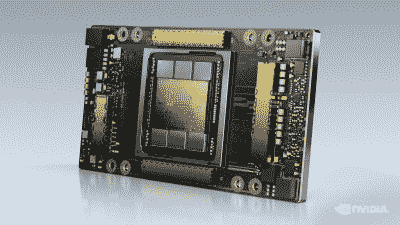
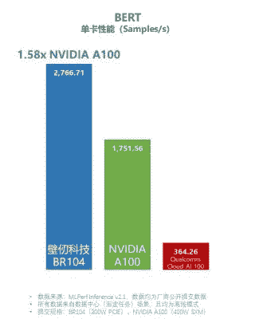

# 中国芯片被人为降低速度，以规避美国出口法规

> 原文：<https://hackaday.com/2022/11/09/chinese-chips-are-being-artificially-slowed-to-dodge-us-export-regulations/>

曾几何时，各国用进口关税保护国内产业。这让本土企业比海外企业更具价格优势，但这种做法在过去几十年里已经有点过时了。

如今，各国政府都更有创造力，利用花哨的出口管制来保护自己的利益。为此，美国颁布了对高性能计算设备的出口限制。作为回应，中国设计师正试图人为降低硬件速度以规避这些规则。

# 我有了新规则，我数了数

Companies like NVIDIA and AMD have had to rework certain products to comply with US regulations against Chinese exports. The A100 datacenter GPU was banned from export, so NVIDIA developed the lower-specced A800 instead. Credit: NVIDIA Press Site

新的出口规则出台之际，美国政府正努力应对中国军力在规模和技术成熟度方面的上升。[法规](https://www.klgates.com/US-Government-Imposes-Significant-New-Export-Controls-on-Semiconductor-Semiconductor-Manufacturing-Equipment-and-Supercomputer-Related-Transactions-Involving-China-and-Chinese-Entities-10-21-2022)限制先进集成电路出口，但法规不止于此。制造此类硬件所需的工具、软件和其他制造设备也受这些规则的约束。经常宣称的目的是减缓或停止先进军事设备的发展，这些设备可能被中国政府使用或出售给其他国家。或者，它可能被描绘成试图保护半导体市场现有参与者的优势。

根据新规定，“所有输入和输出的总双向传输速率”超过 600 GB/s(不包括易失性存储器)的芯片不得出口或再出口到中国。用于电镀、化学气相沉积和其他芯片生产过程的先进制造工具同样被禁止出口。仅涵盖所有基础，用于设计、制造或使用这些芯片或相关硬件的软件包也受到制裁。公司可以申请向中国出口此类材料的许可证，然而，与大多数此类限制一样，有一个假设是此类许可证将被拒绝。其他限制适用于超过某些机器学习性能限制的芯片和强大的超级计算机。

此外，对于不受上述限制的物品出口，如果这些物品将用于在中国“开发”或“生产”符合特定标准的集成电路，则“美国人”必须拥有许可证。这包括使用非平面架构或在 14 纳米或更小的技术节点上制造的芯片，以及具有 128 层或更多层的 NAND 存储器和在 18 纳米或更小的节点上制造的 DRAM。“美国人”的范畴也很广泛，包括美国公民、永久居民以及在美国成立的公司和法律实体，即使是在国外经营。

# 回避问题

自那以后，中国科技巨头阿里巴巴和规模较小的初创公司比仁科技(Biren Technology)发现自己在努力应对这些限制。与许多不太知名的中国芯片公司一起，他们投入巨资为高性能计算应用设计新的芯片。其中包括与 Nvidia 和 AMD 等公司的 GPU 竞争的新芯片，以及用于机器学习应用的处理器。

但是阿里巴巴和 Biren 是无工厂的，外包了实际的生产步骤。许多这些公司的设计由台积电(TSMC)生产，台积电被认为是世界领先的硅代工厂。

这些公司的一些最新设计在数据速率或其他因素方面违反了新的出口规则。虽然它们计划在台湾生产，但美国的出口法规仍然有影响。这是因为全球绝大多数半导体工厂都依赖美国制造的设备和软件。如果外国晶圆厂开始向中国运送此类设计，它们将很快被切断工厂工作所需的美国设备和软件。中国正在建设自己的半导体生产设施，但他们目前落后尖端几年或几十年，因此无法生产如此先进的设计。

Biren Technology has been touting its new datacenter GPUs as outperforming NVIDIA’s A100 offering. Given the latter is no longer legal to export to China, having a homegrown replacement is key. Credit: Biren Tech News Site

Biren Technology 的 [BR100 GPU](https://chipsandcheese.com/2022/10/04/hot-chips-34-birens-br100-a-machine-learning-gpu-from-china/) 有超过极限的风险，该 GPU 旨在用于机器学习应用。早期的声明引用了 640 GB/s 的数字，超过了规定的限制。从那时起，该公司的网站上列出了该卡的带宽，从 [512 GB/s](https://web.archive.org/web/20220821171250/https://www.birentech.com/BR100.html) 到[448 GB/s](https://web.archive.org/web/20221024154108/https://www.birentech.com/BR100.html)不等。据一些研究人员称，该公司可能会禁用 BR100 芯片的部分功能，使其超过限制，但可能会允许它在以后重新启用。

阿里巴巴自身的努力也面临着类似的麻烦。该公司一直在 TSMC 5 纳米技术节点研究用于人工智能工作的先进机器学习芯片。据报道，该团队正在探索重新设计，以避免与法规的问题，但这是一个昂贵的工作，将需要几个月和数百万美元。

工程师们抱怨说，规则并不明确，因为有各种方法来计算双向传输速率。不管怎样，许多人已经在努力降低处理器速度来规避规则。据一位消息人士向 Ars Technica 透露，关键是保持低调。 一些公司公开发布传输速率超过规定的芯片材料，提醒当局监控此类部件的出货。然而，在芯片的功能尚未广为人知的情况下，工程师们更有可能与晶圆厂合作，找到一种可以绕过法规的重新设计。

## 趋势的一部分

这不是美国出口法规第一次试图限制中国科技公司的发展。华为的半导体部门海思在 2019 年与之前的一套出口规则[发生冲突。最初对该公司的制裁是因为在华为的通信设备中发现了后门。这些规定切断了华为从英特尔、谷歌和高通等公司获取软件和硬件的渠道。然而，华为坚持使用自己的芯片和应用程序，在国际业务停滞不前之际，中国买家支撑了该公司的销售。海思很快成为中国智能手机芯片组的头号供应商。](https://www.economist.com/business/2022/10/25/ren-zhengfei-has-big-plans-for-huawei-in-spite-of-american-sanctions)

从那里，美国政府向上延伸，宣布向海思提供半导体制造设备是非法的。这为该公司的旗舰智能手机芯片组敲响了丧钟[，它很快被市场上的其他公司超越。](https://www.reuters.com/article/us-huawei-chip-idUSKCN2540HA)

获得世界上最好的硅晶圆厂是制造高性能芯片的关键。目前，由于垄断了尖端制造设备和设计软件的供应，美国掌握着这些技术的关键。中国将坚持提高自己的生产能力，就像它追求生产自己的喷气发动机和其他技术一样。然而，同样的，这是一条漫长而缓慢的路，而且代价高昂。

横幅图片:Enrique Jiménez 的作品:[硅片](https://www.flickr.com/photos/36338618@N02/32126624767)