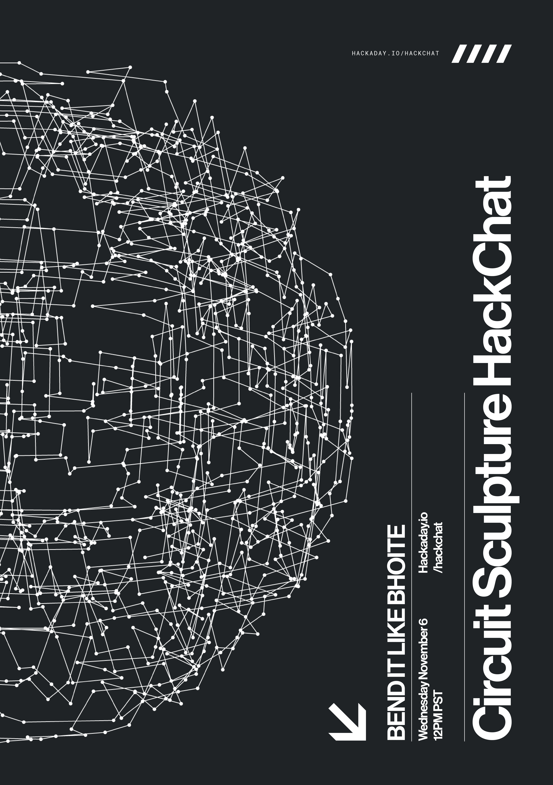

# 电路雕塑黑客聊天

> 原文：<https://hackaday.com/2019/11/04/circuit-sculpture-hack-chat/>

加入我们太平洋时间 11 月 6 日星期三中午的 [Circuit Sculpture Hack Chat](https://hackaday.io/event/167692-circuit-sculpture-hack-chat) 与 [Mohit Bhoite](https://hackaday.io/MohitBhoite) ！

尽管工程师们在电子设计上投入了大量的精力，但很少有人能够欣赏它。设计一个好的 PCB 并仔细选择正确的元件的所有艰苦工作在电路板被放入外壳的那一刻就被隐藏了，只有通过用户界面才能再次进行交互，该界面为产品的外观和感觉赢得了所有荣誉。

然而，也有一些人把电路设计成纯粹的艺术品。他们可能会做一些有趣或有用的事情，但对于这些电路雕塑家来说，功能通常是次要的。电路雕塑通常由黄铜丝骨架组成，以精确的角度弯曲，形成复杂的结构，是电子设计的禅宗花园:在这里，设计师专注于元件本身的美，并将它们展示出来供所有人欣赏，从而平息制定最后期限和满足规格的疯狂。

白天，我们的主持人 Mohit 在 Particle 设计和制造硬件。然而，到了晚上，电线和钳子出来了，他制作出了活的电路雕塑。看看他的作品集。你不会失望的。这次聊天将是你找到制作这些雕塑的一切的机会。找出莫希特从哪里得到他的灵感，了解他的如此精确，令人满意的脆电线弯曲的秘密，并看看需要什么把硅变成艺术。

我们的黑客聊天是在 [Hackaday.io 黑客聊天群发消息](https://hackaday.io/messages/room/2369)中的实时社区活动。本周，我们将于太平洋时间 11 月 6 日星期三中午 12:00 坐下来讨论。如果时区让你烦恼，我们有[一个方便的时区转换器](https://www.timeanddate.com/countdown/generic?iso=20191106T12&p0=224&msg=Circuit+Sculpture+Hack+Chat&font=cursive)。

点击右边的那个发言气泡，你会被直接带到 Hackaday.io 上的黑客聊天群，不用等到周三；随时加入，你可以看到社区在谈论什么。

