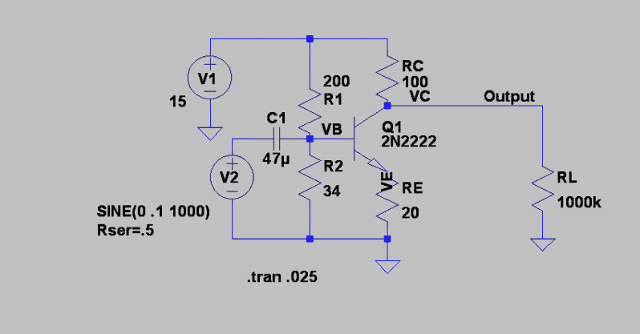
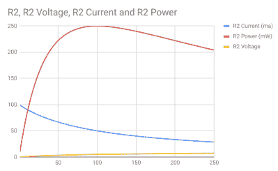
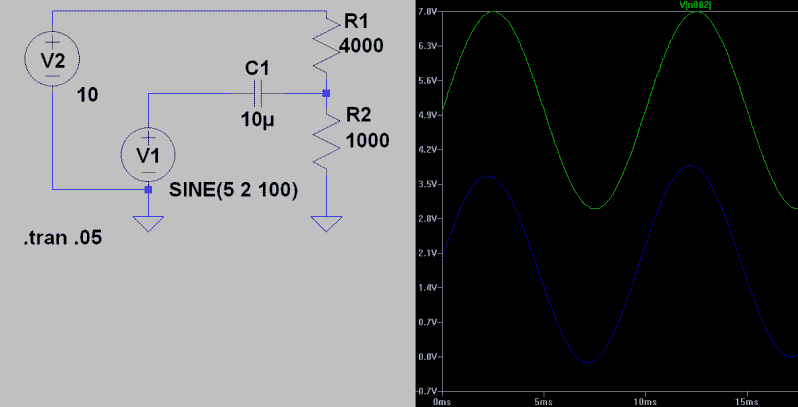
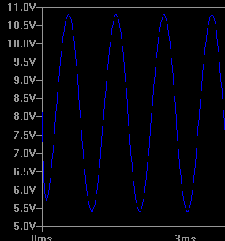
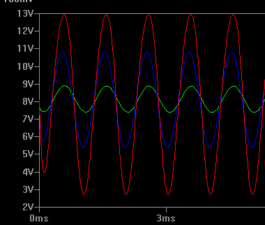
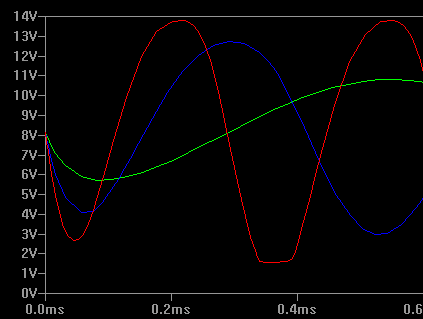
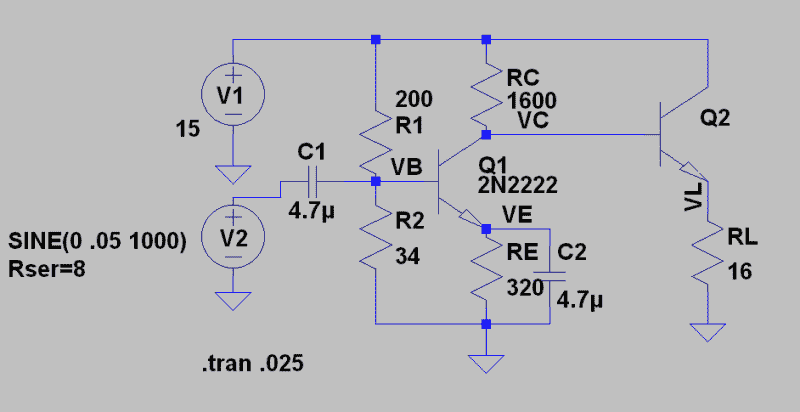
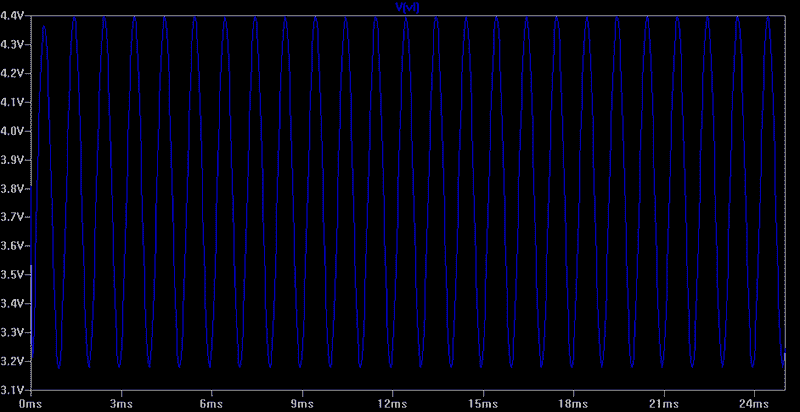

# 电路虚拟现实:两个晶体管的故事

> 原文：<https://hackaday.com/2018/08/17/circuit-vr-a-tale-of-two-transistors/>

[上一次](https://wp.me/pk3lN-1kwK)在 Circuit VR 上，我们讨论了如何创建一个非常简单的共发射极放大器，但我们没有讨论如何选择电容值，也没有讨论我们为什么需要它们。这次我们将探讨这一点，以及如何在射极跟随器(或共集电极)配置中使用第二个晶体管来增强放大器驱动输出负载的能力。

一些读者写信指出，我将 2N2222 的 Ic 值推高了一点。事实证明，评论中至少有一个计算有点高。然而，我已经在最后更新了帖子，以探索评论中的内容，并更多地讨论如何在有或没有 LTSpice 的情况下计算功耗。如果你读了那篇文章，你可能想跳回去看看更新。

## 回到我们的节目

提醒一下，我们开始使用的 LT Spice 电路如下所示。你可以在 GitHub 上下载这个文件和其他文件。

## 输出 Z

上次，我们讨论了设计方程，甚至查看了一个[电子表格](https://docs.google.com/spreadsheets/d/1aqnElnE4TMKD-cQmnPr0d9aq_zXHk4yU2nl2ZL_R9Mk/edit?usp=sharing)来计算数值。该电子表格假设您想要选择几个项目，包括器件的正常集电极电流。不过，在某些情况下，您的驱动设计目标将是一定的输出阻抗。在这种情况下，相应地选择 RC，并执行相同的步骤，但您将计算 Ic，而不是选择它并跳过步骤 4。当驱动的实际负载是集电极电阻时，也可以使用同样的方法，这种情况并不少见。

如果稍加逻辑分析，很容易看出 RC 是输出阻抗。记住，这个放大器是反相的。因此，当输入信号较大时，Q1 接近关断。假设 Q1 完全关闭。那么输出电路会是什么样子呢？由 RC 和 RL 组成的分压器。像任何分压器一样，RL 的最大功率将在 RL=RC 时出现。如果你有更多的工程思维，你可以认为放大器的戴维宁等效电路是一个以 RC 为电阻的电压源。或者，如果你更形象，想象一个 10V 输入和 100 欧姆“顶”电阻(R1)的分压器。如果您尝试从 1 到 200 范围内的底部电阻(R2)值，它看起来像这样:

R2 的电压不断上升，但电流却在下降。当 R2 为 100 欧姆时，最大功率约为 250 毫瓦。这就是为什么你试图匹配，比方说，发射机与天线或扬声器与放大器。

您可能还想控制输入阻抗。对于输入阻抗的情况，您必须控制 Re、R1 和 R2 的值，这在不建立大量联立方程或仅进行迭代的情况下要困难得多。它还将取决于 beta，这是出了名的不可靠。如果 Re 和β的乘积是一个很大的数，你可以把它近似为 R1 和 R2 的乘积，这就足够了。

请注意，在上面的电路示例中，我只是放了一个大电阻作为负载，因此不会对事情产生太大影响。但是如果这个电阻是一个 16 欧姆的扬声器呢？

## 回到电容器

那么为什么电容很重要呢？因为晶体管的端子上需要一组非常特殊的 DC 电压，连接输入或输出会对此产生干扰。然而，我们可以在输入和输出端使用一个电容，将电路与任何 DC 效应隔离开来。这意味着我们不能很好地放大非常低频的信号——电容器将像大电阻器一样工作。但是在更高的频率下，就不会有什么问题了。您可以在仿真中看到，一些电容保护输入和输出。

如果你想以一种不那么令人分心的方式来看效果，看看这个模拟。这里，输入信号处于 DC 电平。分压器设置另一个 DC 电平。两者之间有一个电容，电路实际上将输入转换到新的 DC 电平，如下所示:

电容器的电抗当然取决于频率，根据 1/(2*π*f*C)。这意味着在给定频率下，电容越高，电抗越低。这种情况下，100 Hz 信号将 10 uF 电容视为约 160 欧姆的电抗。在 47uF 时，这个值下降到大约 34 欧姆。在 1 kHz 时，这将把这两个值再除以 10 (16 和 3.4 欧姆)。

## 获得

发射极电阻本质上引入了负反馈，降低了我们对β的依赖，使情况总体上更加稳定。然而，它也限制了增益。如果你假设你有一个 0 欧姆的短路电阻，你可能会认为你可以得到无限的增益。但事实上，你得到的只是一个小内阻，它与温度和电流有关。然而，在室温下，它通常最多只有几欧姆。如果我们可以短接发射极，它仍然可以增加相当多的增益——理论上，达到晶体管的β。但是如果没有负面反馈，我们会得到所有其他我们试图避免的不良特征。

然而，正如我们使用电容隔离输入和输出一样，为什么我们不能使用电容将信号短接到地，即使 DC 路径是通过电阻的？事实证明，你可以。尝试在 RE 上增加一个电容，观察输出变高。下面，你可以看到一个 47 uF 电容跨接在 RE 上的相同输出。看看这些天平。0.2V 输入信号现在产生超过 5V 的峰峰值输出。这大约是 DC 增益的 25 倍。

Gain with bypass cap

这种效应会影响电容值，当然还有频率。这是 10uF、47uF 和 100 uF 电容的输出(下图第一张)。第二张图显示了效应与频率的关系。在接受 3dB 压降的频率下，通常希望电容的电抗约为发射极电阻的 1/10。

Three values of bypass cap

Three different frequencies

请注意，电容工作得非常好，以至于在某些频率下，我们超出了允许的增益和削波范围(见上图)。根据你的设计目标，你可能需要小心。

## 选择耦合电容

要知道耦合电容的值，需要知道放大器的阻抗。这很容易估计，但有了 LT Spice，我们可以做得更好。看看 V2，你知道它输出 50 mV，你可以测量它的电流。欧姆定律会告诉你 0.05 除以那个电流一定是 V2“看到”的电阻随着 C1 设置为荒谬的高(1F)和 V2 的内部电阻设置为零，电路从 V2 汲取约 1.75 毫安。大约是 28.6 欧姆。因此，如果知道所需的 3dB 频率，只需使用熟悉的 1/(2*π*f*R)公式计算电容即可。假设我们想要 10 kHz 作为 3dB 点。由于 R 为 28.6，因此至少需要 0.6 uF 的电容。当然，你也可以把公式反过来，确定你的 3 dB 点应该给定什么样的电容值。

这里有一个小小的 WolframAlpha 提示。如果你尝试[做上面的计算](https://www.wolframalpha.com/input/?i=1%2F(2*pi*10000*28.6))，你会得到科学记数法的答案:5.56 x 10 ^(-7) 。当然，你可以把小数点向右移动 2 位，得到指数-9…或者是向左？然而，你也可以在你的查询中添加“工程形式”这个词[，你会得到最近的指数的答案，它是 3 的倍数。](https://www.wolframalpha.com/input/?i=1%2F(2*pi*10000*28.6)+engineering+form)

## 输出负载

另一个常见问题是，需要驱动低阻抗负载，这会限制增益，因为匹配该阻抗会阻止使用大 RC。一个答案是使用输出晶体管作为射极跟随器或共集电极放大器。这是一个非常简单的设置，基极的输入在发射极上几乎没有变化。所以该级的增益接近 1。这可能看起来不太妙，除非你意识到这种放大器的输出阻抗大致等于源阻抗除以β。请记住，较低的输出阻抗有利于驱动更大范围的负载。

假设主放大器中的 RC 为 1600 欧姆，您想要驱动一个 16 欧姆的扬声器。如果射极跟随器β为 100，从主放大器看到的有效阻抗将为 1.6K 欧姆，该级的输出阻抗将非常低。但因为在这种情况下，发射极电阻可能就是负载本身，所以不要在输出端放置电容，因为它会阻塞接地路径。

看看这个设计:

这与之前的放大器非常相似，但输出端没有耦合电容。此外，组件值发生了一些变化。当 Q1 关闭时，最大电压将流向负载，当 RL=RC 时，这将传递最大功率，因此 Q1 的输出阻抗为 1600 欧姆。对于 16 欧姆的扬声器来说，这是一个很差的匹配，但 Q2 可以让我们在射极跟随器配置中接近它。的确，beta 不可靠，所以匹配可能不会完美，但对于大多数目的来说应该足够好了。

以下是输出结果:

将其与驱动 16 欧姆负载的原始放大器的输出进行比较。您需要将输入驱动降低到 50mV，但即使这样，原始电路的输出也会非常令人失望。

当然，Q2 需要成为一个功率晶体管。在 Q2 的基础上，你不可能得到所有的 15V 电压，但你可以接近。在发射极下降后，您可能会有大约 14V 的 ve，这比 900 mA 略低，大约为 13 瓦特以上。想象一个带散热器的大设备。幸运的是，模拟并不在乎。但是，当然，这也是模拟的危险之一，你可以给模型施加过大的压力，而它们并不关心。

## 结局？

虽然我们已经讨论了共集电极放大器，但还有更多的内容。集电极负载是调谐电路怎么办？还是发射器旁路？以此为基础，你可以构建很多东西，包括多级放大器。

顺便说一下，你可能会认为双极晶体管与场效应晶体管相比已经过时了，但它们确实有其用途。此外，所有这些放大器配置都有相应的 FET 设计。想法是一样的，但是，当然，设计方程式有点不同。场效应晶体管依靠电压工作，还有其他特性。例如，某些类型的场效应晶体管通常是导通的，所以你需要一个负偏置电压来关断它们。fet——尤其是 MOSFET——具有非常高的输入阻抗，这使得输入电路易于设计。然而，它们也会引入电容，这在较高频率下可能会比较棘手。但这是未来电路虚拟现实的主题。