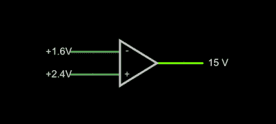
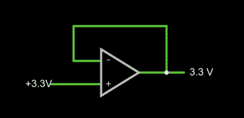
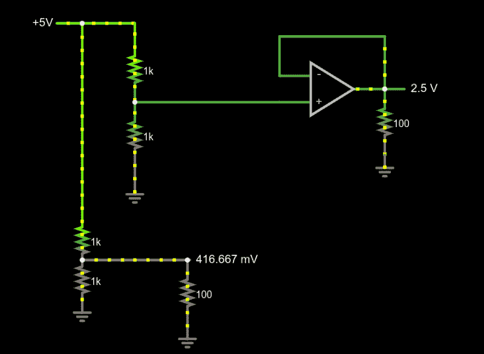
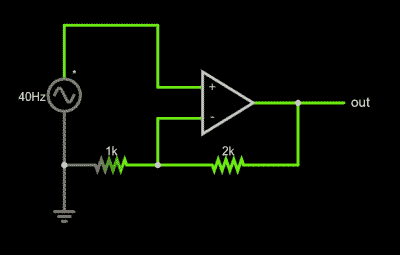

# 电路 VR:一些运算放大器

> 原文：<https://hackaday.com/2020/12/24/circuit-vr-some-op-amps/>

电路仿真很棒，因为你可以试验电路，几乎不费吹灰之力就能做出改变。在 Circuit VR 中，我们使用模拟器查看电路来做实验，而无需加热烙铁或打开工作台电源。这一次，我们要讨论一个大话题:运算放大器。

运算放大器是运算放大器的缩写，是一种封装差分放大器。理想的运算放大器——我们得不到——具有无限增益和无限输入阻抗。虽然我们在现实生活中无法做到这一点，但现代设备已经足够好，我们可以在大多数时间假装这是真的。

a very simple op amp circuit with some detail omitted

如果你在法尔斯塔德模拟器中打开这个电路，你会看到右边有两个滑块，你可以在那里调整输入电压。如果使电压相同，输出将为零伏。你可能认为差动放大器会接受 1.6V 和 2.4V 的输入，产生 0.8V 或-0.8V，但事实并非如此。试试看。根据您设置为 2.4V 的输入，您将在输出上获得 15V 或-15V。这就是无限的收获。任何正输出电压或负输出电压都会很快“触及供电轨”或电源电压，本例中为+/-15V。

## 实际问题

上面的原理图符号中最大的省略细节是这里没有电源，但你可以猜测它是+/- 15V。运算放大器通常有两个电源，一个正电源和一个负电源，虽然它们的幅度不一定相同，但通常是相同的。一些运算放大器专门采用单端电源，因此其负电源可以接地。当然，前提是你不需要负电压输出。

输出切换所需的时间称为压摆率，通常可以在器件数据手册中找到。显然，对于高速应用，快速压摆率非常重要，尤其是当您想要像这里这样将电路用作比较器时。

其他实际问题的出现是因为运算放大器并不完美。真正的运算放大器不会完全达到 15V 供电轨。这将取决于你从输出端获取多少电流。电流越大，离供电轨越远。当输入相等时，运算放大器也会有一些失调，防止其达到零，但在现代器件中，失调可能非常低。一些较老的器件或用于高精度设计的器件会有一个端子，允许您使用外部电阻精确调整零点。

## 运算放大器可以在可变负载下提供稳定的电压

如果你记住两个简单的规则，你就可以处理几乎所有的运算放大器电路，而不必钻研大量的数学知识:

1.  运算放大器的输入不连接任何内部器件。
2.  只要在物理上可能，输出会神秘地尽其所能使输入相等。

1x amplifier

第二条规则一会儿会更有意义，但我们已经看到了它的作用。设置模拟器，使–输入(反相输入)为 0V，同相输入(+)为 4V。输出应为 15V。输出试图使反相输入与同相输入匹配，但因为没有连接，所以无法匹配。输出想要提供无限量的电压，但它只能达到 15V 的供电轨。

我们可以利用这一点，通过简单地将输出短接到–端，制作一个非常好的 [x1 放大器](https://tinyurl.com/yc3kue54)。请记住，我们的规则说输入终端似乎没有连接到任何东西，所以它不会伤害。现在，放大器将输出我们输入的任何电压:

你可能想知道为什么这很有趣。我们将学习如何提高增益，但实际上这种电路非常常见，因为输入阻抗非常高(理论上是无穷大，但实际上不是)。输出阻抗非常低，这意味着您可以汲取更多电流，而不会对输出电压产生太大影响。

Comparing voltage divider performance with and without a 1x amplifier

[该电路展示了 1x 放大器的功率](https://tinyurl.com/ycytv8jk)。两个分压器在空载时都产生 2.5V 电压。然而，当输出端负载为 100 欧姆时，分压器只能提供大约 400 毫伏的电压。你必须考虑分压器设计中的负载，如果负载是可变的，就不可能选择一个在所有情况下都能工作的电阻。然而，顶部分压器为运算放大器的高阻抗输入端供电，从而为您提供的任何负载提供“硬”2.5V 电压。例如，尝试将负载电阻从 100 欧姆更改为不同的值。底部负载电压将大幅波动，但顶部负载电压将保持在 2.5V。

不要忘记，在现实生活中，有一些实际的限制是站不住脚的。例如，您可以将负载电阻设置为 0.1 欧姆。模拟器将忠实地显示运算放大器通过负载流出 25A 的电流。普通的运算放大器无法做到这一点，即使做到了，也不太可能有电源支持。

## 什么被放大了？

这是一个放大器，即使电压保持不变。你在放大电流，从而放大功率。断开底部分压器(只需删除长导线)，您将看到 5V 电源提供 12.5 mW 的功率。输出功率为 62.5 mW，当然，它随负载电阻而变化。

注意这个电路是如何符合第二条规则的。当输入改变时，运算放大器使其输出相等，因为这使得+和–端保持相同的电压。

当然我们放大的时候一般都希望电压高一点。我们可以通过在反馈环路中构建一个分压器来实现。如果我们在环路中放置一个 1:2 分压器，输出必须加倍以匹配输入，只要这在物理上是可能的，它就会这样做。显然，如果你输入 12V，它就不能在 15V 电源下产生 24V，所以要合理。

Non-inverting amplifier example

[这种类型的配置](https://tinyurl.com/y92mpytx)被称为同相放大器，因为与反相放大器不同，输入电压的增加会导致输出电压的增加，而输入的减少会导致输出跟随。

请注意，反馈分压器并不像分压器那样绘制，而只是在纸上移动符号。它仍然是一个分压器，就像前面的例子一样。你能计算出这个级的电压增益吗？分压比为 1:3，毫无疑问，输入端的 5V 峰值变为输出端的 15V 峰值，因此增益为 3。尝试将分频器更改为不同的比率。

## 下一步是什么？

虽然这在数学上并不严谨，但将运算放大器想象成一台使其输入相等的机器却是惊人的有效。这无疑简化了对这些简单电路、比较器、缓冲放大器和一般同相放大器的分析。

当然，还有许多其他类型的放大器，以及使用运算放大器的其他原因，如振荡器、滤波器和其他更奇特的电路。下节课我们将讨论其中一些，以及虚地的概念，这是另一个有用的分析经验法则。