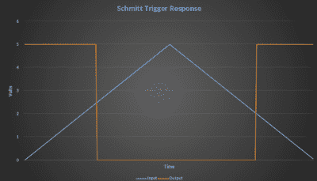
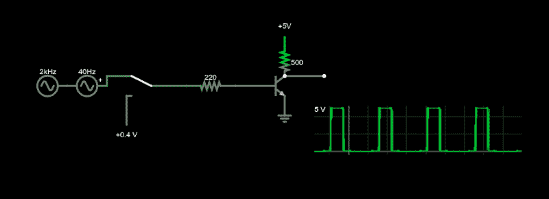
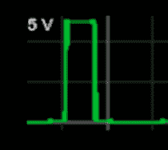
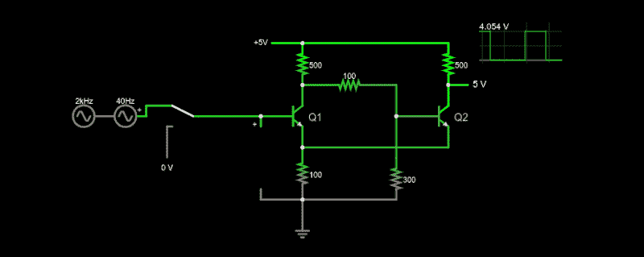
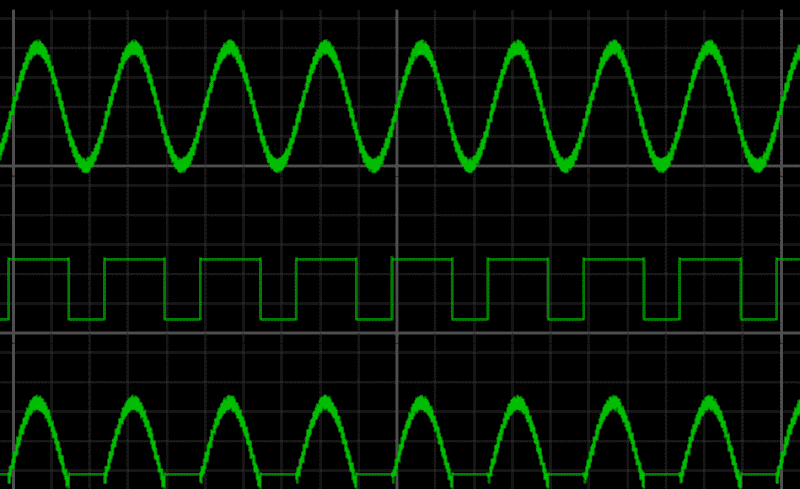

# 电路 VR:用施密特触发器平方

> 原文：<https://hackaday.com/2020/12/04/circuit-vr-squaring-with-schmitt-triggers/>

在原理图的幻想世界里，导线没有电阻，方波有无限急剧的上升时间。当然，现实世界要残酷得多。有很多东西可以帮助你将狂野的模拟世界驯服成数字世界。开关需要去抖，信号需要限幅，甚至可能需要滤波器。你可能用到的一个基本元件是施密特触发器。在…里

在本期*电路 VR* 中，我将通过在法尔斯塔德电路模拟器中构建施密特触发器来观察实际电路的内部。您可以点击链接，获得电路的实时仿真，以便进行自己的实验和虚拟测量。

## 为什么施密特触发器？

通常使用施密特触发器将噪声信号转换为干净的方形数字逻辑电平。任何种类的逻辑门都有一个阈值。对于 5V 器件，阈值可能是任何低于 2.5V 的都是 0，而在 2.5V 或更高时，信号计为 1。一些逻辑系列定义了其他阈值，并且可能有信号未定义的区域，这可能导致不可预测的输出。

当然，门槛存在无数问题。两部分可能没有完全相同的阈值。阈值可能会因温度或其他因素而稍有变化。对于没有禁区的部分，如果电压正好在阈值边缘会怎么样？

施密特触发器输入略有不同。它有两个门槛。一个阈值是将输入从 0 跳变到 1 需要多少电压。另一个阈值是从 1 到 0 需要多少时间。例如，如果输入从 0.3V 开始上升，施密特触发器反相器会将其视为 0，并输出 1。当输入通过时，比如 2.5V，输出将变为 0，因为输入现在是 1。到目前为止，这就像一个普通的门。区别在于投入开始下降的时候。当输入为 2.4V 时，正常的门电路已经将输入翻转到相反的状态。然而，施密特触发器将保持 1，直到输入越过第二个阈值。也许那是 2V。

这非常类似于家用恒温器。如果你的取暖器设定为 70 度，它不会在 69.9 度时打开。在加热器启动并将温度恢复到 70 度之前，温度必须下降一点。这就是所谓的滞后现象。从技术上讲，该术语指的是系统状态对其历史的依赖性。为了预测施密特触发器的输出，您需要知道输入电压和先前的输入状态。在某种程度上，它是简单状态机的模拟版本。

 这里的图表显示了一个信号缓慢上升到 5V，然后又降回零。方形轨迹是施密特触发器反相器的输出，阈值为 2V 和 2.5V。当然，在现实生活中，输出不会真的那么尖锐，但它会很快，并与其他逻辑信号兼容。

## 在实践中

实际上，您可能会使用施密特触发器来读取 RC 电路或清除来自高噪声传感器的输入。驱动任何类型的容性负载都会干扰信号的上升时间，并可能导致数字电路出现问题，尤其是当您处理的逻辑系列在高阈值和低阈值之间存在禁区时。

大多数情况下，您只需购买一个 IC 来添加一个施密特触发器。这通常是一组反相器，但你会发现其他类型的门具有施密特触发器输入。它们在微控制器的某些引脚上也很常见，这些引脚可能会连接到高噪声信号。你也可以用运算放大器或者无处不在的 555 定时器集成电路创建一个施密特触发器。然而，在这篇文章中，我们将使用优秀的旧晶体管来更好地了解正在发生的事情。像往常一样，做事有几种方式，每种方式都有自己的权衡。

## 模拟

首先，考虑一个带有一个晶体管的[简单反相器。理论上，晶体管要么处于关断状态，因此输出端基本上有一个 5V 上拉电阻；要么处于饱和状态，因此输出只有十分之几伏特。如果你给这个电路输入一个好的方波，它就会工作得很好。但是，如果你发送一个噪声正弦波，你会在输出的边缘得到很多散列。](http://tinyurl.com/yyawzsey)

 该模拟有两个可能的输入源。如果开关按下，输入将是一个电压，您可以用模拟屏幕右侧的滑块来改变。如果开关打开，你会得到一个嘈杂的正弦波。我们将在所有示例电路中使用这种特殊的输入排列。

示波器走线有点难以看清，但放大后可以看到，当信号通过约 0.7V 的阈值时，晶体管会切换入和切换出，因此边沿噪声很大，这就是我们需要施密特触发器的原因。

## 首次拍摄

法尔斯塔德的例子有一个简单的施密特触发器，所以我借用了它的一部分来实现第一次尝试清理这些边缘。

那个看起来好多了(虽然这个不反转)。它是如何工作的？关键是从 Q2 的发射极到 Q1 的发射极的反馈以及晶体管的工作模式。

如果您将鼠标悬停在模拟器中的一个晶体管上，它会报告该晶体管是处于截止、饱和还是正向激活模式。当鼠标在一个晶体管上时，只要看模拟器的右下角。

*   截止就像它听起来的那样。晶体管或多或少会消失。
*   饱和是指晶体管的集电极电流达到最大值。更大的基极电流实际上不会改变什么，集电极和发射极之间的电压将接近 0V，但并不完全是 0V。在这种模式下，晶体管就像集电极和发射极之间的闭合开关。
*   正向有源模式是指一定量的基极电流导致一定量的集电极电流流动。理论上，这种模式下的基极电流与集电极电流之比就是晶体管的β，但只要β很高，通常就不会在意，因为电路不依赖于特定的β值。由于β随许多因素而大幅变化，因此通常需要通过电阻上的电压来设置较低的电流，以便精确控制。

## 三种制度

这是这条电路运行的三种状态:Q1 关闭，Q1 饱和，Q1 在活跃区域。回顾一下，晶体管关断时，从集电极到发射极看起来几乎是开路。在饱和状态下，晶体管的发射极和集电极将非常接近短路。集电极电压只比发射极高十分之几伏特。然而，在有源操作中，集电极中的电流将与基极电流成比例。

如果 [Q1 关断](http://tinyurl.com/y29zf7rq)，或多或少会有一个 1/3 分压器对着 Q2 的基极 5V。这并不完全正确，因为 Q2 的底部增加了一些阻力，但由于它相对较高，你可以忽略它。所以你在 Q2 的基础上得到大约 1.5V。这将开启 Q2，使输出降低到一个低电压。同样重要的是，通过 100ω发射极电阻的饱和集电极电流将使发射极节点保持在略低于 0.9V。

如果你想验证这一点，拉下开关，设置滑块到一个切断 Q1 的电压，比如 0V。因为发射极电压是 0.88 伏，Q1 的基极需要达到 1.5 伏左右才能使 Q1 导通。

第二种状态是当 Q1 达到饱和时。很容易看出，由于集电极的电压非常低，它将关闭 Q2，输出只是上拉电阻至 5V。

如果你开始增加电压，Q1 将最终移动到正向活跃阶段。不过，这对 Q2 的电压不会有太大影响。发射极电压略有增加，导致输出电压略有增加，但不会超过 1V。

因此，事情基本保持不变，直到 Q1 在 1.47V 饱和。您可能需要编辑电压源，而不是使用滑块来获得这种精度。此外，不要忘记，如果您滑过阈值，您必须在设置电压之前重置为零(或至少低于低阈值)，因为我们希望电压上升，而不仅仅是任意值。

在 1.46 伏时，Q2 的基极仍然是 1.5 伏，发射极节点仍然是 880 毫伏。输出低于 1V (984.8mV)。在 1.47 伏输入时，Q1 饱和，Q2 的基极电压现在低于 650 毫伏。发射极电压达到大约 815 毫伏。

随着输入电压继续增加，Q2 的基极和发射极电压也增加，Q2 保持截止。那么如果输入电压回落到 1.46V 会怎么样呢？不多。随着 Q1 的饱和，它保持饱和。注意，现在发射极电压比以前低了近 80mV，所以更容易保持 Q1 饱和。由于发射极电压随着输入下降，你可以预期大约 40mV 的下降会使事情回到相反的状态。在 1.06 伏，电路翻转 Q1 关闭，你又回到原来的状态。下表总结了这一点，其中 1.46+表示电压升至 1.46，1.46-表示电压降至 1.46。

| 投入 | 雌三醇环戊醚 | Q2 | Q2 基地 | 拥有 | Q1·Vbe | 输出 |
| 0.10+ | 离开 | 坐 | One point five three one | Zero point eight seven eight | -0.778 | Zero point nine four nine |
| 1.46+ | 行动 | 坐 | One point five three one | Zero point eight eight | Zero point six five one | Zero point eight zero nine |
| 1.47+ | 坐 | 离开 | Zero point six four three | Zero point eight one five | Zero point six five five | Five |
| 3.00+ | 坐 | 离开 | One point seven four two | Two point three zero six | Zero point six nine four | Five |
| 1.46- | 坐 | 离开 | Zero point six three seven | Zero point eight zero six | Zero point six five four | Five |
| 1.07- | 行动 | 行动 | Zero point nine three six | Zero point four three seven | Zero point six three three | Four point nine seven six |
| 1.06- | 离开 | 坐 | One point five three one | Zero point eight seven eight | Zero point one eight two | Zero point nine four nine |

这有点难处理，但是如果您尝试将表的输入列输入到模拟器中，您会清楚地看到它。另一种形象化的方法是查看如下所示的作用域轨迹。顶部轨迹是高噪声输入，中间是输出。发射极电压是底部轨迹。请注意，当输出为低电平时，底部走线保持不变，但当输出为高电平时，它会跟踪输入信号。这就是基于先前状态改变阈值的原因。请注意，电压在回升至关电平之前是如何下降的。然后突然下降开始下一个高周期。

## 再来一次

电子技术有一个类似的施密特触发器，它使用两个晶体管之间的直接连接，并且在 Q2 上没有显式的分压器。我已经把它和另外两个电路一起放在[一个模拟](http://tinyurl.com/yxtpky4p)中，供你试验。

我们之前已经讨论过带运算放大器的施密特触发器，但用几个元件来做也令人满意。如果你想要一个实际的应用，施密特经常在[时钟读取交流电源线频率](https://hackaday.com/2020/04/09/tell-time-like-its-1960-with-this-all-transistor-digital-clock/)，虽然你有时会看到一个过零检测器做同样的工作。