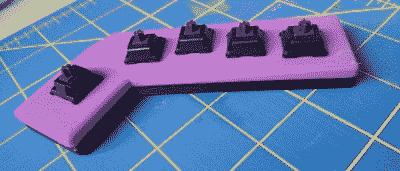
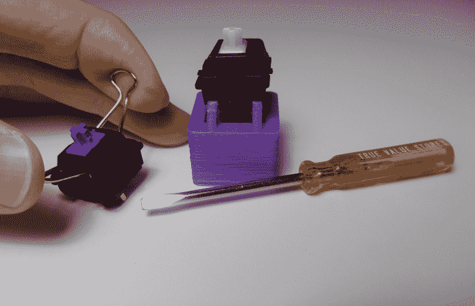
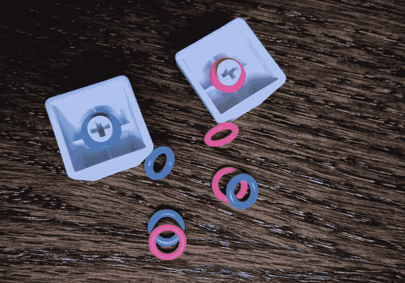
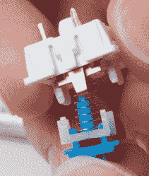
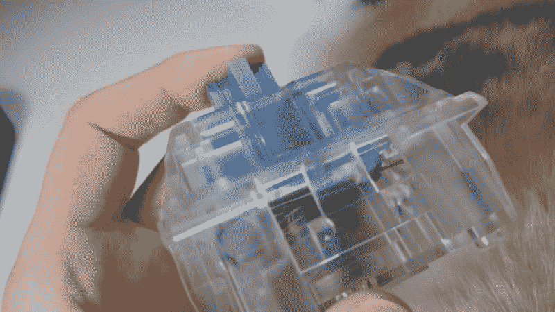
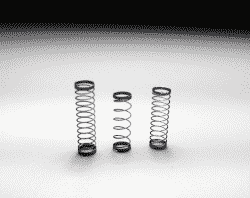
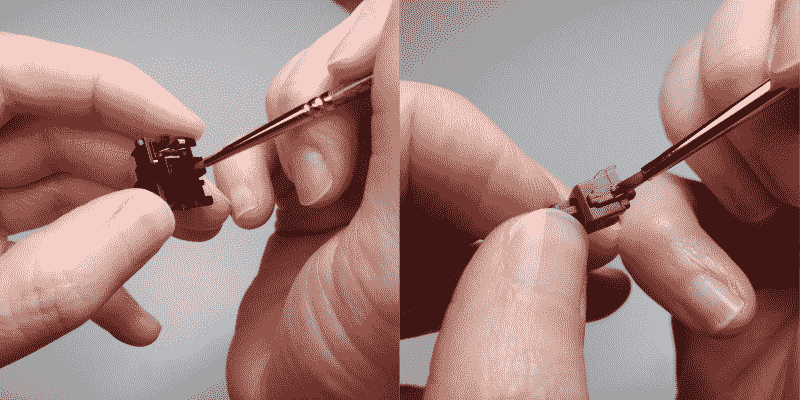
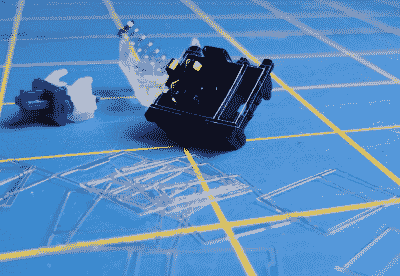

# 克拉克黑客:飞车手罗德开关模块

> 原文：<https://hackaday.com/2020/07/20/clacker-hacker-hot-rod-switch-mods/>

无论你是程序员、游戏玩家、作家还是数据输入专家，键盘都是你神经系统的延伸。与其说它是一种工具，不如说它是一种流动的媒介——为了进入状态。所以我认为，你应该深深地关心你的键盘——它看起来如何，听起来如何，最重要的是，整天用手指敲打那些戴着头盔的小开关是什么感觉，这是很自然的。反正那是我的借口。

你可能会感到惊讶，机械键盘开关可以用多种方式修改。根据你想从键盘体验中得到什么，你可以让开关感觉更轻或不那么刺耳，让它们安静下来，或者收紧外壳中的任何抖动。你为什么想这么做？因为定制很好玩。因为机电的东西很牛逼，也因为把开关拆开再装回去很好玩。因为这是真正的黑客行为，这是黑客日。

This is a pair of plates from a macro keeb I’m making that will sit directly in front of my trackball.

我进入开关改装，因为我想把樱桃清除在我的手指，但担心他们会采取太多的力量来启动和磨损我的手指。所以我买了一些非常轻(39 克)的弹簧，真的很期待把它们换成透明的，但它们就是不工作。比如身体上。滑块下降，滑块卡住。它会回来，但只有当我再次击中它，并在同一时间涂抹我的手指到一边一点。那些弹簧一定太弱而不能恢复清晰的滑块。

我认为这是一个信号，表明我应该忍气吞声，改用棕色。毕竟，没有人需要知道我的滑块是什么样的。当我打开开关的时候，我试了一个棕色的超轻弹簧，心想也许它们不会被浪费掉。浅色弹簧不仅在棕色中工作，而且感觉非常好。很难想象一个完整的 keeb 基于一个开关会有什么样的感觉，但如果你能收集一把并把它们放在一个盘子里，让你的手指在上面快速移动，那么，它可能足够接近一个完整的键盘，无论你在做什么，都会有很好的感觉。

### 开业

请注意，我只有修改 Cherry MX 交换机及其完美克隆的经验，所以这就是我在这里要谈的。两者之间有一些显著的差异，尤其是在外壳的设计方式上。打开樱桃的工具不一定会打开克隆开关。

一般来说，有很多方法可以打开开关。你可以用一个小平头螺丝刀打开几乎任何一种开关，只要你知道把它放在哪里。我打印了一个开关开启器，在一颗牙齿脱落之前，它完成了大约 10 次开关。第二次持续的时间要长得多，在我从将开关垂直向下压在齿上切换到一次一面在开关外壳夹下操作齿之后。

后来我偶然发现了弯曲活页夹的方法。我觉得这样做真的很好玩，但是方法有点蛮力的一面。如果你把弹簧钢把手从活页夹中解放出来，你可以把两端弯曲成一个小工具，像一对钥匙一样从顶部打开开关。如果没有真正的螺栓固定的台钳，做这些有点困难，但我设法用锁紧钳把它固定住，并用普通钳弯曲。

### 推的时候垫一个小垫子

大部分 mod 必须用松开关完成，但不是全部。不想经历所有的麻烦，拉或脱焊你日常驱动器上的所有开关？这可以理解。一些键盘噪音来自触底——打字时一直按下按键。改装开关最简单也是最可逆的方法就是拉下键帽，在键帽杆上贴一个 o 型圈。你甚至可以使用那些用于矫正牙齿的小橡皮筋。如果他们觉得太软，你所要做的就是再次拉下键帽，尝试另一种尺寸的 o 型圈。

The white piece is the click jacket, and the black piece is the j-spacer. Image via [Bland Name](https://blandname.com/2017/01/01/outemu-blue-jailhouse-mod/)

有些人喜欢蓝色和绿色等咔嗒声开关的感觉，但他们无法忍受咔嗒声。或者过一段时间后，他们可能会厌倦这种声音，或者他们喜欢这种声音，但其他人都在盯着那个可怕的机枪键盘。Clicky 开关以不同的方式获得滴答声，其中一些开关无法安静下来，否则会失去随之而来的感觉。

Clicky Cherry MX 开关有点特别，因为它们也是触觉型的。他们在茎上有一个额外的塑料片，称为点击外套。如果你想花时间并且不害怕打开开关，你可以通过在滑块和 click jacket 之间放置一小片称为 j-spacer 的橡胶来使 clicky Cherry MX 更像一个敏锐的触觉。这被称为[监狱模式](https://blandname.com/2017/01/01/outemu-blue-jailhouse-mod/)，它通过固定点击夹克来工作。触感仍然存在，但噪音有所减弱。

Clicky Kailh 开关的工作方式非常不同。滑块上没有额外的塑料片，而是有一个水平的弹簧杆，滑块轴上的突起可以拉动它。你必须用 o 型圈来使大多数这类开关安静下来，但是 o 型圈对咔嗒声没有任何作用。移除点击条后，它们仍然可以工作，但是因为它有双重功能，所以感觉是线性的。

[Big Switches](https://novelkeys.xyz/products/the-big-switch-series) are great for the purposes of demonstration. This one sounds like a stapler!

Left to right: stock Cherry brown spring, stock Cherry clear, 39g replacement.

### 春季狂欢

你是一个游戏玩家还是一个打字速度很快的人，会因为键盘而感到速度变慢？一天下来，你的手指会累吗？如果你不介意打开开关，更换弹簧是很容易做到的事情，而且完全可逆。[更轻的弹簧可以让键盘的手感产生巨大变化](https://imgur.com/a/RJqM4)。

我正在更换我的樱桃棕色的弹簧，因为我想在不牺牲触感的情况下获得尽可能低的打字力。普通的棕色弹簧驱动大约 45-50 克的力，新的弹簧只需要 39 克。

如果你不太喜欢实验，社区中有几个众所周知的 spring mods，如 Ergo Clears——Cherry MX clear sliders，带有红色、蓝色或棕色的弹簧。这些都很受欢迎，现在有一个叫 Zealios 的商业版本。

### 润滑作业

这是事情变得严重和不可逆转的地方。一点润滑油就可以用很长时间，特别是如果你用的是油脂而不是液体。这完全取决于一开始的转变是什么样的，以及你想从中得到什么。

陆兵交换机有点不稳定。我这么说并不是为了阻止任何人去尝试它——事实上恰恰相反。我建议慢慢放松，在最少的地方尝试最少的润滑油，然后添加更多，直到感觉像你想要的感觉。

你可以在上面看到我为我的手指涂上润滑油的地方。我只将其应用于滑块的业务部分和外壳内相应的导轨。我不想做过头，让开关感觉糊里糊涂的。对润滑有意义的其他地方是弹簧所在的滑块内部，弹簧另一端所在的外壳地板，以及弹簧本身。我听说有些人直接把所有的弹簧浸泡在润滑油里，然后用镊子把它们拔出来。

###  切换贴膜和贴纸

这些基本上是一样的，除了开关膜通常比贴纸厚一点，贴纸是粘性的，而薄膜不是。它们都有相同的目的——减少开关外壳的晃动。

我认为电影比贴纸更容易使用，而且由于材料的原因，整体效果更好。我发现这是真的，直到我试图把开关放回一起，发现自己希望电影被卡住。

有人说，开关抖动以及随之而来的对垫圈的需求是一个虚构的问题。我不同意。如果您的开关安装在 PCB 上，并依靠焊点来实现稳定性，而不是先卡入板中，那么肯定会有抖动的空间。随着时间的推移，开关会逐渐适应，总会有一些开关比其他开关用得更多。我还认为，拆开开关来添加润滑油或更换弹簧可能会导致抖动。如果 switch 贴纸或贴膜对你有用，有什么坏处？谁在乎呢。它们很便宜，而且它们有一堆漂亮的颜色，可以从房屋的边缘看出去。

### 做你感觉到的

如果每一次按键都感觉完美，你还能做多少次？如果打字成为一件值得期待的事情，你还能完成多少工作？所有这些都是为了个性化键盘的感觉，这意味着除了一些物理上不工作的东西之外，没有什么是真正确定的。发明你自己的 mods 是乐趣的一部分。所以去打开开关吧！