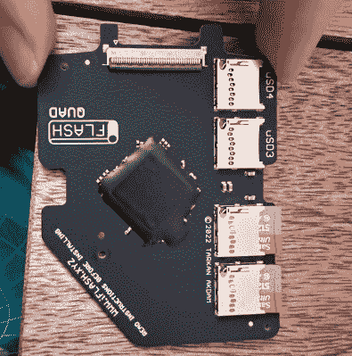

# 经典 IPods 在 2022 年可以超级升级

> 原文：<https://hackaday.com/2022/02/16/classic-ipods-are-super-upgradeable-in-2022/>

经典的 iPod 是当时最受欢迎的 MP3 播放器，它有很大的存储空间和独特的点击轮界面。[Ellie]放着一个 iPod 视频，这是该产品运行快结束时推出的更有能力的型号之一，[并着手升级它，以便在 2022 年疫情肆虐的荒地上使用。](https://ellie.wtf/ipod/)

 问题中的 iPod 是第 5.5 代机型，因最后一个配备了音质良好的 Wolfson DAC 而备受赞誉。[艾莉]使用非常有用的[iFixit 指南](https://www.ifixit.com/Device/iPod_5th_Generation_%28Video%29)来学习如何安全地拆卸设备。小心的手和一把短柄钻是避免损坏压在一起的金属外壳的关键。

打开后，内部安装了一个 iFlash 四块板，可以让 iPod 使用多达四个微型 SD 卡进行存储，而不是原来的硬盘驱动器。装了两张 512 GB 的卡，【爱丽】就不会缺存储了。然后，一个新的电池被替换了进去，还有一个漂亮的透明前壳，以体现其美学魅力。

硬件修改完成后，iPod 需要恢复 iTunes 才能再次工作。然后她安装了开源 Rockbox 固件，这极大地开放了硬件的功能。也许最好的是，它可以玩毁灭战士！或者，如果你愿意的话，你可以使用点拨轮来控制 MacBook 上的音量[。](https://twitter.com/ellie_huxtable/status/1492989855101509634?s=20&t=C9L2RYcRdfT7aPmvmQqJmw)

[Ellie 的]项目表明，由于现在有了很好的软件和硬件，现在修改 iPod 可以成为一个有趣的周末活动。看到该平台在停产多年后仍有如此大的支持，真是太棒了。如果你真的想回顾过去，看看苹果突破性的 MP3 播放器的早期原型。