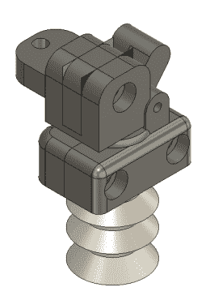
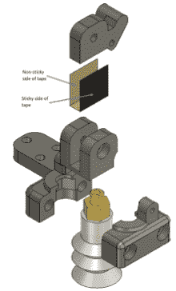
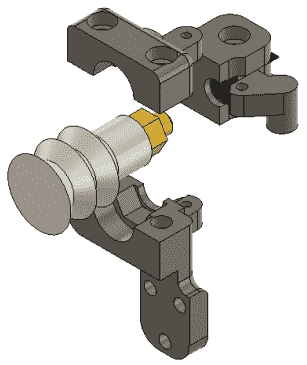

# 用于机器人手臂自动化面罩生产的巧妙吸附

> 原文：<https://hackaday.com/2020/04/12/clever-suction-for-robot-arm-automates-face-shield-production/>

我们当然熟悉制造业中用于拾取物品的真空抓取器，但这有点不同。[James Wigglesworth]发送了一些 Dexter 机械臂和自动生产面罩的激光切割机的渲染和演示视频(在休息后嵌入)。

 这是一个不错的一点点自动化，你可以看到 Glowforge 激光切割机右侧的一卷塑料正在进入机器。一旦激光完成了它的工作，机器人手臂就会伸入并抓住新切割的面罩，并将其整齐地叠放在一个盒子里，以备将来组装。这里有很多有趣的部分，但真空抓取器在没有真空空气供应的情况下完成工作的事实是我们关注的一个问题。

真空来自一个波纹套管，它构成了机器人手臂末端的吸盘。一根橡皮筋将[一个铰接件固定在套筒上的一个阀门上，该阀门可以由伺服电机](https://photos.google.com/share/AF1QipPz_mEgXkCubHKILX3VBaH9Mtp-lm4b8l0Oe3X3fkr8Q6-cXc9ir9KTp4uISqI0sg/photo/AF1QipOt55mm2Pxy_Ru2yt_yosrfn_-3TR-JGCcMlCv_?key=cFZaTzJCUmdSOGtnZVQtWWdOYmFoNVNwcjUzUGp3)打开或关闭。当箍带被压向面罩时，伺服机构使用胶带作为垫圈来关闭阀门，并且箍带的波纹性质由于其提升的物品的重量而产生真空。这意味着你不需要一个真空源接入机器人，只需要一根电线给伺服系统供电。

      

机械臂当然是[获得 2018 年 Hackaday 奖](https://hackaday.com/2018/11/03/dexter-robotic-arm-wins-the-2018-hackaday-prize/)的设计。看到哈丁顿动力公司的员工建立这样一条生产线，我并不感到意外。正如我们几周前发现的， [3D 打印机、激光切割机和机器人手臂是他们微型工厂设置的一部分](https://hackaday.com/2020/03/09/dexter-robot-arm-embraces-new-manufacturing-with-first-micro-factory/)，非常适合制造个人防护设备，以帮助减少新冠肺炎疫情期间的短缺。

[https://drive.google.com/file/d/12EFcOq_v_aMKLEtCa4Xkb5v0TVQXeFGv/preview](https://drive.google.com/file/d/12EFcOq_v_aMKLEtCa4Xkb5v0TVQXeFGv/preview)

