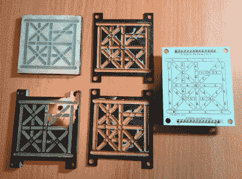

# 时钟使用自定义的 LED 显示屏来保持神秘的时间

> 原文：<https://hackaday.com/2020/01/28/clock-uses-custom-led-displays-to-keep-myst-time/>

观众中的神秘粉丝会喜欢这个项目，因为[展示了达尼号](https://hackaday.io/project/169627-25-hour-digital-myst-clockchronometer)的 25 小时计时系统。硬件黑客会稍微靠近他们的屏幕，因为它是用定制的 25 段 led 来实现的，当他们听到它保持 0.001 秒的精度时，痴迷于精度的人会开始深呼吸。至于创作者[Mike Ando]最认同哪一个阵营，我们不能说。但我们绝对尊重他的风格。

我们就不深入描述《神秘世界》系列中使用的 25 进制数字系统了。如果你有足够的兴趣，你可以点击该项目的 Hackaday.io 页面，学习如何真正读取时钟。大概你会回到这里，用克林贡语发表你的评论。

 让我们直接跳到真正让我们兴奋的部分，那些定制的展示。为了创造它们，[迈克]用激光从黑色丙烯酸中切割出表面，并用透明树脂和非常精细的石膏混合物填充每个空隙。获得正确的混合可能有点挑剔，因为石膏会结块，但最终结果是很好地漫射光。丙烯酸前面板和几个纸板“垫圈”防止光泄漏到相邻的部分，然后堆叠在具有相应的 0603 SMD LEDs 的 PCB 的顶部。

除了内部连接一切所需的令人窒息的电线数量之外，项目的其余部分相对简单。它使用 WeMos D1 迷你连接到 WiFi 网络，并每隔几个小时从地理上最近的 NTP 服务器下载当前时间。[Mike]没有在电路板上安装温控振荡器，而是决定将他的精度寄托在持续的互联网连接和积极的同步上。

从[令人印象深刻的曲线条形图模块](https://hackaday.com/2017/05/16/3d-printing-custom-led-bar-graphs/)到[与家居用品分割的显示器](https://hackaday.com/2018/10/27/custom-led-signage-from-household-items/)，我们已经看到了我们的定制指标的公平份额。但我们不得不承认，为一个虚构的星际物种的字母表建造 25 段 LED 显示屏设置了相当高的门槛。

 [https://www.youtube.com/embed/xDaKi6vqnOw?version=3&rel=1&showsearch=0&showinfo=1&iv_load_policy=1&fs=1&hl=en-US&autohide=2&wmode=transparent](https://www.youtube.com/embed/xDaKi6vqnOw?version=3&rel=1&showsearch=0&showinfo=1&iv_load_policy=1&fs=1&hl=en-US&autohide=2&wmode=transparent)

