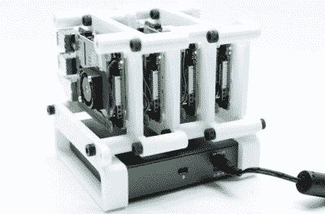

# Cluster Deck 将四个 pi 装入一个便携包中

> 原文：<https://hackaday.com/2020/10/22/cluster-deck-packs-four-pis-into-one-portable-package/>

并行计算是一个相当复杂的主题，我们中的许多人都只有有限的实践经验。但是将任务分解成更小的块，并在不同的处理器之间，甚至是完全不同的计算机之间转移它们，可以说是软件开发的未来。为了在游戏中领先一步，许多人组建了自己负担得起的家庭集群来帮助他们学习诀窍。

作为去中心化加密货币工作的一部分， [[Jay Doscher]最近发现自己需要一个小型研究集群](https://back7.co/home/the-raspberry-pi-cluster-deck)。他认为 Raspberry Pi 4 会给他带来最大的收益，所以他开始研究一个小型的独立集群，可以处理四台单板计算机。鉴于他现有的作品，正如我们所期望的那样，最终的结果是简洁、优雅，并且对于任何希望追随他脚步的人来说都是有据可查的。

The core unit would make a great desktop cluster.

从外表上看，这个集群[看起来很像几个月前他开发的*Mil-Plastic*](https://hackaday.com/2020/08/27/mil-spec-looks-without-defense-department-budget/)，配有同样的 10 英寸 Pimoroni IPS LCD。但是 3D 打印外壳的内部设计已经进行了调整，以适应四个具有独特交错安装排列的 pi，这使得一个单元比我们过去见过的其他单元更加紧凑。事实上，即使你不想构建[Jay]称之为的整个*集群，打印出“核心”本身也是为你自己的实验组装一个整洁的 Pi 集群的好方法。*

多亏了以太网供电帽，[Jay]只需要在每个 Pi 和 TP-Link 五端口交换机之间架设一条短的以太网电缆。这在很大程度上消除了我们通常与这些小 Pi 集群相关的电线缠结，不仅看起来干净很多，而且使 dual Noctua 80 mm 更容易让冷空气在机箱内循环。最终，最终产品看起来一点也不像一堆树莓馅饼。但是，我们认为这是重点。

当然，[你真正需要的是几个 pi 和一个网络交换机](https://hackaday.com/2020/04/24/raspberry-pi-cluster-shows-you-the-ropes/)在每个人都喜欢的 Linux 板上玩并行计算。[在那之后](https://hackaday.com/2019/11/27/your-raspberry-pi-cluster-is-not-like-this-one/)你能在这个概念上走多远完全取决于你。