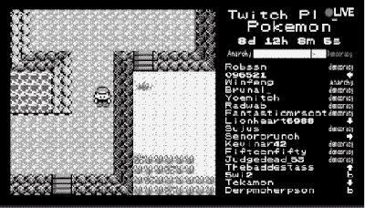

# 为机器人编写你自己的 Twitch 聊天控件——或者其他任何东西！

> 原文：<https://hackaday.com/2021/04/08/code-your-own-twitch-chat-controls-for-robots-or-just-about-anything-else/>

2014 年，Twitch Plays Pokemon 闯入当时新兴的直播场景，让 Twitch 观众通过简单的聊天命令控制运行 Pokemon Red 的 Game Boy 模拟器。从那以后，同样的概念被应用于世界上的一切事物。其他的视频游戏，安装 Linux，甚至纽约证券交易所的交易都已经通过 Twitch chat 游戏化了。



*TwitchPlaysPokemon* started a craze in crowdsourced control of video games, robots, and just about everything else.

你，饥渴的读者，想知道如何才能在这个美味的行动中分得一杯羹。不要害怕，因为只要一点点混乱的代码，你就可以让 Twitch chat 接管你电脑里、电脑上或电脑周围的任何东西。

## 只是 IRC

Twitch 的伟大之处在于它运行在普通的 IRC(互联网中继聊天)上。该协议已经存在很久了，库的存在使接口变得容易。就像 Twitch 后面的原始 streamer 玩口袋妖怪一样，我们将使用 Python，因为它非常适合像这样有趣的小实验。也就是说，任何语言都可以——只要在相关的语法中应用相同的技术。

SimpleTwitchCommander，[，我在 Github](https://github.com/whatuptkhere/SimpleTwitchCommander) 上给它起了个名字，假设你对基本的 Python 编程有些熟悉。该代码将允许您以两种方式从聊天中获取命令。来自聊天的命令可以被列表，并且只有投票最多的命令被执行，或者每一个命令可以被直接执行。实际上，让这些代码控制你的机器人、视频游戏或宠物蝰蛇取决于你。我们在这里做的是与 Twitch 聊天接口，并拉出命令，这样你就可以让它做你喜欢的任何事情。也就是说，对于这个例子，我们已经为一个简单的轮式机器人设置了解析命令的代码。让我们开始吧。

## 代码行走

```

import socket
from emoji import demojize
from apscheduler.schedulers.background import BackgroundScheduler

```


With this code, you too can watch as random people from the Internet [drive your robot straight into a bush.](https://youtu.be/CSSg1R2GKdQ?t=28)

在我们的代码中要做的第一件事是导入我们需要的库。库是伟大的，它们是天才程序员的礼物，让我们的生活变得更简单——或者至少我们希望如此。在本例中，我们使用了四个库，但是根据您的应用程序，您可以只使用前三个库。第一个，也许是最重要的，是`socket`库，它处理我们所有的网络通信。`emoji`库为我们提供了一个从聊天信息中剥离表情符号的简洁工具，因为它们可能会变得混乱。`APScheduler`用于我们的命令投票系统，它让 Twitch 用户对他们想要的动作进行投票，而不是简单地让每个 Twitch 命令通过。

`class TwitchControl:`

这条语句为我们的程序建立了类。

```

def __init__(self):
    self.server = 'irc.chat.twitch.tv'
    self.port = 6667
    self.nickname = 'yourtwitchusername'
    self.token = 'oauth:youroauthkeyhere'
    self.channel = '#yourtwitchchannel'

    self.sched = BackgroundScheduler()

    self.sock = socket.socket()
    self.sock.connect((self.server,self.port))
    self.sock.send(f"PASS {self.token}\n".encode('utf-8'))
    self.sock.send(f"NICK {self.nickname}\n".encode('utf-8'))
    self.sock.send(f"JOIN {self.channel}\n".encode('utf-8'))

```

`__init__()`是一个特殊的 Python 例程，当从一个类创建一个对象时调用。简单地说，当我们调用`TwitchControl`时，`__init__()`中的代码首先运行。这里，我们创建变量来存储 Twitch 聊天服务器的地址、端口以及我们的 Twitch 登录和频道详细信息。oauth 令牌是 Twitch 服务器知道谁连接到聊天频道的方式，[，你可以在这里生成你自己的](https://twitchapps.com/tmi/)。

```

    self.voteDict = {"null": 0, "fwd" : 0, "rev" : 0, "left" : 0, "right" : 0}    

```

接下来，我们创建一个名为 dictionary 的特殊变量，并将其命名为`voteDict`。字典是伟大的，因为它们允许我们以整齐的小对存储数据。在我们的例子中，我们有我们想要的命令，每个命令旁边都有一个数字。这将对应于聊天中每个命令的投票数。我们从 0 开始初始化它们。

```

    self.sched.add_job(self.voteCount, 'interval', seconds=2)
    self.sched.start()

```

上面几行设置了`APscheduler`以 2 秒的间隔运行一个函数。该函数名为`voteCount`，每两秒钟检查一次`voteDict`，看看哪个命令在聊天中获得了最多的投票，然后执行获胜者。我们一会儿再回来看看 voteCount。现在，让我们来看看初始化好之后运行的主循环。

```

def loop(self):
    while True:
        resp = self.sock.recv(2048).decode('utf-8')
        if resp.startswith('PING'):
            self.sock.send("PONG\n".encode('utf-8'))
        elif len(resp) > 0:
            respClean = demojize(resp)
            print(respClean)
            msgComponents=respClean.split(" ",3)

            msgUser=msgComponents[0] #get username from message
            msgUser = msgUser[msgUser.find(':')+1: msgUser.find('!')]
            msgContent=msgComponents[3] #print message content

```

一旦我们进入 while 循环，我们需要从 IRC 服务器接收数据。如果数据是“PING ”,我们按照典型的 IRC 惯例用“PONG”来响应，以保持连接活动。否则，我们用 demojize 函数清理数据，用纯文本替换消息中的任何表情符号。然后，我们使用字符串函数将来自服务器的原始消息分成几个部分:发送消息的用户名和实际的消息内容。在这一点上，我们可以直接搜索命令，如果我们想直接触发消息，我们可以在这里做。

```

            if msgContent.find("LIGHTS") >=0:
                print("Turning Lights On!") 
                #code to turn lights on here

```

或者，如果我们想收集聊天中的命令，看看哪个命令最受欢迎，我们也可以这样做。每次检测到以下命令之一，其在`voteDict`字典中的相应字段就会增加 1。

```

            if msgContent.find("FWD") >=0:
                self.voteDict["fwd"] = self.voteDict["fwd"] +1
            if msgContent.find("REV") >=0:
                self.voteDict["rev"] = self.voteDict["rev"] +1
            if msgContent.find("LEFT") >=0:
                self.voteDict["left"] = self.voteDict["left"] +1
            if msgContent.find("RIGHT") >=0:
                self.voteDict["right"] = self.voteDict["right"] +1

```

这就是我们的主循环所做的一切。它接收来自 IRC 服务器的数据，对其进行处理，并根据输入的命令增加投票计数。为了对这些投票进行实际操作，我们需要使用我们的`voteCount`函数。感谢我们之前设置的`APscheduler`例程，它每两秒钟自动运行一次。

```

def voteCount(self): #function responsible for checking votes and executing commands
    print('Counting votes and executing command')
    voteWinner = max(self.voteDict, key=self.voteDict.get)
    print("biggest vote:" + voteWinner)
    nullCheck=all(x==0 for x in self.voteDict.values())

    if nullCheck:
        print('doing a nullo')

    elif voteWinner=="fwd":
        print('going Forward')
        #code to go forward here
    elif voteWinner=="rev":
        print('going Reverse')
        #code to go reverse here
    elif voteWinner=="left":
        print('going Left')
        #code to go left here
    elif voteWinner=="right":
        print('going Right')
        #code to go right here
    self.voteDict = {"null" : 0, "fwd" : 0, "rev" : 0, "left" : 0, "right" : 0}

```

voteCount 是一个简单的函数，它使用 Python 内置的字典函数来确定投票最多的命令。请注意，我们还会检查所有投票是否都等于零——在这种情况下，我们必须什么都不做，这就是 nullCheck 代码的由来。一旦确定了获胜者，就可以执行相关命令的代码。

## 你会对 Twitch 释放什么？

有更多的样板文件来把事情串在一起，但从根本上说，这些是使一切工作的模块。如果你想在家里修补东西，可以从 Github 上下载真正的东西。显然，从这里开始，只需根据您的特定目的定制代码。如果你想控制一个机器人，把伺服系统或电机的指令放在必要的地方，或者通过串行向处理这些任务的微控制器发送指令。或者，如果您在模拟器中处理游戏，让 Python 代码简单地模拟相关的按钮按压。

代码没有经过任何优化；写这篇文章花费的时间大约是写代码本身的两倍。通过使用更理想的字符串管理代码和其他类似的调整，可能会有巨大的收益。将所有这些打包成一个整洁的库的进一步工作留给了读者。希望这能让你在 Twitch 上享受一些众包的乐趣！一如既往，黑客快乐。