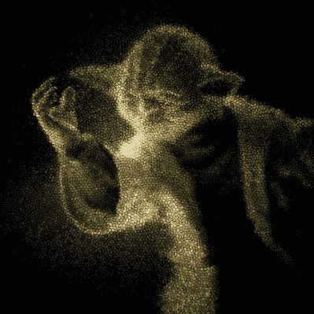

# 咖啡搅拌器充当这个数码吸管相机的镜头

> 原文：<https://hackaday.com/2021/05/06/coffee-stirrers-act-as-lens-for-this-digital-straw-camera/>

当你把超过 23000 个咖啡搅拌器和一个树莓派相机混合在一起会发生什么？可能除了一片混乱之外什么都没有，除非你非常明确地包装塑料吸管，并正确地调整相机的方向。在这种情况下，你会得到这个非常酷的无镜头数码吸管相机，它可以巧妙的拍摄幽灵般的图像。

Image of Yoda photographed through many straws

事实上，无镜头有点像阿德里安·汉福特的创作。虽然他用来捕捉图像的相机有一个镜头，但由于缺乏更好的术语，目标只是一捆紧密包装的吸管。在之前，我们已经见过[这种摄影方法，但在那里，相机使用放置在稻草捆后面的胶片来捕捉像素化图像。](https://hackaday.com/2017/02/18/can-a-bundle-of-soda-straws-be-a-camera/)

在这里，毛玻璃屏幕代表电影；一个长长的不透光的盒子，后面提供了一个安装照相机来拍摄图像的地方。聪明的是，[阿德里安]用乐高建造了相机支架，允许相机和镜头快速更换。任天堂游戏手柄控制器与运行在 Raspberry Pi 上的定制软件对话，并允许摄影师使用智能手机作为显示器来控制曝光和滚动图片。下面有一个简短的视频，是给那些对稻草包装技术不感兴趣的人看的。

与这款相机的胶片版本一样，我们只是喜欢由此产生的照片的外观——稻草蜂窝的纹理和散焦的主题产生了惊人的效果。

 [https://www.youtube.com/embed/LVWuXccv03I?version=3&rel=1&showsearch=0&showinfo=1&iv_load_policy=1&fs=1&hl=en-US&autohide=2&wmode=transparent](https://www.youtube.com/embed/LVWuXccv03I?version=3&rel=1&showsearch=0&showinfo=1&iv_load_policy=1&fs=1&hl=en-US&autohide=2&wmode=transparent)

感谢[Itay Ramot]的提示。