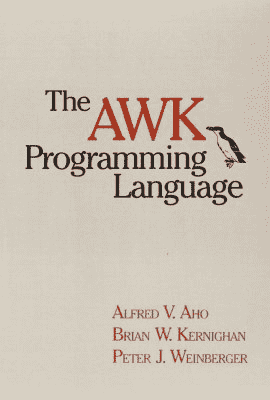

# 克尼根咖啡

> 原文：<https://hackaday.com/2022/08/24/coffee-with-kernighan/>

上周发布的一个计算机爱好者视频中有一个有趣的花絮(在插播广告下方)，主角是教授(大卫·布雷斯福德)和教授(布莱恩·克尼根)边喝咖啡边聊天。在其他主题中，他们讨论了各种文本处理工具的历史和现状。我们了解到[Kernighan]已经承担了一个更新 AWK 文本处理语言来处理 UTF-8 文本的夏季项目，他承认在这个时代这种疏忽是令人尴尬的。他还在编写 AWK 编程语言 的第二版 *[，该书自 1988 年首次发布以来就没有更新过。](https://en.wikipedia.org/wiki/The_AWK_Programming_Language)*

[Brian Kernighan]是 Unix 和计算领域的传奇人物，在开发 Unix 和 C 的 70 年代，他在贝尔实验室工作。在他职业生涯的众多成就中，他因与 *[的【Dennis Ritchie】合著《C 编程语言](https://en.wikipedia.org/wiki/C_(programming_language))* 而闻名，该书于 1972 年首次出版，几十年后仍在使用，上文提到的 AWK，以及对 troff 的重大更新。最近，他在 2015 年与人合著了《T4》这本关于围棋编程语言的书。

如果更新的 UTF-8 能力的 AWK 让你感兴趣，请留意 [AWK GitHub 仓库](https://github.com/onetrueawk/awk)，在那里【Kernighan】预期更新，[一旦他把 git 想得更好一点](https://github.com/onetrueawk/awk/commit/9ebe940cf3c652b0e373634d2aa4a00b8395b636)。我们很高兴看到 80 岁的布莱恩如此活跃。如果你想了解贝尔实验室早期的更多情况，我们回顾了几年前[kernighan]非常有趣的 *[UNIX:一段历史和回忆录](https://hackaday.com/2019/10/29/unix-tell-all-book-from-kernighan-hits-the-shelves/)* 。

 [https://www.youtube.com/embed/GNyQxXw_oMQ?version=3&rel=1&showsearch=0&showinfo=1&iv_load_policy=1&fs=1&hl=en-US&autohide=2&wmode=transparent](https://www.youtube.com/embed/GNyQxXw_oMQ?version=3&rel=1&showsearch=0&showinfo=1&iv_load_policy=1&fs=1&hl=en-US&autohide=2&wmode=transparent)

