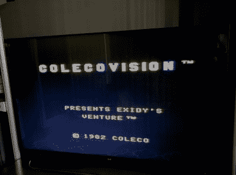

# ColecoVision Barn Find 获得无线改造

> 原文：<https://hackaday.com/2022/11/14/colecovision-barn-find-gets-wireless-makeover/>

很少有事情比在某个地方找到一件旧的、被遗忘的技术并让它起死回生更令人满意了。虽然看到一辆罕见的跑车或一台阿波罗飞行电脑被修复是一件好事，但即使是 20 世纪 80 年代不太成功的游戏机也可以成为一些伟大的修复故事。让我们看看[谨慎的市长]是如何描述他在谷仓中发现的 ColecoVision 的修复和改造工作的。

鉴于 ColecoVision 在 1982 年至 1985 年期间上市，我们可以假设[Discreet Mayor]的控制台已经在货架上放置了至少 30 年，而且这台机器肯定显示出了它的年龄。几个组件因腐蚀而失效，包括时钟晶体、7400 系列逻辑芯片和电源中的电容器，但由于这些都是标准组件，更换它们相当简单。

可惜的是，控制器已经无法修复了。用标准的操纵杆代替它们并不是一个真正的选择，因为 ColecoVision 控制器包括一个数字键盘，主要用于选择游戏选项。做一些全新的东西是一条出路，而[谨慎的市长]决定在做的时候使用无线系统。毕竟，他已经开发了一个基于 IEEE 802.15.4 标准的[模块化无线物联网系统，事实证明它非常适合这个系统。](https://hackaday.com/2021/11/11/rolling-your-own-long-range-iot-sensor-network/)

 【谨慎的市长】在一块中密度纤维板上建造了一个简单的操纵杆加开火按钮装置，并为其配备了物联网发射器。他没有添加替代的数字键盘，而是决定使用操纵杆来模拟最常用的按钮:“右”代表“1”，“下”代表“2”，等等。接收器模块使用数字开关来模拟控制台输入端口的按键。最终的结果可能看起来有点粗糙，但控制台又完全正常了，可以像三十多年前一样运行游戏。

我们已经看到了几个将无线控制器添加到各种经典控制台的项目。如果你有一个无法挽回的梦想，你总是可以[从头开始打造你自己的梦想。](https://hackaday.com/2020/07/12/remaking-a-colecovision/)