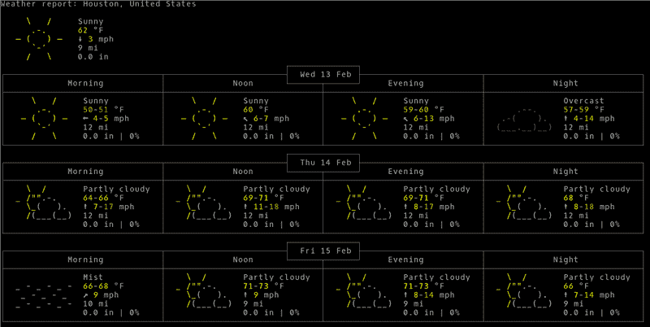

# 云中的命令行实用程序？

> 原文：<https://hackaday.com/2019/02/17/command-line-utilities-in-the-cloud/>

尽管许多人认为基于 Linux 的操作系统是图形化的，但实际上 GUI 只是在裸操作系统上运行的另一个应用程序。高级用户、远程管理员和运行像 Raspberry Pi 这样功能不足的计算机的人倾向于使用命令行工具做更多的事情。【Igor】做了一个 [FOSDEM19 演示](https://www.youtube.com/watch?v=PmiK0JCdh5A)你可以在下面看到他如何使用 web 服务器和 curl 作为客户端向命令行提供类似 web 的服务。

这与仅仅通过 curl 访问普通的 web 服务器略有不同。输出是为了在终端上显示。当然，如果你愿意的话，你也可以用网络浏览器来点击它们——至少对其中一些来说是这样。[Igor]的工具包括天气预报器、QR 码编码器、货币和网络货币汇率的信息和图表，以及面向程序员的在线帮助系统。

这与普通云服务有相似的优点和缺点。调用很简单。例如，要获取当前天气:

```
curl wttr.in
```

产生这个:

[](https://hackaday.com/wp-content/uploads/2019/02/wx.png)

当然，您可以传递参数来设置不同的位置和其他选项。

对于控制台工具来说，有些工具有非常令人印象深刻的图形输出。当然，旋度没有什么魔力。如果您安排 wget 的输出到控制台，您可以很容易地使用它。

[Igor]承诺即将推出一个框架来帮助创建这类服务。老实说，我们可以很容易地看到使用十几个其他协议中的任何一个来做同样的事情，除非有令人信服的理由将东西放在云上，否则我们不确定这些服务是否特别棒，除非作为例子。但是我们可以看到使用这种技术向终端会话提供集中的数据。作为其他协议能做什么的例子，试试这个:

```
telnet towel.blinkenlights.nl
```

[Igor]并没有垄断像这样的 curl 友好服务。尝试:

```
curl http://ifconfig.co
```

如果你是命令行的忠实粉丝，为什么不在你的 Arduino 上安装一个呢？如果你开始处理很多命令，也许可以检查一下[标记](https://hackaday.com/2018/10/24/linux-fu-marker-is-a-command-line-menu/)。

 [https://www.youtube.com/embed/PmiK0JCdh5A?version=3&rel=1&showsearch=0&showinfo=1&iv_load_policy=1&fs=1&hl=en-US&autohide=2&wmode=transparent](https://www.youtube.com/embed/PmiK0JCdh5A?version=3&rel=1&showsearch=0&showinfo=1&iv_load_policy=1&fs=1&hl=en-US&autohide=2&wmode=transparent)

