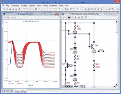
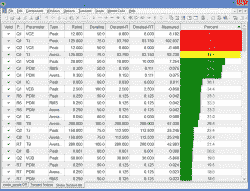

# 商用电路模拟器免费

> 原文：<https://hackaday.com/2020/01/08/commercial-circuit-simulator-goes-free/>

如果您正在寻找模拟软件，您可能会考虑 LTSpice 或 Ngspice(驱动 Oregano 和 QUCs-S)或 GNUCap 等开源模拟器。不过去年频谱软件关闭后又有了新的免费选项:[微帽 12](http://www.spectrum-soft.com/download/download.shtm) 。你可能在想:为什么要用另一个闭源模拟器？嗯，所有的模拟器都有其独特的优势，但微型电脑确实有非常好的功能，过去的零售价约为 4500 美元。

该模拟器拥有多页原理图编辑器、本机鲁棒数字模拟、蒙特卡洛分析、库中的 33，000 个零件、最坏情况和烟雾分析、史密斯图表，甚至可以合并电子表格。有源和无源滤波器有一个内置的设计器。看一下[手册](http://www.spectrum-soft.com/down/mc12broc_hi.pdf)，你会发现这是一款非常重要的软件。现在它至少是免费的[啤酒](https://en.wiktionary.org/wiki/free_as_in_beer)

## 模型

有源器件支持的模型数量令人印象深刻，包括一些非常新的 MOSFET 模型，而不仅仅是旧的标准模型。它还可以读取任何常规 Spice 或 IBIS 模型。如果您想使用另一个引擎或与其他 Spice 用户共享设计，它还可以导出 Spice 文件。也提供了相当多的例子。还有 2000 多个标准数字器件，包括所有常见的 7400 系列、CD4000 CMOS，甚至 ECL。

作为奖励，我们在 Wine 下测试了它，效果很好——至少是 32 位版本。稍加努力，64 位的可能也能工作。在大显示器上，您可能希望使用 Winecfg 来设置更高的 DPI 设置，尽管工具栏图标的大小是固定的，这有点不方便。但是，您可以选择选项|首选项菜单上的“大工具栏”,这会有所帮助。

## 特征

 一个很好的体验是，你可以查看一个模拟，并交互式地更改组件值，并立即观看结果更新。

当我们懒得做选择一组最佳值所需的数学运算时，我们经常使用 Spice。有了这个软件，你可以设置各种电路元件的范围，告诉程序你想优化什么，它会为你计算出最佳值。

烟雾分析有些独特。其思想是运行瞬态分析，程序确定是否有任何电路值超过元件的最大值。你会得到一个漂亮的彩色图表，告诉你离吸烟有多近，或者，如果你有一些红色的条，哪些部分会吸烟。

另一个巧妙的特性是你可以创建非常酷的 3D 绘图。如果您正在步进参数或测量对温度等参数变化的影响，这尤其有用。

我们喜欢的另一个特性是该程序可以输出印刷电路板程序的网表，包括 Protel、Accel、Orcad 和 PADS。库中超过 18，000 个组件有可用的包，并且有一个包编辑器。我们希望它能与 KiCAD 一起工作，尽管我们很确定你能从一种可用的格式中找出一些转换路径。

## 为什么免费？

该软件自 1982 年以来一直在开发中。我们不知道 Spectrum 关闭的具体情况，但我们希望它能继续发展。然而，我们感谢这个强大的模拟器的免费发布，它可以让 LTSpice 物有所值。的确，我们预计不会有未来的发展，但软件包似乎非常完整，并有能力导入模型，这将是非常有用的很长一段时间。

## 学问

如果你正试图学习这个程序，有一些旧版本的[启动说明](http://s-iihr64.iihr.uiowa.edu/MyWeb/Teaching/ece_55041_2014/Labs/SPICELAB.pdf)应该能让你掌握基本知识。您还可以在网站上找到用户手册和参考手册。

我们去找教程，发现【亲亲模拟】刚开始一套视频教程。到目前为止，只有一个完成了(见下文)，但我们相信还会有更多的。

 [https://www.youtube.com/embed/WExvpASP-1c?version=3&rel=1&showsearch=0&showinfo=1&iv_load_policy=1&fs=1&hl=en-US&autohide=2&wmode=transparent](https://www.youtube.com/embed/WExvpASP-1c?version=3&rel=1&showsearch=0&showinfo=1&iv_load_policy=1&fs=1&hl=en-US&autohide=2&wmode=transparent)

如果你想做 LTSpice，我们有一个教程。话又说回来，对于只是玩玩，[法尔斯塔德模拟器](https://hackaday.com/2015/07/20/a-breadboard-in-a-browser/)是相当不错的，不需要安装。