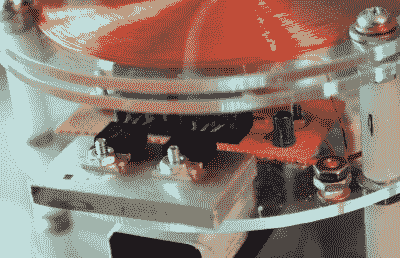

# 紧凑型 Slayer 激励器满足您的高电压需求

> 原文：<https://hackaday.com/2020/03/21/compact-slayer-exciter-for-your-high-voltage-needs/>

特斯拉线圈是令人难以置信的硬件，但它们可能很难制造。在火花隙、电容器和微调线圈之间，这不完全是一个初学者项目。幸运的是，任何人都有希望寻找一种不太复杂的方式来激发火花:杀戮者激励器。这种设备可以被认为是特斯拉线圈的小表弟，可以用于许多相同的高压实验，同时更容易组装。

显然，现在[Jay Bowles]对建造自己的特斯拉线圈并不陌生，但由于他的许多粉丝都想看看他对这个不太复杂的选项的看法，[他最近建造了自己的杀戮激励器](https://www.youtube.com/watch?v=TT4QolzknC0)。在进行了一些他自己的独特处理后，最终结果看起来很有希望。它可能无法像他的 YouTube 频道上的其他一些作品那样引发火花，但对于如此简单的东西来说，它仍然令人印象深刻。

 

【杰伦】为了可靠性使用两个晶体管并联

当我们说简单时，我们是认真的。建立一个基本的杀戮者激励器只需要五个组件:两个线圈，一个晶体管，一个二极管和一个电阻。对于这种构建，电源由该单元底部的三个可充电 9 伏电池提供，可以根据需要轻松更换。

在视频中，[Jay]很好地解释和说明了这种基本电路如何产生异常高的频率能量。其实频率高到人耳听不到；对于特斯拉线圈特有的嗡嗡声的粉丝来说，这是个不幸的消息。

一般来说，Slayer Exciters 会有与传统特斯拉线圈相同的垂直线圈，但在这种情况下，[Jay]将它换成了位于设备上层的扁平线圈。这使得一个非常紧凑的单元非常适合放在你的桌子上，如果不是因为这个小工具产生的电弧热得足以瞬间蒸发人的皮肤。只是一些需要记住的事情。

过去我们见过杀戮者，但没有一个像这个设计得这么好。顺便说一句，如果你对[杰伊]用来可视化电场的霓虹灯阵列感到好奇，[我们也报道了那个项目](https://hackaday.com/2020/03/04/visualizing-energy-fields-with-a-neon-bulb-array/)。

 [https://www.youtube.com/embed/TT4QolzknC0?version=3&rel=1&showsearch=0&showinfo=1&iv_load_policy=1&fs=1&hl=en-US&autohide=2&wmode=transparent](https://www.youtube.com/embed/TT4QolzknC0?version=3&rel=1&showsearch=0&showinfo=1&iv_load_policy=1&fs=1&hl=en-US&autohide=2&wmode=transparent)

