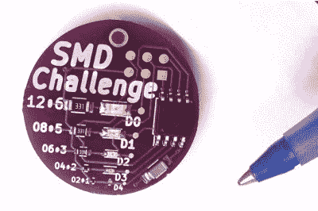

# 竞争激烈的表面贴装焊接来到了 Supercon

> 原文：<https://hackaday.com/2018/10/26/competitive-surface-mount-soldering-comes-to-supercon/>

谁会在下周的超级黑客大会上展示最好的焊接技术？我们有一个小小的挑战，事实上是非常小的挑战:将表面贴装元件焊接到微小的 0201 封装上。这是 SMD 焊接挑战，成功完成电路板展示了最好的手工焊接技术，但在周末我们也将继续运行领先电路板。

Ballpoint pen for scale

在本次活动中，我们使用 MakersBox 的 [SMD 挑战板，它利用 SOIC8 ATtiny85 来驱动 1206、0805、0603、0402 和 0201 封装中的 LED/电阻对。在预赛开始时，将有 5 分钟的检查时间来打开套件，熟悉电路板，并确认您拥有所需的所有元件和工具。我们建议在将 0201 零件放在电路板上时不要打喷嚏——套件中只有一套备用的 0201 零件，因此如果您需要，您可能会有一次额外的机会获得最小的零件，但在加热过程中丢失的零件将不会提供替换件。](https://hackaday.io/project/25265-an-unfortunate-smd-project)

将有六个人参加八场预赛，所以确保你一到达 Supercon 就报名参加。您只能参加一次比赛，并且必须使用我们的烙铁和焊料。我们手头还会有放大镜、镊子、助焊剂和脱焊带。可以带合理的工具等辅助材料；在这种情况下，进行挑战的 Supercon 员工是“合理”的仲裁者。

评分基于时间、完成度、功能性(你试图完成的电路)、整洁度和焊点质量。如果最高分是平手，所有预赛中最快的时间将是赢家。官方规则在活动页面上，请花点时间浏览一下。

不要认为这很容易。下面是 SMD 挑战板项目页面上的一段引文:

> 请注意，试图手工焊接一个仅比一粒沙子稍大的 0201 封装，可能会被视为精神错乱的证据，并让你被你所爱的人和/或死对头带到不好的地方

真正的奖励是作为一个熟练的焊接大师的吹牛的权利。你有这种能力吗？现在读到这篇文章的人会。但是第一步是出席[黑客日超级会议](https://hackaday.io/superconference/)。再见，祝你好运！