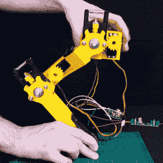

# 使用伺服系统的柔顺四足腿

> 原文：<https://hackaday.com/2020/03/22/compliant-quadruped-legs-using-servos/>

平稳移动的行走机器人很难制造，通常涉及某种柔顺的腿部机构——机器人的肢体可以像自然生理学一样反弹，以实现比僵硬的机器更好的运动。在他建造一只真正工作的机器狗的永恒追求中，[詹姆斯·布鲁顿]正在研究一只负担得起且容易接近的迷你机器狗，从符合[的腿机构](https://www.youtube.com/watch?v=DfBF26DaT-M)开始。

3D 打印的腿部机构有两个关节(髋关节和膝关节)，每个关节都有一个 RC 伺服驱动。为了使关节柔顺，两者都装有弹簧来吸收外力，偏转由霍尔效应传感器检测，每侧都有移动的磁体。使用来自霍尔效应传感器的输入，伺服机构可以跟随偏转，并在力消散后平稳地返回到其原始位置。这是一个简单的技术，但它显示了很多承诺。休息后看视频。

一个项目有时可以发展自己的生命，或者在[詹姆斯]的 [OpenDog](https://hackaday.com/2018/06/11/james-bruton-is-making-a-dog-opendog-project/) 的情况下，产生实验性进化的后代。这是第四个，它被设计成一个学习如何让四足动物正确行走的平台，并且足够简单和便宜让其他人来建造。我们期待看到结果如何。

如果你错过了，也来看看这个机器人的怪异兄弟，[自平衡声波](https://hackaday.com/2020/02/26/sonic-the-self-balancing-robot-face-plants-and-the-challenges-of-sensor-integration/)。

 [https://www.youtube.com/embed/DfBF26DaT-M?version=3&rel=1&showsearch=0&showinfo=1&iv_load_policy=1&fs=1&hl=en-US&autohide=2&wmode=transparent](https://www.youtube.com/embed/DfBF26DaT-M?version=3&rel=1&showsearch=0&showinfo=1&iv_load_policy=1&fs=1&hl=en-US&autohide=2&wmode=transparent)

