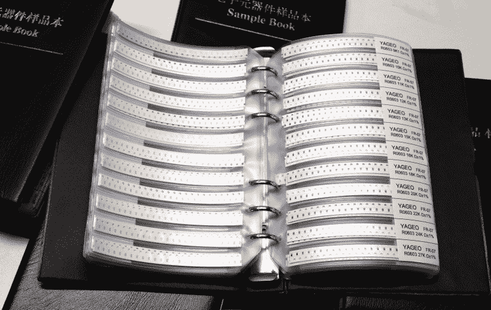
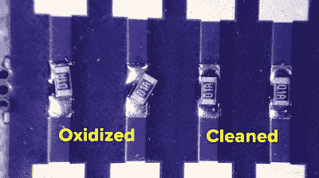
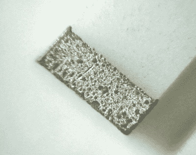
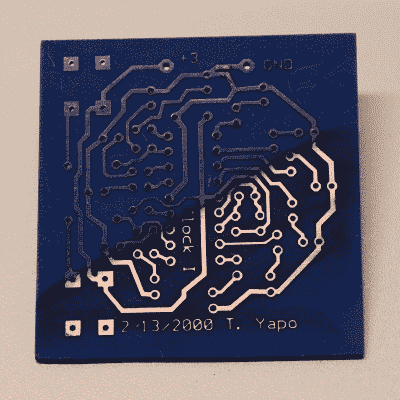

# 组件保质期:如何使用所有旧垃圾

> 原文：<https://hackaday.com/2019/04/23/component-shelf-life-how-to-use-all-that-old-junk/>

有两种类型的 Hackaday 阅读器:一种拥有他们多年来收集的大量零件库存(换句话说，一大堆垃圾)，另一种将在几十年后拥有一个。很容易出现一大堆东西，尤其是那些你可能会在不止一个设计中用到的东西；数量为 10 或 100 件的价格断点可能非常诱人，而且由于当地零件商店已经走上了恐龙的道路，拥有个人库存肯定会加速黑客攻击过程。不过，这并不是一个完美的解决方案，因为有些组件确实有保质期，并且会随着时间的推移以某种方式退化。

如果你的仓库里有旧的电子元件，你可能会发现它们没有老化，但有时这是可以解决的。让我们来看看常见零件的保质期，如何延长保质期，如果它们需要一点更新，你可以做些什么。

## 旧组件的新样本

Inexpensive SMD resistor sample book bought on eBay.

20 多年前，我买了几百个 1/4 W 通孔电阻的普通 E24 系列值，总共 169 个不同的值。在这中间的二十年里，我很少需要为快速原型甚至小批量电路板购买电阻；每当箱子空了，我就重新进货。最近，我开始购买类似的表贴元件，包括电阻、电容和少量电感。我需要库存多种尺寸的事实被 SMD 器件较低的单位成本所抵消，因此前期投资大致相同，手头有器件也很方便。

Oxidized terminals cause SMT components to float on molten solder (left two resistors).

虽然我焊接通孔电阻从来没有问题，但样书中的 SMD 器件从一开始就证明是有问题的。我发现一些元件不能正确回流:它们漂浮在熔化的焊料上，四处移动，没有附着在 PCB 上，在某些情况下，最终只能靠助焊剂支撑。这就是通常所说的“头在枕头里”的缺陷。经过一点试验，我得出结论，这些元件样本书中的一些很可能是来自非常旧的元件卷轴的切割带，这些卷轴不再适合自动取放装配。我想象在某个地方有一个小型的家庭手工业，把过期的胶片切碎，塞进书里，在易贝叫卖。

0603 resistor from ebay sample book shows terminal oxidation.

在回流过程中，我不得不用镊子夹住元件，让它们粘在一起，这让我很沮丧，于是我求助于 Hackaday.io 上的黑客聊天室。在那里，[salec]建议我在将元件放在 PCB 上之前，在一张普通纸上摩擦它们，以此来清洁它们。令我惊讶的是，这非常有效；干净的部件焊接得很好。我随后在显微镜下观察了一些组件，发现端子显示出一层氧化层——用纸魔术很容易去除——这阻止了焊料正确润湿它们。如果你自己尝试这样做，请确保之后彻底洗手，因为这些旧零件可能会使用锡铅焊料，清洁过程会产生非常细小的颗粒，如果摄入，很容易被吸收。本文末尾有一个简短的视频，展示了清洗这些元件的过程及其在回流焊接过程中对其性能的影响。

## 可焊性是一个东西

原来可焊性是一个可测量的属性。通过将元件端子浸入熔化的焊料中，并检查由此产生的焊料膜，可以评估其焊接性能。Mil-Std-883 Method 2003.7(PDF)中规定了这种浸渍和观察方法的一种形式，其中还包括将零件暴露在约 90 ℃的水蒸气中的加速老化试验。放大检查时，合格/不合格标准是 95%的焊料覆盖率。

回想过去，当焊料由铅制成时，需要定期测试可焊性，因为铅锡合金容易氧化，会影响可焊性。这种效应在无铅焊料中不太明显。事实上，Air Products (PDF)的一篇[论文显示，锡铅焊料生长的氧化层厚度约为锡铜或锡银焊料的十倍。这让我相信，我遇到的有问题的 SMD 元件是旧的锡铅涂层部件。](http://www.airproducts.com/~/media/Files/PDF/industries/epat/electronics-assembly-Atmosphere-Composition-Soldering-Performance-Lead-free-450-10-012-GLB.pdf)

来自 Mini Circuits (PDF)的一份[应用笔记为一些挑剔的客户解释了当前生产器件的年龄限制。美国军方已经取消了对零件的日期代码限制，美国宇航局现在只要求零件在 5 年后进行审查，以确定是否需要进行测试。在无铅焊料出现之前，军事应用要求在标记日期代码三年后重新测试元件的可焊性。更多关于长保质期的证据来自](https://www.minicircuits.com/app/AN40-015.pdf)[德克萨斯仪器公司的一项研究](http://www.ti.com/lit/wp/slva304/slva304.pdf) (PDF)，该研究发现在湿度可控的环境中储存超过 15 年的集成电路不会受到影响。

因此，如果您现在购买符合 RoHS 标准的器件，它们可能在很长一段时间内都不会有问题。另一方面，如果你正在从网上拍卖网站购买来历不明的零件，或者已经收集了一批镀铅焊料的零件，你可能需要解决可焊性问题。对于旧的通孔元件，我经常会在 dead-bug 原型制作时，在将引线焊接到位之前，用熨斗和一点新鲜的焊料重新镀锡，因为这有助于形成良好的连接。同样的技巧理论上可以用于表面贴装元件，但实际上要困难得多；纸戏法简单多了。

## PCB 老化

普通的 FR4 印刷电路板也会老化。虽然基板会吸收水分，在某些情况下需要在焊接前进行预烘烤，但随着时间的推移，爱好者主要关心的还是可焊性的降低。与元件引线和焊盘一样，表面处理决定了老化如何影响 PCB 的可用性。业余爱好者原型板常见的表面处理包括含铅和无铅 HASL(热风整平)和 ENIG(化学镀镍/浸金)。

文献将锡铅 HASL 列为具有超过 12 个月的“极好”保质期，而无铅的 HASL 和 ENIG 都列为 12 个月。你可能会认为金涂层会无限期地保持可焊性，但金涂层实际上有些多孔，允许氧气接触镍层，镍层很容易氧化。同样令人惊讶的是，根据具有类似表面的组件的保质期，锡铅 HASL 的保质期应该比无铅 HASL 更长，但你的里程数将因储存条件而异。

19-year-old PCB protected by laser printer toner. The FR4 substrate is blue/purple – before that was cool.

长期储存 PCB 的推荐方法是真空密封。如果你有一台厨房真空封口机，如果你有想保存一段时间的木板，你当然可以试一试。如果你有干燥剂的话，可以放一包进去。如果有一天你发现自己的旧印刷电路板无法焊接，你可以尝试使用一点额外的助焊剂，甚至在蚀刻溶液中快速浸泡——之后彻底清洗——以恢复可焊性。

有趣的是，如果你正在蚀刻你自己的 PCB，你可能根本不用担心老化。我最近发现了一块 PCB，是我在 2000 年 2 月用墨粉转移法蚀刻的，然后扔进一个盒子里就忘了。今天，用浸有丙酮的纸巾快速擦拭后，发现近 20 年前的碳粉下的铜非常干净，可以随时焊接。然而，一旦你取出墨粉，时钟就开始滴答作响。如果你等待的时间太长，你可能需要在焊接前重新清洁铜-Scotch-Brite 垫是我的首选工具。这个 PCB 是我为 PIC16F84 供电的 LED 时钟项目制作的两个 PCB 之一；另一块板被填充了，可能就在这附近。

## 焊料呢？

不含焊剂的固态焊料，无论是棒状还是线状，基本上都是永久性的。尽管外部可能会氧化，但在焊接过程中适当使用助焊剂——如果你的焊料没有自带助焊剂，你需要使用助焊剂——接头会变得很好。即使是药芯焊丝焊料似乎也有无限的使用寿命，尽管制造商会告诉你，由于焊剂的轻微腐蚀作用，它最终会变质。我使用过一些非常古老的药芯焊丝，从未听说过任何人——至少是业余爱好者——对旧焊丝有严重的问题。另一方面，如果你正在组装商业产品，你可能需要听从焊料制造商的建议，尽管在那种环境下你可能不太可能遇到旧库存。

焊锡膏是一个不同的故事。它肯定会变坏，我也看到了。根据制造商和产品的不同，包装上会有有效期，通常还有冷藏说明。焊锡膏含有混合有液态助焊剂的非常细小的金属球。随着时间的推移，助焊剂会溶解焊球外部的保护性氧化层，导致它们熔合在一起。这有效地增加了糊状物的粘度，使其更难处理——尤其是如果你使用注射器和皮下注射针头来组装原型的话。这一过程还会降低助焊剂的有效性，因此在回流过程中，当真正需要时，助焊剂不太能够溶解氧化物层。

在一个业余爱好者的环境中，你可以推动一些事情。我储存了一个牙膏注射器，声称冷藏后的保质期为一年，出于纯粹的懒惰，在室温下储存了大约三年。虽然它仍然“工作”，但在快结束时，一个相同材料的新注射器令人惊讶地更容易使用。我不会再那样做了——我做了很多不必要的返工。市面上有一些锡膏是不需要冷藏的:[比如乐泰 GC10](https://www.henkel-adhesives.com/us/en/product/solder-pastes/loctite_gc_10.html) 在室温下可以正式保存一年。我敢肯定，在业余爱好者的背景下，它可以被推得更久。唯一的缺点是它似乎只能在相对较大的容器中使用。

## 包扎

以上是使用旧零件时可能会遇到的一些问题。如果你知道任何其他的，你可以在下面的评论中分享。我们都想了解他们。

我甚至不想讨论电解电容的老化问题。在电解质变干和氧化层可能需要重整之间，它们绝对是可怕的，但我必须在这里提到它，以防有人还不知道这一点，特别是因为我们最近发表了一篇关于电容器问题的 [Ask Hackaday 文章](https://hackaday.com/2019/04/12/ask-hackaday-experiences-with-capacitor-failure/)。

与此同时，您可以观看展示如何清洁 SMD 零件的视频以及结果。它只有 2:20 长，但如果你想直接跳到显示回流的精彩部分，[你可以直接跳到 1:36](https://youtu.be/tk_khtUSjUA?t=96) 。

 [https://www.youtube.com/embed/tk_khtUSjUA?version=3&rel=1&showsearch=0&showinfo=1&iv_load_policy=1&fs=1&hl=en-US&autohide=2&wmode=transparent](https://www.youtube.com/embed/tk_khtUSjUA?version=3&rel=1&showsearch=0&showinfo=1&iv_load_policy=1&fs=1&hl=en-US&autohide=2&wmode=transparent)

