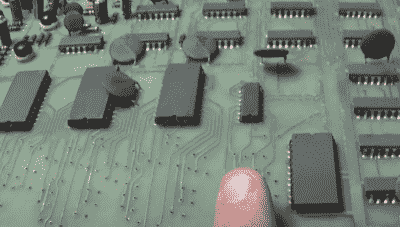

# 计算机空间再次飞逝

> 原文：<https://hackaday.com/2022/11/10/computer-space-flies-again/>

*经典街机修理部的【肖恩】修理经典街机，他接到了一个修理一台非常特殊的机器的请求。这是*电脑空间*，有史以来第一个商业街机柜，大致基于*太空战！这个投币游戏的老爷爷是一个真正的谷仓发现，放置多年后情况相当糟糕。所有的部件看起来都是原装的，有 50 年的历史了。可以想象，这种组合对于组件的健康来说不是好兆头。这里有几个小时的镜头，但这是无价的故障排除建议，非常酷地看到这样一个老机器正在工作。
 
[第一部分](https://www.youtube.com/watch?v=EBnZJXByNCc)是介绍，而[Sean]从惠普逻辑分析仪开始，只是探测电路板上的许多 TTL 芯片，寻找浮动或其他可疑输出。找出明显有问题的芯片，用插座和新芯片替换每个芯片。几乎机器中的每个二极管都需要更换。**

[维修的第二部分](https://www.youtube.com/watch?v=DjNg0CDBEU0)从一次断线维修开始，发现电路板上的所有陶瓷电容都有泄漏。有趣的是，万用表测试这些电容值是否正确，但一个专门的泄漏测试仪发现了问题。

[第 3 部分](https://www.youtube.com/watch?v=R1LkRBB7Bm0)展示了通过逻辑测试仪运行剩余芯片的过程，发现了更多有问题的 ic。在某些情况下，芯片只是有时测试工作正常。奇怪的是，其中一个新的替换芯片出现了问题。虽然正如一位评论者指出的那样，这可能是逻辑芯片的下降沿与上升沿变化造成的。或者新的芯片是伪造的。很难确定。

[第 4 部分](https://www.youtube.com/watch?v=j3zppgjFF5s)从一个抓住问题的瞬间开始，对电路板的第一次修复是一个失误。看似损坏的痕迹，实际上是工厂修改(博奇切割？).然后一个幸运的突破真的帮了大忙，7476 个芯片中的一个只有一半在用，手头的一个芯片只有一半在工作。把死位放进没用的槽里，机器真的开始运转了。

第 5 部分是胜利圈，所有的部件最终都到达了，一切都在工作台上开始工作。看到这台旧机器又开始哔哔作响，多酷啊。