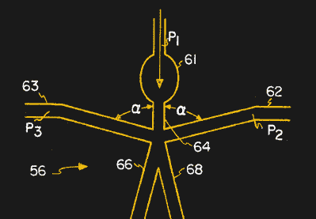

# 流畅计算

> 原文：<https://hackaday.com/2022/10/27/computing-fluidly/>

计算机有很多种形式，取决于你的定义。我们已经看到计算机和计算机门是由各种各样的东西制成的，如弹珠、继电器，当然还有晶体管。然而，有些逻辑门系统利用流体运动的特性来形成逻辑门和双稳态元件。这就是构建一台正常工作的计算机所需的所有部件。

这听起来可能有些牵强，但是已经有了使用这种技术建造的通用计算机。它还用于流体已经流动的特殊应用，如淋浴头、汽车变速器，以及电子设备容易发生故障的地方。许多人认为，当我们也需要为纳米技术应用建立分子水平的逻辑时，这个领域将会复兴。

## 基础

在其最基本的形式中，射流门使用流量作为逻辑 1，使用较少的流量作为逻辑 0。将两个流合并在一起提供了一个或门。使用可以用控制流转移的供应流提供了 NOT 功能。只要有足够多的反相器和或门，你就可以建造其他任何东西。

[Charles Ahem’s 1966 Patent](https://patents.google.com/patent/US3348773A/en)

然而，最有效的流体逻辑门是[双稳态元件，有时被称为流体放大器](https://patents.google.com/patent/US3348773A/en)。这类似于 RS 触发器。一个供给流供给该装置，两个压力口提供输入。如果一个端口出现压力，流量将继续从两个输出端口之一流出。如果压力出现在另一个端口上，流量将继续从另一个端口流出。

这些触发器设计成 Y 形，控制端口就在分支之前。来自控制端口的较小压力使流体“粘”在一个壁或另一个壁上，因此更倾向于在 Y 的一侧而不是另一侧流动。

## 历史

尼古拉·特斯拉在 1920 年发明了一种流体二极管。1949 年，一位来自新西兰的经济学家，比尔·菲利普斯，想要模拟英国的经济过程，由于计算机很难使用并且不是很强大，他求助于一台他自己建造的叫做 MONIAC 的流体计算机。

计算机用水箱来代表经济的不同部分。最上面的容器是财政部，改变阀门的位置可以让你以不同的速度花钱并观察效果。原型大约花费 400 英镑(约合今天的 15000 英镑)，由废料制成。总的来说，大约有 12 台机器最终被制造出来，大部分是由那些重视模型在视觉上易于理解的学校制造的。你可以在下面的视频中看到，新西兰储备银行有一个工作复制品作为展品。

 [https://www.youtube.com/embed/rAZavOcEnLg?version=3&rel=1&showsearch=0&showinfo=1&iv_load_policy=1&fs=1&hl=en-US&autohide=2&wmode=transparent](https://www.youtube.com/embed/rAZavOcEnLg?version=3&rel=1&showsearch=0&showinfo=1&iv_load_policy=1&fs=1&hl=en-US&autohide=2&wmode=transparent)

然而在现实中，用水来表示数学量并不是一个新想法。1901 年，Arnold Emch 提出使用特殊形状的砝码通过测量排开的水量来计算功率。使用水作为集成的类比也是一个老想法，在 20 世纪 30 年代“水力计算器”可用于执行专门任务的集成，直到 20 世纪 80 年代才在俄罗斯得到相当广泛的采用。

这个想法在 1957 年再次出现，当时一个军队实验室意识到烟气可以被引导到两个路径中的一个。这导致了我们上面提到的“流体放大器”触发器。1964 年，Univac 制造了一台原型 FLODAC T1 计算机来展示它的工作原理。

这些放大器就是我们所说的逻辑门。当然，它们不是很快，但与继电器或对噪声、静电放电和振动问题敏感的电子设备相比，它们非常稳健。一些实验飞机，如 BAE 的 MAGMA 无人驾驶飞行器，使用流体推力矢量来控制喷气排气，这对于 555 来说可能很难做到。因此，即使你的台式电脑的水消耗将被限制在冷却，也有应用程序很难做到这一点。

当我们在电子不活动的地方制造微小的东西时，我们可能会看到这些方法获得新生。此外，莱斯大学和哈佛大学一直在使用[流体技术来制造机器人](https://news.rice.edu/news/2022/fluidic-circuits-add-analog-options-controlling-soft-robots)，你可以在下面的视频中看到他们在做什么。

 [https://www.youtube.com/embed/0D22s2cMlxc?version=3&rel=1&showsearch=0&showinfo=1&iv_load_policy=1&fs=1&hl=en-US&autohide=2&wmode=transparent](https://www.youtube.com/embed/0D22s2cMlxc?version=3&rel=1&showsearch=0&showinfo=1&iv_load_policy=1&fs=1&hl=en-US&autohide=2&wmode=transparent)

在之前，我们已经看过[水加法器。事实证明，你可以用](https://hackaday.com/2021/04/26/logic-flows-literally-in-this-water-adder/)[制造几乎任何东西](https://hackaday.com/2017/01/03/make-logic-gates-out-of-almost-anything)的逻辑门。