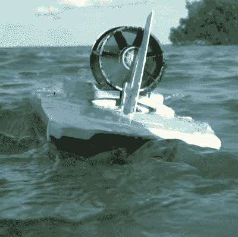

# 混凝土船高速行驶

> 原文：<https://hackaday.com/2022/11/11/concrete-boat-cements-its-way-to-high-speeds/>

钢铁稀缺。木头不是一个选项。你现在需要一艘船。这些战时环境推动了各种疯狂方向的创新，还有一个不太疯狂的方向——混凝土船。正如彼得·斯里波尔在休息时间下面的[视频中所展示的，制造一艘钢筋混凝土船并不难。做一个*快*一个反过来*就是*。但这并没有阻止他尝试，我们认为这种努力值得一看。](https://www.youtube.com/watch?v=Syy_bl2t084)

从一个基本的排水量型船体开始，[彼得]和他的同伴们试验了一个简单的遥控船，它可以工作，但只能以较慢的速度移动。他们把事情搞大了一两个档次，取而代之的是仿照他们手头的一艘钢筋混凝土快艇的船体来建造他们的混凝土船。

虽然建造方法还有很多需要改进的地方，他们甚至尝试了各种金属丝网作为钢筋，但是它们被证明太重了。不过最终，他们得到了一个可以工作的船体，并从中获得了一些乐趣。他们没有尝试用方向舵和螺旋桨来使船体防水，而是选择了导管风扇和汽艇式方向舵来制造他们所谓的“世界上最快的混凝土船”。

它是否是最快的还未确定，但是它*比*快，实际上速度相当不错。我们赞赏替代材料的探索和不同建造方法的实验。如果用混凝土建造的东西漂浮在你的船上*，那么一定要检查一下这个[混凝土针孔摄像机](https://hackaday.com/2022/05/12/making-a-concrete-pinhole-camera/)。*

 [https://www.youtube.com/embed/Syy_bl2t084?version=3&rel=1&showsearch=0&showinfo=1&iv_load_policy=1&fs=1&hl=en-US&autohide=2&wmode=transparent](https://www.youtube.com/embed/Syy_bl2t084?version=3&rel=1&showsearch=0&showinfo=1&iv_load_policy=1&fs=1&hl=en-US&autohide=2&wmode=transparent)

