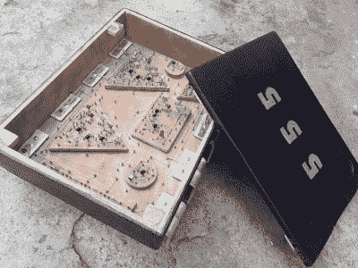
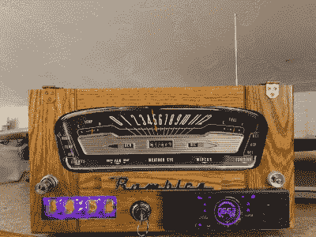
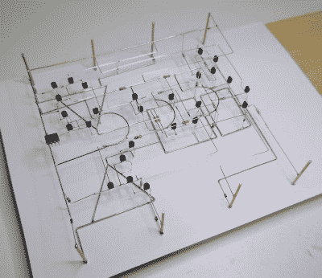
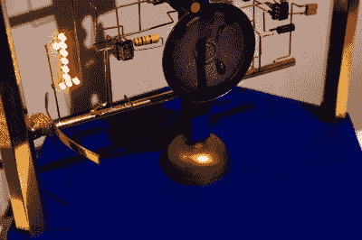
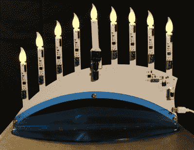
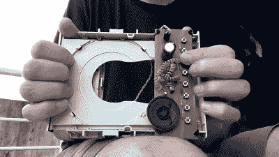

# 祝贺 555 计时器竞赛的获胜者！

> 原文：<https://hackaday.com/2022/01/20/congratulations-winners-of-the-2021-555-timer-contest/>

有时候最好的灵感是限制。555 定时器做“一件事”——将电压与一对阈值进行比较，并相应地输出信号。它包括两个比较器、一个电压阶梯和一个触发器。然而，它是有史以来销量最大的单芯片，今年庆祝了它的 50 岁生日！因此，当 [Hackaday 举办 555 计时器比赛](https://hackaday.io/contest/182830-555-timer-contest)时，各种各样的黑客拿出他们最好的作品，以显示他们对可能出现的小衰退的热爱。

## 获胜者

 毫无疑问，最受欢迎的参赛作品是[巨型 555 定时器](https://hackaday.io/project/182863-giant-555-timer)，作者【Rudraksha Vegad】。我们的每一位评委都把它评为前五名，它还两次获得最高荣誉。从表面上看，这是一个简单的“巨型 555 in a box”构建，但看看引擎盖下。组成 555 的每个子模块——比较器、触发器和放大器——都是由实际试验板样式的废弃分立部件制成，焊接到钉在木头上的黄铜钉上。作为最终产品，它是一件精美的木工作品，但作为一个创作过程，它是深入理解 555 的杰作。我们都应该做一个！

烛台 555 是一个简单的设计，袖子上有一些非常漂亮的小把戏。也许其中最可爱的是拔掉中间的蜡烛，用它点燃其他的——这是一个涉及超级电容器和簧片开关的技巧。然而，每个蜡烛照明电路都使用一个 555 定时器，一个用于提供定时上电复位脉冲，另一个 555 用作简单的触发器。这是一个巧妙的设计，也是一个很棒的用户交互。

Cyclotone 机械朋克控制台音序器是一个电路雕塑和噪音制造者的旋转塔。这个看起来很棒，在视频系列中有令人惊讶的好记录，并且使用了十亿个聪明的小技巧。555 的作用？四个级别中的每一个都是经典的[雅达利朋克控制台电路](https://hackaday.com/2015/09/17/the-ubiquitous-atari-punk-console/)。

这三个项目都赢得了 Digi-Key 150 美元的购物狂欢。定时器可真多啊！

### 你好世界！

你只有一个任务——让 555 的 LED 闪烁。[Sami]为一位即将离职的同事制作了一个奥迪 e-tron 的 PCB。我们能说什么呢？led 闪烁 555 秒，主板看起来很时髦。

### 带宽克星

原来你可以用两个 LMC 555 制造一个 [4 MHz 无线电发射机。(他们是最快的。)的确，电路的*只有*半导体是两个 555。一个产生载波频率，另一个只是反转信号。它们两个串联起来形成一个推挽放大器，以获得“最大”功率。4 MHz 带 555 振荡器还不错！](https://hackaday.io/project/183536)

### Chiptunes

毫无疑问，最奇怪的黑客之一是[折叠器](https://hackaday.io/project/183278-acordeonador)。它是由一个 CD 驱动器制成的，拉进拉出 CD 滑轨就可以转动驱动电机，驱动电机被用作发电机，为整个电路提供动力。七个按钮将定时电阻连接到 555 上，从而产生音乐。非常酷！

### 不该用 555 的

如果有你应该有的时候，也一定有你不应该的时候，对不对？例如，在这个[跳跃青蛙 LED 雕塑](https://hackaday.io/project/183518-led-animated-kinetic-chaser)中，你可能不应该使用 555 作为步进电机驱动器或计数器。一个 555 肯定没有精确的时间分辨率来[干扰 STM8 的只读保护位](https://hackaday.io/project/183537-dumping-firmware-with-a-555)，对吗？当然你不会[比特邦 DMX512 串行协议](https://hackaday.io/project/183034-dmx55512-lighting-console)或[使一个串行 ADC](https://hackaday.io/project/183026-555-based-serial-adc) 与 555？如果你不应该使用 555，那你把一辆 ATTiny85 改装成一辆替代车算不算？

这个类别没有让人失望，我们也不感到意外。告诉 Hackaday 的读者他们不能做什么，他们就会去做！

### 为艺术而艺术

最后，我们的评委非常喜欢 [CS 555](https://hackaday.io/project/183404-cs-555) ，这是一款完全电路雕塑的分立 555，以及 62 年谢妮漫步者时钟的[精神，它让一辆旧车的冲刺充满活力，仿佛被一股幽灵般的力量驱动。当然是 555。](https://hackaday.io/project/183364-the-sprit-of-the-62-rambler-nixie-clock)

### WTF 奖

老实说，我们并不知道自己制作 20 引脚 555 定时器芯片需要一个荣誉奖，但显然我们需要。【Adrian Freed】拥有[一对新的基于 555 的 IC 设计](https://hackaday.io/project/183336-new-555-timers-with-20-pins/details)，包括片上的其他功能:一个有八个输出缓冲器和一个计数器，另一个内部有线性反馈移位寄存器的内脏。他的演示例子？[闪烁着一串发光二极管](https://hackaday.io/project/183519-555-twinkle)，很自然。我们很想在未来看到这个项目的更多细节。

## …以及更多

向所有参赛者致敬！你真的应该花些时间浏览所有参赛作品的[*，而不仅仅是那些与我们最有共鸣的作品。因为谁知道呢，你可能会发现自己被困在一个荒岛上，手头只有一箱 555，需要重建现代社会。*](https://hackaday.io/submissions/555-timer-contest/list)

 *再次感谢我们的赞助商 Digi-Key 的奖品和支持！*