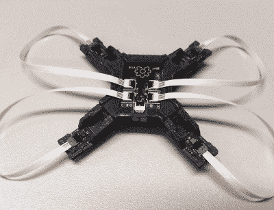
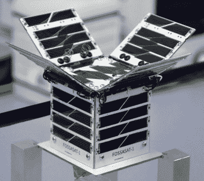
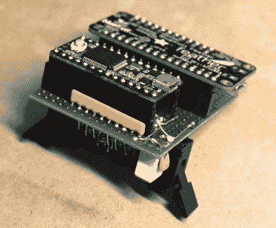
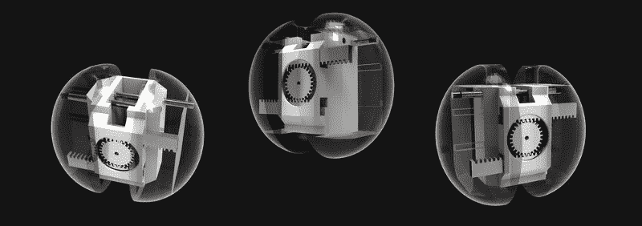

# 互联世界大赛:四大赢家揭晓

> 原文：<https://hackaday.com/2019/10/09/connected-world-contest-four-top-winners-announced/>

我们喜欢看到大大小小的项目惊人地加入黑客竞赛，推动可能性的边界。我们最近的一次是在 6 月份宣布的[互联世界竞赛](https://hackaday.io/contest/163251-connected-world-contest)，今天我们很高兴为您带来四位顶级获胜者。概括来说，这个简介是要创造一个无线连接的东西，展示创意和功能的融合。最后四种具有不同的应用范围，下面是它们各自的类别:

## 最佳项目:蜂巢跟踪器

The Hive Tracker sensor head

游戏硬件场景的观察者可能熟悉 HTC Vive Tracker 虚拟现实位置反馈系统，其中红外激光扫描场景，并由手持设备拾取，以毫米级测量其位置。 [HiveTracker](https://hackaday.io/project/160182-hivetracker) 采用 Vive Tracker 的传感器并将其小型化，中央电路板包含 Nordic NRF52 射频微控制器，四个卫星电路板包含 Triad TS4231 激光跟踪芯片。

最初的意图是使用 FPGA 进行处理，但巧妙使用 Nordic 芯片上的外设接口模式使他们可以省去它。

## 最佳设计:Fossasat 开源卫星

FossaSat-1, with solar panels deployed.

想一想你可能尝试过的最雄心勃勃的项目……有可能你不能把目光放得比太空更高。这就是来自西班牙的 Fossa Systems 团队在 Fossa at-1 上所做的事情，这是一颗开源的 pocketqube 皮卫星，其开发和发射的总预算仅为 3 万欧元。像许多这些微小的卫星设计一样，它将由 FR4 PCB 材料制成，并具有 ATmega328AU 处理器和 LoRa 无线电。它有一组太阳能电池板，在发射时隐藏在 50 毫米长的立方体中，但在飞行中会折叠起来，为它提供额外的动力。它的有效载荷将是使用 ATmega1284 处理器的学生项目。

## 最佳文档:Domsnif 点阵

The Domsnif prototype board.

现在许多设备都含有微处理器，但是在没有任何计算机接口的情况下也能工作。提取他们的数据可能是一个几乎不可能的挑战，需要完整的逆向工程。通常有某种后门可以用来规避这种工作的需要，它以设备的 LCD 显示屏的形式出现。

由于许多这些设备使用已知的协议，如果您可以访问它们的接口连接器，读取发送给它们的数据可能会成为一项相对简单的任务。这是 DoMSnif 所采用的方法，它连接到一个 LCD 接口，解码其信号，并通过蓝牙连接将数据提供给更广阔的世界。由于它处于原型形式，它使用一个 Teensy 来检索数据，并使用一根羽毛来处理蓝牙和 USB，但下一个计划是在这些角色中使用 Microchip 的 5V Cortex M0+芯片。

## 最佳社交:网真心脏

The Telepresent Heart mechanism can clearly be seen in this series of views.

与你生命中的爱人分离是艰难的，尤其是长时间分离。来自[Claire Puginier]的 tele present Heart 旨在通过一对心脏感应吊坠将憔悴的情侣拉近一点，这对吊坠会随着对方的心跳而跳动。它与传感器和伺服驱动的心跳机制一起工作，将小瓶蓝牙耦合到智能手机应用程序。这对情侣将他们的智能手机应用配对，彼此都能感受到对方的心跳。我们真的很喜欢这个真正新颖的想法，我们期待着看到它作为一对设备的工作实现。

当然，这四个获胜者只是参赛作品总数的一小部分，事实上他们也不是所有的获胜者。竞赛页面上列出了其他 30 个未分类的获奖者，其中包含一些真正的瑰宝，以及可以在[竞赛参赛作品列表](https://hackaday.io/submissions/connected-world-contest/list)中找到的其他参赛作品。非常感谢所有参与者，我们期待着下一次 Hackaday 竞赛。